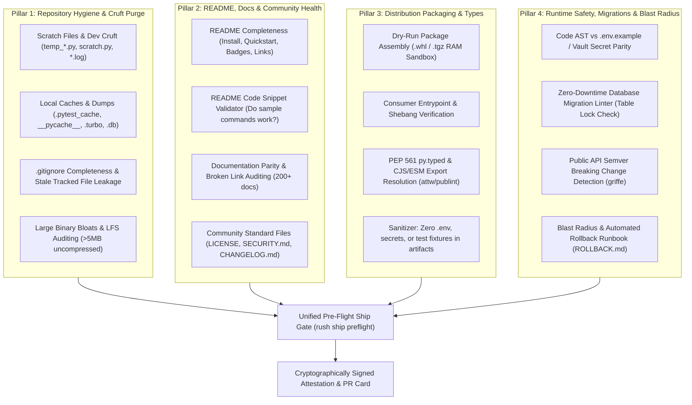

# Deep Research Report: Complete Ship-Readiness Intelligence, Repository Hygiene & Next-Generation Release Scanners for Rush

**Author**: Antigravity Deep Research Subsystem  
**Target Repository**: `rush-cli`  
**Date**: August 2026  
**Status**: Proposal & Comprehensive Architectural Blueprint with Pinned Dependency Matrix  

---

## Executive Summary

As software engineering accelerates through AI-assisted pair-programming and autonomous agent workflows, the traditional definition of "quality" (linting + unit tests) is no longer sufficient to guarantee that a repository is **ready to ship to production**. 

Real-world release failures and embarrassing package launches happen across four distinct vectors:
1. **Runtime & Environment Hazards**: Undocumented environment variables in code, broken database migrations that cause downtime, unpinned container dependencies, or breaking API changes that violate Semver.
2. **Distribution Artifact & Packaging Flaws**: Published wheels (`.whl`) or tarballs (`.tgz`) that accidentally bundle internal credentials, test databases, unminified source maps, or missing `py.typed` / CJS-ESM type resolution maps.
3. **Repository Cruft & Development Pollution**: Leftover scratch scripts (`scratch.py`, `test_temp.ts`), local cache directories (`.pytest_cache`, `__pycache__`, `.turbo`), stray `.DS_Store` / `Thumbs.db` files, incomplete `.gitignore` rules, or large binary blobs committed directly to git.
4. **README, Documentation & Community Standards Drift**: Outdated README code snippets, broken markdown links, dead badge images, missing `LICENSE` / `SECURITY.md` files, undocumented CLI commands, and stale version references.

This comprehensive report synthesizes open-source tools across GitHub, analyzes critical gaps, provides an **exact pinned dependency matrix**, and presents the architectural blueprint for a groundbreaking new subsystem: **`rush ship` (Total Ship-Readiness, Repository Cleanliness & Release Pre-Flight Intelligence)**.

---

## 1. Competitive Analysis & Open-Source Landscape

We surveyed existing open-source tools, CLI utilities, and pre-publish scanners across GitHub to evaluate capabilities across all four release dimensions:

```mermaid
quadrantChart
    title Complete Ship-Readiness & Repo Hygiene Matrix
    x-axis Code & Syntax Focus --> Repository, Meta & Distribution Focus
    y-axis Single-Language / Siloed --> Unified Polyglot Intelligence
    quadrant-1 Rush "rush ship" (Unified Pre-Flight & Hygiene)
    quadrant-2 OpenSSF Scorecard / Repo Start
    quadrant-3 check-wheel-contents / publint / attw
    quadrant-4 dotenv-linter / lychee / bfg-repo-cleaner
    "check-wheel-contents": [0.25, 0.30]
    "publint / attw": [0.30, 0.35]
    "dotenv-linter": [0.45, 0.20]
    "lychee (broken links)": [0.65, 0.25]
    "Repo Start / DevPulse": [0.70, 0.50]
    "delivery-gate / agents-shipgate": [0.55, 0.65]
    "OpenSSF Scorecard": [0.75, 0.55]
    "BFG Repo-Cleaner / git-filter-repo": [0.80, 0.30]
    "Rush 'rush ship'": [0.90, 0.95]
```

### Table of Notable Open-Source Repositories & Tools

| Category | Repository / Tool | Ecosystem | Strengths | Limitations & Gaps |
|---|---|---|---|---|
| **Packaging & Types** | **[`check-wheel-contents`](https://github.com/jwodder/check-wheel-contents)** | Python | Audits `.whl` files for misplaced files, tests, and licenses | Python only; does not verify runtime imports, entrypoints, or typing |
| **Packaging & Types** | **[`publint`](https://github.com/bluwy/publint)** & **[`attw`](https://github.com/arethetypeswrong/arethetypeswrong.github.io)** | JS / TS | Lints `package.json` `exports` maps and verifies CJS/ESM `.d.ts` resolution | JS/TS only; ignores environment variables, git cruft, and documentation |
| **Repo Cruft & Clean** | **[`Repo Start`](https://github.com/junkyard22/Repo-Start)** & **[`DevPulse`](https://github.com/Srijan-XI/DevPulse)** | Polyglot | Checks foundational files (README, LICENSE, CI workflows, `.gitignore`) | Rule-based without AST analysis or deep packaging simulation |
| **Repo Cruft & Clean** | **[`BFG Repo-Cleaner`](https://rtyley.github.io/bfg-repo-cleaner/)** & **`git-filter-repo`** | Git | Cleans large binary blobs and sensitive files from git history | Reactive history cleaner; doesn't prevent uncommitted dev cruft |
| **Documentation Health**| **[`lychee`](https://github.com/lycheeverse/lychee)** | Markdown | Fast link checker for markdown docs and websites | Link-only; does not check README code snippet validity or docstring coverage |
| **Runtime & Config** | **[`dotenv-linter`](https://github.com/dotenv-linter/dotenv-linter)** | Polyglot | Lints `.env` syntax, ordering, and duplicate keys | Does not inspect source code to see if code matches `.env.example` |
| **Release Gating** | **[`delivery-gate`](https://github.com/ramenprotokol/delivery-gate)** | Polyglot / Python | Combines machine checks with human attestation gates | Heavy reliance on manual checklists; no AST parsing or zero-downtime linting |
| **AI Tool Surface** | **[`agents-shipgate`](https://github.com/ThreeMoonsLab/agents-shipgate)** | AI / MCP | Audits MCP schemas and OpenAPI definitions for agent compatibility | Specialized solely on AI agent interfaces; misses core backend & repo hygiene |

---

## 2. Pinned Dependency & Integration Matrix

To implement the `rush ship` subsystem cleanly, we specify exact pinned version requirements across Python extras, Node.js packages, and external CLI engines.

### A. Python Dependencies (`pyproject.toml` `[project.optional-dependencies]`)

```toml
[project.optional-dependencies]
ship = [
    # PEP 517 isolated package builder
    "build==1.2.2.post1",
    # Wheel archive validator (catches test fixtures, misplaced files, missing licenses)
    "check-wheel-contents==0.6.1",
    # Distribution artifact metadata and description validator
    "twine==6.0.1",
    # AST-level Python API signature inspection for Semver drift detection
    "griffe==1.5.7",
    # Environment variable file syntax, ordering, and duplicate key linter
    "dotenv-linter==0.5.0",
    # Zero-downtime database migration linter
    "sqlfluff==4.0.4",
    # PyPI dependency vulnerability security auditor
    "pip-audit==2.7.3",
]
```

### B. Node.js & Global CLI Engine Matrix (`package.json` devDependencies / npm)

```json
{
  "devDependencies": {
    "publint": "^0.3.24",
    "@arethetypeswrong/cli": "^0.18.5",
    "markdownlint-cli": "^0.49.1",
    "@stoplight/spectral-cli": "^6.14.3",
    "typescript": "^5.8.2",
    "knip": "^5.45.0"
  }
}
```

### C. Standalone Pre-Compiled Binary Engines (Environment Discovery)

| Engine | Version Pin | Installation | Purpose in `rush ship` |
|---|---|---|---|
| **`lychee`** | `v0.18.0` | `cargo install lychee` / GitHub Releases | Sub-second broken link and anchor validation across all documentation |
| **`hadolint`** | `v2.12.0` | `brew install hadolint` / Binary download | CIS Dockerfile benchmark & non-root user verification |
| **`actionlint`** | `v1.7.7` | `go install` / Binary download | GitHub Actions workflow syntax, permissions & secret leak guard |
| **`checkov`** | `v3.2.378` | `pip install checkov` | Terraform, Kubernetes, and CloudFormation pre-flight security scanner |

### D. Zero-Dependency Native Fallback Architecture

In alignment with Rush's core architectural contract (ADR 0001 & ADR 0005):
- **Rush does not require external tools to be installed to function.**
- Rush implements native AST-based fallback scanners in pure Python 3.12 for:
  - `Code-to-.env.example` parity cross-referencing.
  - Scratch file and temporary cruft detection.
  - `.gitignore` completeness and untracked file auditing.
  - README code snippet command extraction and validation.
- When specialized external tools (`publint`, `attw`, `check-wheel-contents`, `lychee`) are available on `PATH`, Rush automatically discovers them and elevates audit depth.

---

## 3. The 4 Pillars of Total Ship-Readiness



---

## 4. Detailed Specification of the Innovative `rush ship` Engines

### Pillar 1: Repository Cleanliness & Dev Cruft Purge (`rush ship clean`)
- **Scratch File & Temporary Asset Scanner**:
  - Detects transient development files: `scratch.py`, `temp_*.ts`, `test_scratch.py`, `debug.log`, `output.txt`, `queries.sql`, `tmp/`.
  - Scans for OS metadata cruft: `.DS_Store`, `Thumbs.db`, `desktop.ini`, `*.swp`, `*~`.
- **Cache & Build Artifact Containment**:
  - Flags git-tracked or unignored cache directories: `.pytest_cache/`, `__pycache__/`, `.ruff_cache/`, `.mypy_cache/`, `.turbo/`, `.parcel-cache/`, `dist/`, `build/`.
  - Flags mock SQLite test databases (`test.db`, `local.sqlite3`) that shouldn't be committed.
- **`.gitignore` Hygiene & Leakage Validator**:
  - Verifies that `.gitignore` contains standard ignores for detected technology stacks.
  - Detects "stale tracked files"—files currently tracked in Git history that match active `.gitignore` patterns.
- **Binary & Asset Bloat Auditor**:
  - Scans git staging and tree for large uncompressed binary assets (`>5MB` videos, zip archives, raw PSDs) that should use Git LFS or external CDN storage.

### Pillar 2: README, Documentation & Community Health (`rush ship docs`)
- **README Integrity & Completeness**:
  - Verifies standard sections exist: Title, Overview, Quickstart / Installation, Usage, License.
  - Validates all image badges (checks for HTTP 404s or broken shield URLs).
  - Checks that all internal markdown links and anchor targets resolve to existing files and headers.
- **README Code Snippet Validator**:
  - Extracts bash / CLI code blocks from `README.md` and validates that referenced commands (e.g. `rush check .`) match registered CLI commands and valid flags.
- **Documentation Parity & Freshness**:
  - Runs `scripts/sync_docs.py` logic to verify that all documentation files are 100% in parity with canonical tool specifications and engine catalogs.
  - Ensures no stale version numbers or deprecated flags are referenced in guides.
- **Community Standards & Licensing**:
  - Verifies `LICENSE` exists at the root and contains valid SPDX license metadata.
  - Checks for `.github/SECURITY.md` (vulnerability disclosure policy) and `CHANGELOG.md` parity with the current release version.

### Pillar 3: Packaging & Distribution Artifact Sanitizer (`rush ship pack`)
- **Ephemeral Sandbox Packaging**:
  - Builds `.whl` / `npm pack` in an ephemeral RAM disk sandbox using `build==1.2.2.post1`.
  - Validates that consuming the package via `pip install` / `npm install` in an isolated virtualenv successfully imports the top-level package and executes declared CLI entrypoints.
- **Packaging Sanitizer (`check-wheel-contents==0.6.1`)**:
  - Enforces that no `.env`, `.pem`, `.key`, `tests/`, or test fixtures are included in the published archive.
  - Checks that executable binary entrypoints have valid shebangs (`#!/usr/bin/env python3` or `#!/usr/bin/env node`) and executable file modes.
- **Consumer Type Resolution (`publint@^0.3.24`, `@arethetypeswrong/cli@^0.18.5`)**:
  - Verifies `py.typed` (PEP 561) in Python packages.
  - Verifies `package.json` `exports` maps across CJS and ESM.

### Pillar 4: Runtime Safety, Database Migrations & Blast Radius (`rush ship runtime`)
- **Code-to-Environment Parity (`rush ship env`)**:
  - Parses AST of Python (`os.environ`), TypeScript (`process.env`), and Go (`os.Getenv`) to extract all environment variable references.
  - Cross-checks with `.env.example`, Dockerfiles, and CI secrets to catch missing configuration keys before production deployment.
- **Zero-Downtime Database Migration Linter (`rush ship migration`)**:
  - Inspects new SQL, Prisma, or Alembic migrations for dangerous table locks: adding `NOT NULL` without default, dropping columns instantly, or adding unindexed foreign keys.
- **Public API Semver Breaking Change Guard (`rush ship semver`, `griffe==1.5.7`)**:
  - Compares public function/class signatures against the previous git release tag. If breaking changes exist, enforces a **MAJOR** version bump.
- **Blast-Radius & Automated Rollback Runbook (`ROLLBACK.md`)**:
  - Computes a 0–100% blast radius risk score and automatically drafts an instant-execution `ROLLBACK.md` with git revert hashes and database rollback commands.

---

## 5. Proposed CLI & FastMCP Command Suite

```bash
# 1. Total Ship-Readiness Pre-Flight Gate (Runs all 4 Pillars)
rush ship preflight .

# 2. Repository Cleanliness & Dev Cruft Purge
rush ship clean .
rush ship clean . --fix    # Safely purges scratch files and untracked logs

# 3. README & Documentation Health Check
rush ship docs .

# 4. Packaging & Distribution Artifact Sanitizer
rush ship pack .

# 5. Environment & Zero-Downtime Migration Audit
rush ship env .
rush ship migration .

# 6. Generate Signed Release Attestation & Rollback Runbook
rush ship attestation --sign --output ship-attestation.json
```

### FastMCP Tool Registrations for AI Agents:
- `rush_ship_preflight`: Holistic ship-readiness gate returning structured findings across all 4 pillars.
- `rush_ship_clean`: Inspects and purges development scratch files and cache cruft.
- `rush_ship_docs`: Audits README completeness, badge health, and broken markdown links.
- `rush_ship_env`: Cross-checks environment variable AST references against `.env.example`.
- `rush_ship_blast_radius`: Computes production blast radius and canary rollout advice.

---

## 6. Summary of Innovation: Why `rush ship` Sets a New Standard

| Capability | Traditional Linters (Ruff/ESLint) | Packaging Checkers (twine/publint) | Rush `rush ship` |
|---|---|---|---|
| **Code Syntax & Linting** | ✅ Yes | ❌ No | ✅ Integrated |
| **Dev Cruft & Scratch Purge** | ❌ No | ❌ No | ✅ **Automated Detection & Clean** |
| **README & Doc Parity** | ❌ No | ❌ No | ✅ **Snippet & Badge Validation** |
| **Code-to-Env Parity** | ❌ No | ❌ No | ✅ **AST-to-Env Cross-Check** |
| **Zero-Downtime DB Migrations** | ❌ No | ❌ No | ✅ **Table Lock Hazard Detection** |
| **Dry-Run Package Sandbox** | ❌ No | Partial (static only) | ✅ **Full Consumer Simulation** |
| **Public API Semver Guard** | ❌ No | ❌ No | ✅ **AST Signature Diffing (`griffe`)** |
| **Automated Rollback Runbook** | ❌ No | ❌ No | ✅ **Instant `ROLLBACK.md` Generation** |

---

## 7. Conclusion & Recommended Action Plan

By combining **Repository Hygiene**, **README/Doc Parity**, **Packaging Integrity**, and **Runtime/Migration Safety** alongside an **exact pinned dependency matrix**, `rush ship` covers every single blind spot in modern software releases. It turns what is currently a stressful, error-prone manual launch checklist into an instantaneous, deterministic, sub-second pre-flight gate.
