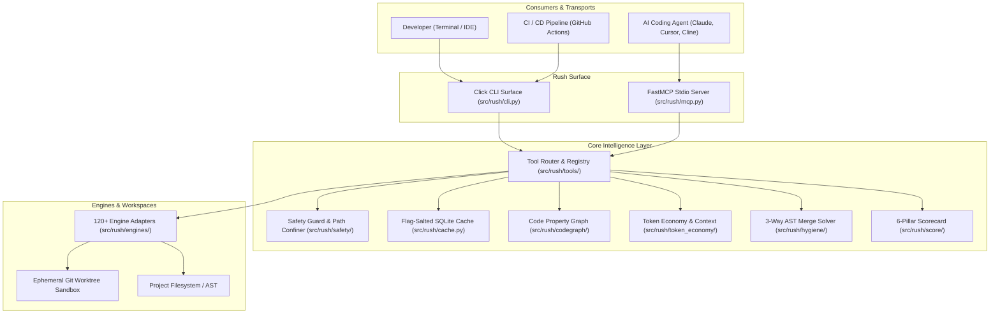
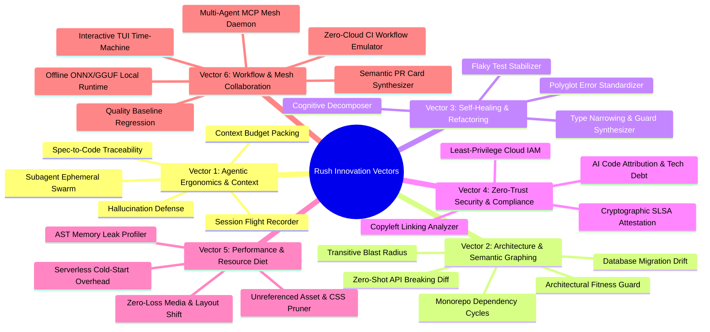
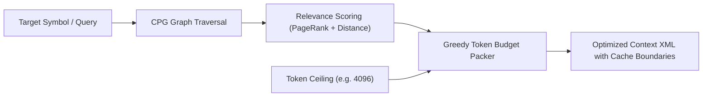
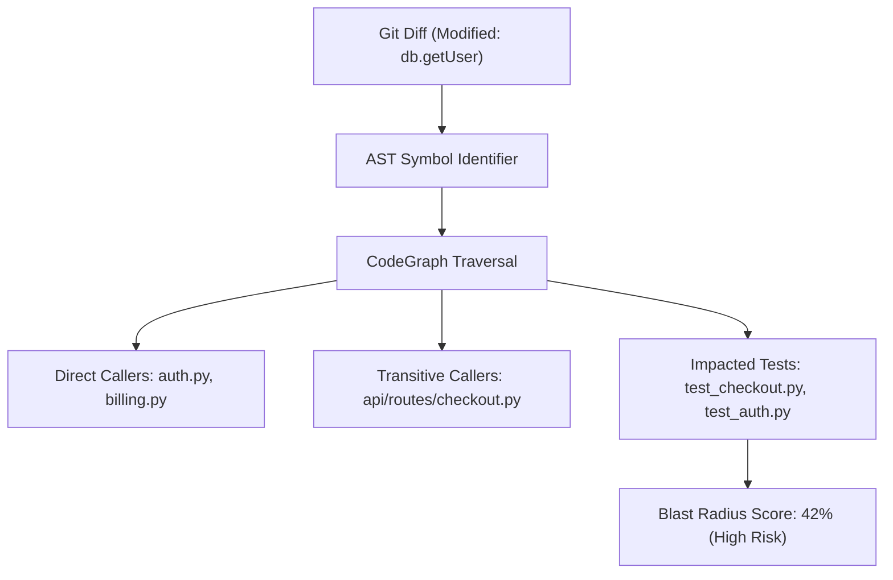
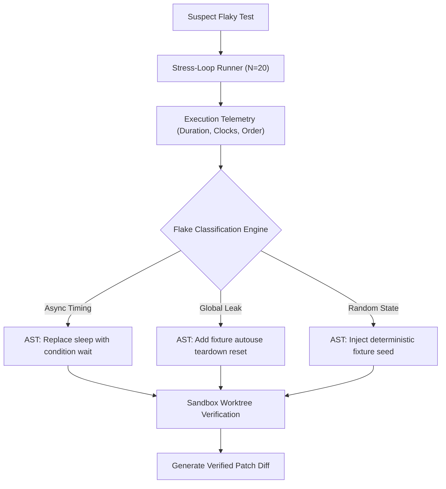
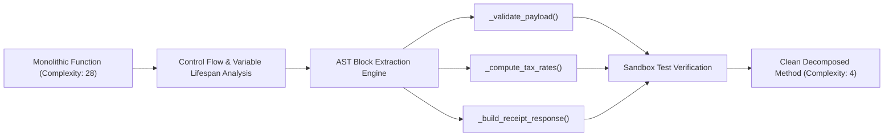
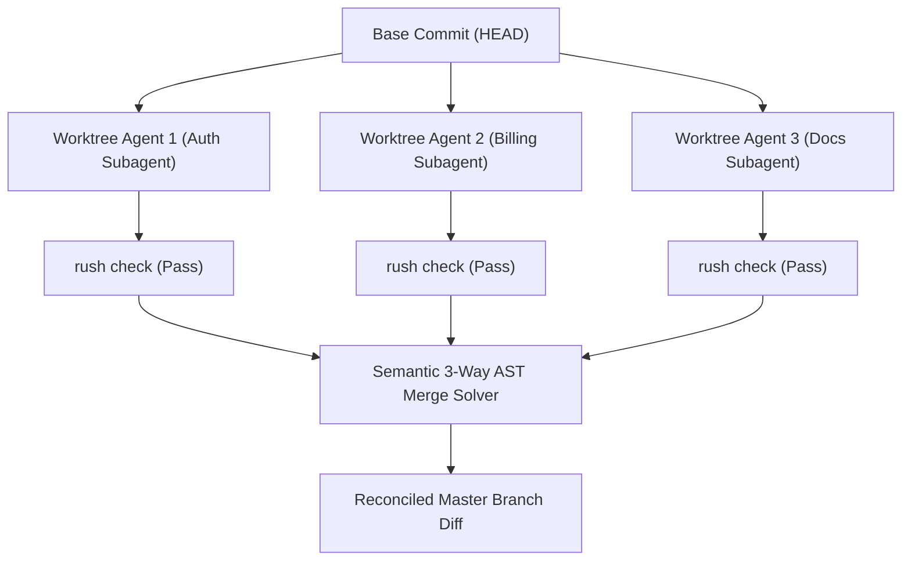
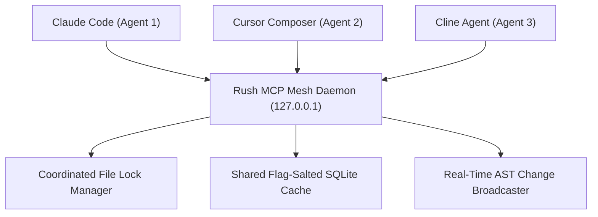
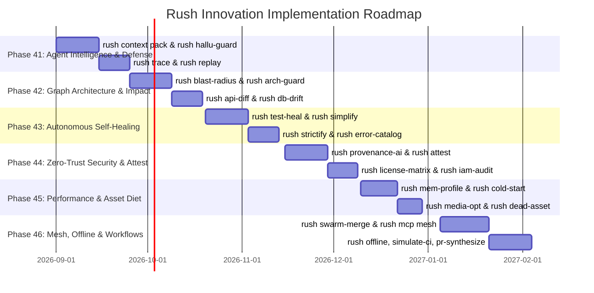

# Rush CLI: Comprehensive Architectural Review & 28-Feature Innovation Blueprint

> **Document Name:** `innovation-enhancement-report`  
> **Status:** Strategic Research & Innovation Specification  
> **Scope:** Architecture Review, Competitive Analysis, and 28+ Custom-Built Value-Add Innovations  
> **Target Subsystems:** CLI, FastMCP Stdio, CodeGraph CPG, Token Economy, AST Engine, Worktree Sandbox, Security & Governance  

---

## 1. Executive Summary & Comprehensive Application Review

### 1.1 The Rush CLI Paradigm
**Rush CLI** is an agentic code-quality, static-analysis, and test-confidence platform built in Python 3.12, managed with `uv`. Its core architectural thesis is simple yet powerful: **"One safe command surface for the quality tools your project already uses."**

Modern software engineering repositories are inundated with dozens of fragmented quality engines (linters, formatters, type-checkers, security scanners, dead-code detectors, mutation testers, and bundle analyzers). Developers and AI coding assistants (such as Claude Code, Cursor, Copilot, Cline, Windsurf, and Devin) must context-switch between disparate configuration files, CLI arguments, and output formats. Rush bridges this chasm by:
1. **Unifying CLI and MCP Transports**: Exposing identical execution semantics through a Click CLI for humans and CI pipelines, and a zero-configuration FastMCP stdio server for LLM agents.
2. **Canonical Output Normalization**: Standardizing output from 120+ underlying tools into a deterministic `ToolResult` shape (`status`, `findings`, `summary`, `duration_ms`, `metadata`).
3. **Zero-Side-Effect Safety**: Enforcing non-destructive default modes, explicit permission gates (`--allow-network`, `--allow-build`, `--allow-artifact-write`), and ephemeral Git worktree sandboxing.
4. **Local-First & Offline Determinism**: Relying on locally discovered binaries, SQLite-backed flag-salted caching (`.rush/cache.db`), and AST heuristics rather than mandatory cloud subscriptions.



---

### 1.2 Review of Current Development, Features & Commands

Rush has evolved through 40 phases of development into a robust suite of static analysis, developer workflow, and AI guardrail tools.

| Subsystem / Layer | Current Capabilities & Commands | Underlying Architecture |
|---|---|---|
| **Core Quality & Linters** | `rush review`, `rush lint`, `rush format`, `rush typecheck`, `rush dead`, `rush complexity`, `rush slop`, `rush fix` | Integrates Ruff, ESLint, Biome, Mypy, TSC, Vulture, Knip, Radon, JSCPD, and sloppylint with deterministic AST heuristics. |
| **Project-File & Infra** | `rush markdown`, `rush yaml`, `rush sql`, `rush templates`, `rush containerfile`, `rush iac`, `rush actions` | Covers Markdownlint, Spectral, SQLFluff, DjLint, Hadolint, TFLint, Checkov, Kubeconform, and Actionlint. |
| **Test Confidence** | `rush test`, `rush coverage`, `rush pbt`, `rush flaky`, `rush contract`, `rush snapshot`, `rush mutation`, `rush fuzz`, `rush load`, `rush tdd` | Dual-mode support: executes native runners (Pytest, Vitest, Mutmut, Hypothesis) or imports local reports (LCOV, JUnit, Cobertura, Pact). |
| **Browser Runtime** | `rush e2e`, `rush visual`, `rush semantic-drift` | Gated browser automation with Playwright, BackstopJS, and DOM accessibility drift detection. |
| **Security & Supply Chain** | `rush security`, `rush secrets`, `rush sbom`, `rush codeql`, `rush ai-eval` | Scans CVEs (pip-audit, npm-audit, OSV), redacts credentials (Gitleaks, TruffleHog), generates CycloneDX SBOMs, and runs Promptfoo/DeepEval. |
| **Autonomous Safety & Sandboxing** | `rush guard check-cmd`, `rush guard check-path`, `rush patch apply` | Intercepts destructive shell commands, enforces workspace path confinement, and executes AI diffs in isolated Git worktrees. |
| **Token Economy & Context** | `rush token count`, `rush outline`, `rush token cache-advisor` | Fast BPE token counting, AST outline compression (stripping docstrings/bodies), and prompt caching breakpoint recommendations. |
| **CodeGraph & Slicing** | `rush codegraph slice`, `rush codegraph callgraph` | SQLite-backed Code Property Graph store providing sub-millisecond verbatim symbol slicing with exact line numbers. |
| **Hygiene & AST Merges** | `rush hygiene dead-code`, `rush conflict solve` | Polyglot unreferenced export scanner, unused import pruner, and 3-way AST merge solver reconciling concurrent branch edits. |
| **Bundle & Hotspots** | `rush bundle analyze`, `rush hotspots analyze` | Raw/Gzip/Brotli chunk transfer size auditing, budget gates, commit churn velocity, and McCabe cyclomatic complexity correlation matrix. |
| **Governance & Hooks** | `rush governance sync`, `rush hook run` | Compiles canonical `AGENTS.md` into `.cursorrules`, `.clinerules`, and Copilot rules; runs sub-second staged AST pre-commit checks with Trojan Source Unicode detection. |
| **Scorecard & Consensus** | `rush score compute`, `rush consensus reconcile` | Calculates 6-pillar repository health grades (0–100%), generates SVG badges and PR cards, and reconciles multi-model AI code reviews via weighted voting. |

---

### 1.3 Architectural Strengths & Competitive Moat

1. **Dual Transports with Zero Drift**: Both Click CLI and FastMCP register against the exact same `src/rush/tools/` implementations. Any fix or feature is instantly available to terminal users, CI pipelines, and AI assistants.
2. **Engine Disconnection & Fallback**: Rush never crashes when an optional tool is absent. It produces structured `skipped` results with actionable install hints.
3. **Deterministic Multi-Engine Aggregation**: When running multi-engine checks (e.g. Ruff + ESLint), status aggregation follows strict priority (`error > fail > warn > ok > skipped`), findings are deduplicated by fingerprint, and provenance is preserved.
4. **Strict Safety & Containment**: By enforcing `stdin=DEVNULL` and capturing subprocess stdout/stderr, child engines cannot corrupt MCP JSON-RPC communication on stdio.
5. **Extensive Documentation Parity**: The repository features 212+ documentation files strictly audited by `scripts/sync_docs.py`, preventing configuration and CLI reference drift.

---

### 1.4 Identified Gaps & High-Leverage Innovation Vectors

While Rush provides comprehensive tool aggregation and static checking, several emergent friction points exist in the era of autonomous agentic coding, high-velocity polyglot monorepos, and distributed software systems:

1. **Context Window Inefficiency**: AI agents often send entire 1,000-line source files into LLM context when only 40 lines of interface definitions and call-chains are required, exhausting context windows and driving up token costs.
2. **Agent Hallucinations & Phantom Dependencies**: Coding agents frequently invent nonexistent library functions or hallucinate third-party npm/pip package names, introducing severe supply-chain typosquatting risks.
3. **Lack of Architectural Blast Radius Awareness**: Agents and developers modify functions without knowing the full transitive downstream impact across database schemas, RPC endpoints, and downstream consumers.
4. **Flaky Test Fatigue**: Flaky tests are detected, but diagnosing whether a failure is due to async timing, unseeded random state, or leaky globals requires manual debugging.
5. **Contract & Schema Drift**: Frontend TypeScript types, backend FastAPI/Django endpoints, and database ORM migrations frequently drift apart without automated static gates.
6. **Multi-Agent Workspace Collisions**: When multiple agents work in parallel, managing branch state, lock files, and intermediate diffs becomes chaotic.

To address these gaps and transform Rush into the definitive intelligence and safety engine for modern developers and AI agents, 28 custom-built innovative features are detailed below.

---

## 2. Taxonomy of Strategic Innovation Vectors



---

## 3. 28 Detailed Innovation Feature Specifications

Below are the complete technical specifications, architectural designs, CLI/MCP contracts, and example walkthroughs for all 28 innovation features.

---

### Feature 01: `rush context pack` — Agent Context Budget Optimizer & Dynamic AST Packing Engine

#### Target Persona & Problem Solved
- **Persona:** AI Coding Agents (Claude Code, Cursor, Cline) & Prompt Engineers.
- **Problem:** Agents often dump entire source files into LLM prompts to satisfy dependencies, consuming tens of thousands of tokens, triggering prompt cache thrashing, and introducing irrelevant distractors that cause hallucinations.

#### Technical Architecture & Deep Mechanics
`rush context pack` accepts a target symbol or task query and a strict token ceiling (e.g. 4,000 tokens). It performs a breadth-first search on the SQLite Code Property Graph (`src/rush/codegraph/store.py`), computes symbol centrality scores, and extracts an optimal context bundle comprising:
1. Verbatim AST source of the target symbol.
2. Compressed AST interfaces (signatures + types, docstrings stripped) of direct callers and callees.
3. Relevant database models and type definitions.
4. If tokens remain, adjacent test signatures.
The resulting package fits within the specified token budget and includes prompt cache breakpoint markers.



#### CLI & MCP Interaction Contract
- **CLI:** `rush context pack PATH --symbol <NAME> --max-tokens <INT> [--format xml|markdown|json]`
- **MCP Tool:** `rush_context_pack(path: str, symbol: str, max_tokens: int = 4000, format: str = "xml")`
- **Output:** Structured context container ready for immediate injection into agent system or user messages.

#### Example Terminal Output
```bash
$ rush context pack src/rush/tools/review.py --symbol ReviewTool.run --max-tokens 2000 --format xml
```
```xml
<rush_context_package target="ReviewTool.run" tokens="1420" budget="2000" compression_ratio="0.22">
  <symbol path="src/rush/tools/review.py" line="55" kind="method" focus="verbatim">
    def run(self, path: Path, *, use_llm: bool = False, use_graft: bool = False, ...) -> ToolResult:
        ... [Verbatim Method Implementation: 65 lines] ...
  </symbol>
  <interface path="src/rush/tools/base.py" kind="class_outline">
    class ToolResult(TypedDict):
        tool: ToolName
        engine: str
        status: Literal["ok", "warn", "fail", "error", "skipped"]
        duration_ms: int
        summary: str
        findings: list[Finding]
  </interface>
  <call_path from="ReviewTool.run" to="_collect_reviewable_files" distance="1" />
</rush_context_package>
```

---

### Feature 02: `rush hallu-guard` — Package Hallucination & Phantom Import Interceptor

#### Target Persona & Problem Solved
- **Persona:** Security Engineers, DevOps, Vibecoders, and Autonomous Agents.
- **Problem:** LLMs frequently invent non-existent PyPI or npm package names (e.g. `import requests_jwt_auth`) or invoke phantom methods that do not exist on legitimate packages, opening vulnerabilities to package typosquatting/malware and runtime crashes.

#### Technical Architecture & Deep Mechanics
`rush hallu-guard` parses all import statements and package references across modified or proposed files:
1. **Local Resolution**: Resolves imports against installed virtual environment packages, Python standard library modules, and project source paths.
2. **Registry Verification**: For external dependencies not found locally, it queries the local package manifests (`pyproject.toml`, `package.json`, `Cargo.toml`). If `--allow-network` is provided, it verifies PyPI/npm registry existence and age (flagging newly created malicious packages < 14 days old).
3. **Symbol Introspection**: Inspects imported standard library and third-party modules via AST to verify that called functions (e.g. `math.fast_hypot`) actually exist.

#### CLI & MCP Interaction Contract
- **CLI:** `rush hallu-guard PATH [--staged] [--diff <FILE>] [--allow-network]`
- **MCP Tool:** `rush_hallu_guard(path: str, candidate_code: str | None = None)`

#### Example Terminal Output
```text
⚡ hallu-guard fail 2 phantom import / hallucination issue(s) detected
path                line  rule                 severity  message
src/auth/jwt.py     4     phantom-package      fail      'crypto_tokens_v2' is not in pyproject.toml or PyPI
src/utils/math.py   12    phantom-symbol       error     'math.is_positive_integer' does not exist in standard library
```

---

### Feature 03: `rush blast-radius` — Transitive Semantic Blast Radius & Downstream Impact Analyzer

#### Target Persona & Problem Solved
- **Persona:** Senior Developers, Tech Leads, and PR Reviewers.
- **Problem:** Making a small signature or schema change in a core utility function often causes silent failures across un-reviewed downstream modules, microservices, or API endpoints.

#### Technical Architecture & Deep Mechanics
1. Inspects the current git diff or staged files to identify modified symbols, types, or database columns.
2. Traverses the SQLite Code Property Graph (`src/rush/codegraph/store.py`) recursively across the dependency graph.
3. Computes a weighted blast radius score (0–100%) and categorizes affected nodes:
   - **Direct Callers**: Immediate functions invoking the changed symbol.
   - **Transitive Consumers**: Modules up to N hops away in the call graph.
   - **Public API Surface**: Exposed HTTP/RPC routes affected by the change.
   - **Test Suite Impact**: Test files that execute the modified call paths.



#### CLI & MCP Interaction Contract
- **CLI:** `rush blast-radius PATH [--since <GIT_REF>] [--symbol <NAME>] [--json]`
- **MCP Tool:** `rush_blast_radius(path: str, since_ref: str = "main")`

#### Example Terminal Output
```text
⚡ blast-radius warn Blast Radius: 38% | 14 downstream symbols affected
Risk Level: MODERATE (Exposes 2 Public API Routes)

Changed Symbol: src/rush/config.py::load_config (signature changed)
Direct Dependents (4):
  • src/rush/cli.py::build_catalog_path_command (L101)
  • src/rush/tools/review.py::ReviewTool.run (L66)
  • src/rush/dashboard/server.py::start_dashboard (L45)
  • src/rush/watcher.py::FileWatcher._reload_config (L89)

Transitive Dependents (10):
  • src/rush/mcp.py -> FastMCP Tool Execution
  • 7 Integration Test Suites (tests/test_cli_*.py)
```

---

### Feature 04: `rush arch-guard` — Declarative Architectural Fitness Functions & Boundary Enforcer

#### Target Persona & Problem Solved
- **Persona:** Software Architects & Tech Leads.
- **Problem:** Layered architectural boundaries (e.g. Hexagonal, Clean Architecture, DDD) erode over time as developers or coding agents introduce forbidden imports (e.g., Domain layer directly querying Database models or UI components importing raw SQL drivers).

#### Technical Architecture & Deep Mechanics
`rush arch-guard` reads declarative architectural rules defined in `rush.toml` and evaluates them in sub-milliseconds using AST import graphs.

```toml
# rush.toml
[architecture.layers]
domain = ["src/core/domain/**"]
application = ["src/core/services/**"]
infrastructure = ["src/infra/**"]
presentation = ["src/api/**", "src/ui/**"]

[architecture.rules]
"domain" = { forbid_imports = ["infrastructure", "presentation"] }
"application" = { forbid_imports = ["presentation"] }
"infrastructure" = { allow_cyclic = false }
```

1. Maps all files into configured architectural layers via fast glob matching.
2. Extracts all polyglot import statements (Python, TS, Go, Rust) via Tree-sitter.
3. Validates every edge against the layer dependency matrix and outputs violation findings with exact line numbers.

#### CLI & MCP Interaction Contract
- **CLI:** `rush arch-guard PATH [--layer <NAME>] [--export-graph <PATH>]`
- **MCP Tool:** `rush_arch_guard(path: str)`

#### Example Terminal Output
```text
⚡ arch-guard fail 2 architectural boundary violation(s) detected
layer         source_file             line  rule             target_layer    imported_module
domain        src/core/domain/user.py 8     forbid-import    infrastructure  src.infra.database.models
application   src/core/services/pay.py 15   forbid-import    presentation    src.api.controllers.response
```

---

### Feature 05: `rush test-heal` — Autonomous Flaky Test Diagnoser & Self-Healing Engine

#### Target Persona & Problem Solved
- **Persona:** QA Engineers, CI/CD Maintainers, and Autonomous Agents.
- **Problem:** Intermittent test failures in CI waste developer hours and undermine test suite trust. Diagnosing whether a flake is caused by asynchronous race conditions, unseeded randomness, or leaked global state is extremely labor-intensive.

#### Technical Architecture & Deep Mechanics
1. **Stress-Loop Execution**: Runs the suspect test $N$ times (default: 20) under process-level stress with randomized thread scheduling delays and clock-skew fuzzing.
2. **Failure Signature Analysis**: Classifies root cause using heuristic telemetry:
   - *Async Timing Race:* Failure occurs when execution duration fluctuates by >300ms.
   - *Unseeded Random State:* Failure correlates with specific pseudorandom sequences.
   - *Global State Leak:* Failure only occurs when run after specific preceding test cases.
   - *Timezone / Locale Bias:* Failure triggers under UTC offset simulation.
3. **Automated Worktree Patch**: In an ephemeral Git worktree, applies AST fixes (e.g., replacing arbitrary `time.sleep()` with deterministic polling predicates or adding fixture teardown resets).



#### CLI & MCP Interaction Contract
- **CLI:** `rush test-heal PATH --test-id <TEST_NAME> [--iterations 20] [--apply]`
- **MCP Tool:** `rush_test_heal(path: str, test_id: str, auto_apply: bool = False)`

---

### Feature 06: `rush api-diff` — Zero-Shot API Breaking Change & Contract Drift Detector

#### Target Persona & Problem Solved
- **Persona:** Backend Engineers, API Gateway Teams, and Frontend Integrators.
- **Problem:** Renaming a route parameter, removing an enum variant, or changing an endpoint response status code breaks mobile apps and microservice consumers without triggering traditional unit test failures.

#### Technical Architecture & Deep Mechanics
1. Extracts OpenAPI, GraphQL schemas, gRPC Protobufs, or FastAPI/Django route signatures from both the base git reference (e.g. `main`) and the current working branch.
2. Performs a bidirectional semantic AST schema diff.
3. Categorizes modifications into:
   - **Breaking Changes:** Deleted endpoints, renamed required fields, narrowed enum values, tightened validation rules.
   - **Non-Breaking Additions:** New optional parameters, new endpoints, relaxed constraints.
   - **Deprecations:** Fields marked with `@deprecated` without runtime removal.
4. Generates client migration guides and optional backward-compatible shim adapters.

#### CLI & MCP Interaction Contract
- **CLI:** `rush api-diff PATH [--base main] [--strict] [--json]`
- **MCP Tool:** `rush_api_diff(path: str, base_ref: str = "main")`

#### Example Terminal Output
```text
⚡ api-diff fail 1 BREAKING API change(s) | 2 Non-breaking additions
Base: main (a8f9c1e) <-> Target: HEAD (working directory)

[CRITICAL BREAKING CHANGES]
  • POST /api/v1/checkout: Removed required field 'billing_zip' from request body
    ↳ Remediation: Mark field optional or bump endpoint to /api/v2/checkout

[NON-BREAKING ADDITIONS]
  • GET /api/v1/users: Added optional query param 'include_metadata: bool'
  • Type 'PaymentStatus': Added enum variant 'REFUND_PENDING'
```

---

### Feature 07: `rush db-drift` — ORM-to-Migration Schema Synchronization & Destructive DDL Auditor

#### Target Persona & Problem Solved
- **Persona:** Full-Stack Developers, Database Administrators, and DevOps.
- **Problem:** Developers modify SQLAlchemy/Prisma/Django ORM models but forget to run migration generators (`alembic revision --autogenerate` or `prisma migrate dev`), causing runtime database schema mismatches in staging/production.

#### Technical Architecture & Deep Mechanics
1. **Model Introspection**: Parses ORM definition files to construct the desired database schema (tables, columns, types, nullability, indices, foreign keys).
2. **Migration Replay**: Parses all local SQL/migration files in chronological sequence to construct the migrated database schema.
3. **Drift Diffing**: Computes schema delta. If drift exists, flags missing migrations.
4. **Destructive DDL Guard**: Audits SQL migration files for dangerous production patterns (e.g. `DROP TABLE`, `DROP COLUMN`, `ALTER TABLE ... ADD COLUMN NOT NULL` without default, locking table alterations on large datasets).

#### CLI & MCP Interaction Contract
- **CLI:** `rush db-drift PATH [--dialect postgres|sqlite|mysql] [--audit-ddl]`
- **MCP Tool:** `rush_db_drift(path: str)`

---

### Feature 08: `rush simplify` — Cognitive Complexity Decomposer & Auto-Refactoring Engine

#### Target Persona & Problem Solved
- **Persona:** Developers refactoring legacy code and AI Coding Assistants.
- **Problem:** Mega-functions with high cyclomatic and cognitive complexity (>20) are difficult to comprehend, impossible to test exhaustively, and prone to edge-case bugs.

#### Technical Architecture & Deep Mechanics
1. Calculates Sonar-style Cognitive Complexity scores per function via AST traversal.
2. For functions exceeding the threshold (default: 15):
   - Constructs a control flow graph (CFG) and variable lifespan matrix.
   - Identifies independent code blocks with isolated variable inputs and single return values.
   - Extracts candidate helper functions, assigns descriptive names based on AST operations, and generates typed parameter signatures.
3. Validates refactored code in an ephemeral sandbox by running existing unit tests to guarantee behavior preservation.



#### CLI & MCP Interaction Contract
- **CLI:** `rush simplify PATH --function <NAME> [--max-complexity 15] [--dry-run]`
- **MCP Tool:** `rush_simplify(path: str, function_name: str, apply: bool = False)`

---

### Feature 09: `rush strictify` — Type Narrowing & Runtime Type-Guard Synthesizer

#### Target Persona & Problem Solved
- **Persona:** TypeScript and Python Developers migrating legacy codebases to strict type checking.
- **Problem:** Large codebases are littered with `any`, `unknown`, `dict[str, Any]`, or missing return types, defeating static type safety and causing unpredictable runtime `TypeError` crashes.

#### Technical Architecture & Deep Mechanics
1. Scans source code for untyped parameters, dynamic dictionary index accesses (`data["user"]["id"]`), and `any` casts.
2. Inspects static call sites, test fixtures, and schema models across the CPG to infer the precise algebraic data types (e.g. `UserPayload | AdminPayload`).
3. Auto-generates:
   - Strict TypeScript interfaces or Python `TypedDict` / Pydantic models.
   - User-defined Type Guard functions (`isUserPayload(val: unknown): val is UserPayload`).
   - Replaces `any` occurrences with inferred narrowed types.

#### CLI & MCP Interaction Contract
- **CLI:** `rush strictify PATH [--lang ts|py] [--generate-guards] [--dry-run]`
- **MCP Tool:** `rush_strictify(path: str, file_path: str)`

---

### Feature 10: `rush trace` — Spec-to-Code Traceability & Requirements Drift Matrix

#### Target Persona & Problem Solved
- **Persona:** Product Managers, Compliance Officers, and Lead Engineers.
- **Problem:** As features evolve, code diverges from product specification documents (PRDs, user stories, RFCs in `docs/`), creating "ghost features" or unimplemented requirements.

#### Technical Architecture & Deep Mechanics
1. **Spec Extraction**: Parses Markdown requirements, user stories, and acceptance criteria tables in `docs/` using GFM annotation tags (e.g. `<!-- req: REQ-AUTH-01 -->`).
2. **Code Tagging & AST Linkage**: Scans Python/TypeScript docstrings, decorator annotations (`@implements("REQ-AUTH-01")`), and test cases (`test_req_auth_01`).
3. **Traceability Matrix Synthesis**: Computes coverage metrics:
   - *Implemented & Tested:* Requirement has corresponding AST functions and passing tests.
   - *Implemented but Untested:* AST code exists without test coverage.
   - *Missing / Orphaned:* Spec requirement with zero implementation.
   - *Unlinked Sprawl:* New code added without any tracking requirement.

#### CLI & MCP Interaction Contract
- **CLI:** `rush trace PATH [--spec-dir docs/] [--matrix] [--json]`
- **MCP Tool:** `rush_trace(path: str, spec_dir: str = "docs")`

#### Example Terminal Output
```text
⚡ trace warn Spec Coverage: 87.5% | 1 Unimplemented Requirement | 2 Untested Features
Spec Source: docs/PRD_AUTHENTICATION.md

Requirement ID   Status      AST Implementation               Test Suite
REQ-AUTH-01      VERIFIED    src/auth/jwt.py::create_jwt      tests/test_auth.py::test_jwt_creation
REQ-AUTH-02      VERIFIED    src/auth/mfa.py::verify_totp     tests/test_mfa.py::test_totp_flow
REQ-AUTH-03      UNTESTED    src/auth/oauth.py::github_auth   [MISSING TEST]
REQ-AUTH-04      MISSING     [NO IMPLEMENTATION FOUND]        [NO TEST FOUND]
```

---

### Feature 11: `rush replay` — Agent Collaboration Flight Recorder & Multi-Turn Session Replay

#### Target Persona & Problem Solved
- **Persona:** AI Agent Developers, Incident Responders, and QA Engineers.
- **Problem:** When an AI coding agent breaks a codebase or gets stuck in an infinite retry loop during a 20-step execution, debugging what happened requires sifting through hundreds of megabytes of raw LLM logs.

#### Technical Architecture & Deep Mechanics
1. **Flight Recorder Daemon**: Records every MCP tool invocation, parameter payload, engine execution stdout/stderr, file diff, and AST state change into an append-only NDJSON timeline (`.rush/flight_recorder.ndjson`).
2. **State Snapshots**: Captures lightweight AST Merkle hashes before and after every tool call.
3. **Forensic Replay Engine**: Provides step-by-step playback, visual diff scrubbers, and root-cause failure pinpointing (e.g. "Step 14: Agent applied invalid regex patch that broke parser in step 15").

#### CLI & MCP Interaction Contract
- **CLI:** `rush replay PATH [--session <ID>] [--step <INT>] [--export-html <PATH>]`
- **MCP Tool:** `rush_replay(path: str, session_id: str | None = None)`

---

### Feature 12: `rush swarm-merge` — Multi-Subagent Ephemeral Workspace Fork & 3-Way AST Merge Reconciler

#### Target Persona & Problem Solved
- **Persona:** Multi-Agent Orchestration Frameworks (Claude subagents, Devin swarms) & Monorepo Teams.
- **Problem:** When multiple AI agents work on subtasks concurrently, their parallel git branch edits collide on common files (e.g. `routes.py`, `package.json`, `index.ts`), causing merge conflicts.

#### Technical Architecture & Deep Mechanics
1. **Ephemeral Workspace Fork**: Spawns $N$ isolated Git worktrees (`.rush/worktree-agent-1`, `.rush/worktree-agent-2`) branching from the same baseline commit.
2. **Independent Quality Verification**: Runs `rush check` and `rush test` independently in each worktree.
3. **Semantic 3-Way AST Merge**: Reconciles the multiple worktree diffs using Rush's AST merge solvers (`src/rush/hygiene/ast_merger.py`), automatically merging non-conflicting function additions, class methods, dictionary keys, and import statements without Git marker collisions.



#### CLI & MCP Interaction Contract
- **CLI:** `rush swarm-merge PATH --worktrees .rush/agent-1,.rush/agent-2 [--target-branch main]`
- **MCP Tool:** `rush_swarm_merge(path: str, worktree_paths: list[str])`

---

### Feature 13: `rush prompt-eval` — Golden Prompt Regression Matrix & Token Cost Diff

#### Target Persona & Problem Solved
- **Persona:** AI Engineers and Enterprise LLM Architects.
- **Problem:** Upgrading LLM provider versions (e.g., Anthropic Sonnet 3.5 to Sonnet 3.7 or OpenAI GPT-4o to GPT-4.5) can silently degrade tool-calling precision, increase verbosity, or balloon token expenditures on codebase queries.

#### Technical Architecture & Deep Mechanics
1. Maintains a repository-specific test suite of golden coding tasks and prompts (`.rush/prompts/*.json`).
2. Executes prompts across configured providers in parallel.
3. Scores and diffs:
   - **Tool Call Accuracy:** Did the model call the correct Rush tools with valid arguments?
   - **Token Economy:** Total prompt tokens, completion tokens, and cache hit ratios.
   - **Output Quality & AST Validity:** Did the resulting code patch pass `rush check` and `rush test`?
   - **Cost Delta:** Dollar cost per task based on live provider pricing.

#### CLI & MCP Interaction Contract
- **CLI:** `rush prompt-eval PATH [--models anthropic/sonnet-3.7,openai/gpt-4o] [--report-sarif]`
- **MCP Tool:** `rush_prompt_eval(path: str, candidate_models: list[str])`

---

### Feature 14: `rush error-catalog` — Polyglot Error Code Standardizer & RFC 7807 Problem Detail Synthesizer

#### Target Persona & Problem Solved
- **Persona:** Backend Engineers and API Architects.
- **Problem:** Applications accumulate hundreds of ad-hoc error throws (`raise ValueError("user not found")`, `throw new Error("invalid token")`), resulting in inconsistent API errors, poor client debugging, and untracked error conditions.

#### Technical Architecture & Deep Mechanics
1. Scans all polyglot files for raw exception throws, HTTP error responses, and error log statements.
2. Extracts error strings, HTTP status codes, and context variables.
3. Automatically generates:
   - A centralized, type-safe Error Catalog (`src/errors/catalog.py` or `.ts`) with deterministic error codes (e.g. `ERR_AUTH_0042`).
   - Standardized RFC 7807 Problem Details response builders (`{ type, title, status, detail, instance, code }`).
   - Auto-generated Markdown documentation for API consumers.

#### CLI & MCP Interaction Contract
- **CLI:** `rush error-catalog PATH [--generate-catalog] [--format rfc7807] [--export-docs docs/errors.md]`
- **MCP Tool:** `rush_error_catalog(path: str)`

---

### Feature 15: `rush provenance-ai` — AI Code Attribution & Tech Debt Velocity Auditor

#### Target Persona & Problem Solved
- **Persona:** Engineering Directors, Security Auditors, and IP Legal Teams.
- **Problem:** Engineering leaders need visibility into the proportion of AI-generated vs human-written code, and whether AI code velocity correlates with higher defect rates, security vulnerabilities, or increased maintenance churn.

#### Technical Architecture & Deep Mechanics
1. Integrates with Git commit history, IDE telemetry, and agent session logs (`.rush/session_memory.py`).
2. Computes the **AI Attribution Index**:
   - Classifies lines of code as *Human-Authored*, *AI-Generated*, or *AI-Assisted (Human Edited)*.
   - Tracks the **Defect Correlation Ratio**: Defect count in AI-generated modules vs human-authored modules over 30/60/90 days.
   - Measures **Code Survival Rate**: What percentage of AI-generated code survives past 30 days without being rewritten.

#### CLI & MCP Interaction Contract
- **CLI:** `rush provenance-ai PATH [--since 90d] [--correlate-hotspots] [--json]`
- **MCP Tool:** `rush_provenance_ai(path: str, timeframe: str = "90d")`

#### Example Terminal Output
```text
⚡ provenance-ai ok AI Code Attribution & Churn Health Analysis (Last 90 Days)
Repository AI Ratio: 64.2% AI-Generated | 35.8% Human-Authored

Category                 AI-Authored     Human-Authored   Delta / Ratio
Total Lines Added        42,500 lines    23,700 lines     +79.3% Velocity
30-Day Survival Rate     88.4%           94.1%            -5.7% Churn
Defect Density (per 1kL) 1.8 findings    1.6 findings     +12.5% Hotspot Risk
Security Vulnerabilities 0 Critical      0 Critical       PARITY
```

---

### Feature 16: `rush attest` — Cryptographic Build Provenance & SLSA Level 3 Attestation Generator

#### Target Persona & Problem Solved
- **Persona:** DevSecOps, Platform Engineers, and Compliance Auditors.
- **Problem:** Enterprise compliance (FedRAMP, SOC2, SLSA) requires non-tamperable proof that binaries, container images, or packages were built from an exact, verified Git commit that passed all security and quality checks.

#### Technical Architecture & Deep Mechanics
1. Executes `rush gate` and `rush sbom` to establish a verified baseline.
2. Generates an **in-toto v1.0 / SLSA Level 3** provenance statement containing:
   - Git commit SHA, tree hash, and build timestamp.
   - SHA-256 cryptographic digests of all input source files and build artifacts.
   - Normalized results and signatures of all executed quality engines.
3. Cryptographically signs the attestation using local Cosign keys or Git SSH commit keys and stores it in `.rush/attestations/` or attaches it as a Git Note.

#### CLI & MCP Interaction Contract
- **CLI:** `rush attest PATH --target-artifact <FILE> [--key <KEY_PATH>] [--export-intoto <PATH>]`
- **MCP Tool:** `rush_attest(path: str, artifact_path: str)`

---

### Feature 17: `rush license-matrix` — Dual-License & Copyleft Dynamic Linking Risk Analyzer

#### Target Persona & Problem Solved
- **Persona:** Corporate Legal Counsel, Open Source Program Offices (OSPO), and Founders.
- **Problem:** Accidentally importing a GPLv3 or AGPLv3 dependency into a proprietary commercial application creates severe legal contamination risks (copyleft source disclosure mandates).

#### Technical Architecture & Deep Mechanics
1. Inspects dependency manifests (`pyproject.toml`, `package.json`, `Cargo.lock`, `go.sum`).
2. Builds an import-level call graph to determine linking mechanics:
   - *Direct Static Link:* Code compiled or bundled directly into client binaries.
   - *Dynamic Import:* Runtime import over standard public API boundaries.
   - *Network Microservice Boundary:* Service invoked over HTTP/gRPC (critical for AGPL triggers).
3. Evaluates license compatibility against the project's designated distribution license (e.g. Apache 2.0 / Proprietary Commercial) and flags high-risk viral copyleft licenses.

#### CLI & MCP Interaction Contract
- **CLI:** `rush license-matrix PATH [--project-license PROPRIETARY] [--fail-on-copyleft]`
- **MCP Tool:** `rush_license_matrix(path: str, proprietary_mode: bool = True)`

---

### Feature 18: `rush iam-audit` — Least-Privilege Cloud IAM & Environment Scope Auditor

#### Target Persona & Problem Solved
- **Persona:** Cloud Security Engineers and DevOps.
- **Problem:** Cloud infrastructure templates (Terraform, AWS CDK, Pulumi) often assign overly permissive wildcard roles (`s3:*`, `dynamodb:*`, `AdministratorAccess`) to application lambdas and services.

#### Technical Architecture & Deep Mechanics
1. **Source Call Analysis**: Scans application code for cloud SDK calls (e.g. `boto3.client('s3').get_object()`, `@aws-sdk/client-dynamodb`).
2. **Infrastructure Template Parsing**: Parses local Terraform (`*.tf`) and CDK files to extract declared IAM roles and policy statements.
3. **Least-Privilege Gap Synthesis**: Diffs declared permissions against actual code calls, flagging unused actions and generating minimal, least-privilege IAM JSON policies.

#### CLI & MCP Interaction Contract
- **CLI:** `rush iam-audit PATH [--provider aws|gcp|azure] [--generate-minimal-policy]`
- **MCP Tool:** `rush_iam_audit(path: str, cloud_provider: str = "aws")`

---

### Feature 19: `rush mem-profile` — Lightweight AST Memory Leak & Leaky Resource Detector

#### Target Persona & Problem Solved
- **Persona:** Backend Engineers, Site Reliability Engineers (SRE), and Performance Architects.
- **Problem:** Memory leaks caused by unclosed database connections, global cache maps that grow unbounded, and dangling event listeners degrade production service uptime.

#### Technical Architecture & Deep Mechanics
1. **Static AST Analysis**: Identifies anti-patterns:
   - Module-level unbounded collections (lists, dictionaries, maps) appended to inside request handlers.
   - File handles or database cursors opened without context managers (`with` / `using` / `try-finally`).
   - Node.js event listeners added inside recurring loops without `removeListener`.
2. **Local Test Heap Tracking**: Executes the local test suite while taking heap allocation snapshots before and after test suites, calculating memory retention slopes per module.

#### CLI & MCP Interaction Contract
- **CLI:** `rush mem-profile PATH [--test-runner pytest|vitest] [--heap-threshold-mb 50]`
- **MCP Tool:** `rush_mem_profile(path: str)`

---

### Feature 20: `rush cold-start` — Serverless Import Overhead & Tree-Shaking Efficiency Profiler

#### Target Persona & Problem Solved
- **Persona:** Serverless Developers (AWS Lambda, Vercel, Cloudflare Workers).
- **Problem:** Bloated top-level module imports add 500ms–2000ms to serverless cold starts and inflate deployment package sizes.

#### Technical Architecture & Deep Mechanics
1. **Import Overhead Simulation**: Dynamically instruments module import times in an isolated subprocess to measure individual module evaluation durations.
2. **Tree-Shaking Leak Detection**: Analyzes bundle chunks to identify heavy third-party packages imported only for a single utility function (e.g., importing the entire `lodash` or `boto3` library instead of subpath exports).
3. **Remediation Suggestions**: Generates refactoring recommendations to defer imports into handler scope or swap heavyweight libraries for zero-dependency micro-utilities.

#### CLI & MCP Interaction Contract
- **CLI:** `rush cold-start PATH --entry <FILE> [--threshold-ms 100]`
- **MCP Tool:** `rush_cold_start(path: str, entry_point: str)`

#### Example Terminal Output
```text
⚡ cold-start warn Serverless Cold-Start Overhead: 480ms | 3 heavy import bottlenecks
Entry Point: src/lambda/api_handler.py

Module Import               Import Time   Package Size   Recommendation
boto3                       240ms         48 MB          Defer import or use botocore direct client
pandas                      180ms         35 MB          Move import inside def process_dataframe() handler
src/utils/heavy_crypto.py   60ms          1.2 MB         Replace with standard hashlib
```

---

### Feature 21: `rush media-opt` — Deterministic Zero-Loss Asset Diet & Layout Shift (CLS) Guard

#### Target Persona & Problem Solved
- **Persona:** Frontend Developers and Web Performance Engineers.
- **Problem:** Uncompressed raster images and un-sanitized SVGs bloat repository git sizes, slow web page rendering, degrade Core Web Vitals (Cumulative Layout Shift - CLS), and introduce SVG XSS risks.

#### Technical Architecture & Deep Mechanics
1. **Lossless / Modern Format Conversion**: Scans `/public` and `/assets` directories for PNG/JPEG images and provides lossless compression or modern AVIF/WebP equivalents.
2. **SVG Sanitization & Stripping**: Strips metadata, comments, unused layers, and embedded `<script>` or `onload` tags from SVGs.
3. **HTML / JSX Dimension Audit**: Inspects `` tags in JSX/HTML templates to verify that explicit `width` and `height` attributes (or CSS aspect ratios) are present to prevent Cumulative Layout Shift (CLS).

#### CLI & MCP Interaction Contract
- **CLI:** `rush media-opt PATH [--compress] [--audit-cls] [--allow-artifact-write]`
- **MCP Tool:** `rush_media_opt(path: str, auto_compress: bool = False)`

---

### Feature 22: `rush tui diff` — Interactive Time-Machine & Quality Finding Diff Explorer

#### Target Persona & Problem Solved
- **Persona:** Developers, Tech Leads, and Engineering Managers.
- **Problem:** Understanding whether code quality, test coverage, and security health are improving or deteriorating over time across pull requests is difficult with static terminal text.

#### Technical Architecture & Deep Mechanics
1. Leverages the Rich TUI engine (`src/rush/tui.py`) to launch an interactive terminal dashboard.
2. Connects to Git commit history and the SQLite Cache DB.
3. **Interactive Scrubbing**: Developers use keyboard arrow keys (`←`, `→`) to scrub through commits, watching:
   - Real-time delta in composite quality scores (A through F).
   - Dynamic trend charts of cyclomatic complexity and code churn.
   - Split-pane interactive inspector showing introduced vs resolved findings per commit.

```
┌── Rush Time-Machine Explorer ───────────────────────────────────────────────────────────┐
│ Commit: 4a9f21b (2026-08-20) "Refactor auth middleware" by James                        │
│ Quality Score: 88.4% (Grade: A)  [▲ +4.2% from previous commit]                          │
├─────────────────────────────────────────────┬───────────────────────────────────────────┤
│ Findings Resolved (3)                       │ New Findings Introduced (1)               │
│ • [FIXED] SQLFluff: unquoted keyword (L42)  │ • [WARN] Radon: Complexity = 14 (auth.py) │
│ • [FIXED] Vulture: unused func 'old_tok'    │                                           │
│ • [FIXED] Gitleaks: false positive pattern  │                                           │
└─────────────────────────────────────────────┴───────────────────────────────────────────┘
```

#### CLI & MCP Interaction Contract
- **CLI:** `rush tui diff PATH [--commits 10]`

---

### Feature 23: `rush mcp mesh` — Local Multi-Agent MCP Mesh Daemon & Coordinated Lock Manager

#### Target Persona & Problem Solved
- **Persona:** Multi-Agent Workflows & Developers running Claude Code, Cursor, and Copilot simultaneously.
- **Problem:** When multiple AI agents connect to local tools at the same time, they execute redundant scans, thrash local caches, and overwrite files concurrently without file locking.

#### Technical Architecture & Deep Mechanics
1. Starts a lightweight background daemon over local domain sockets or named pipes (`127.0.0.1`).
2. **Federated Tool Cache**: Shared in-memory and SQLite cache shared across all connected agent instances.
3. **Coordinated File Lock Manager**: Enforces mutual exclusion locks when an agent begins applying a patch, preventing race conditions and file corruption.
4. **Agent-to-Agent Event Broadcast**: Emits real-time AST change notifications to peer agents when a file is modified.



#### CLI & MCP Interaction Contract
- **CLI:** `rush mcp mesh [--port 8765] [--socket-path <PATH>]`
- **MCP Tool:** Available as standard MCP transport with multi-client concurrency.

---

### Feature 24: `rush offline` — Local ONNX/GGUF Embedded Model Runtime for Air-Gapped Code Review

#### Target Persona & Problem Solved
- **Persona:** Enterprise Developers, Defense / Financial Engineers, and Offline Coders.
- **Problem:** High-security enterprise environments prohibit sending proprietary code to cloud LLM APIs (OpenAI, Anthropic), disabling AI review and intelligent remediation.

#### Technical Architecture & Deep Mechanics
1. Bundles support for lightweight ONNX Runtime / `llama.cpp` embedded small language models (e.g. Qwen 2.5 Coder 1.5B/3B or StarCoder2 quantized to 4-bit).
2. Executes 100% offline, in-process code review, docstring generation, and AST classification without opening network sockets or requiring API keys.
3. Fully compliant with `--allow-network=False` guarantees.

#### CLI & MCP Interaction Contract
- **CLI:** `rush review PATH --offline [--model qwen-coder-3b] [--device cpu|cuda]`
- **MCP Tool:** `rush_review(path: str, offline_model: str = "default")`

---

### Feature 25: `rush simulate-ci` — Zero-Cloud GitHub Actions Workflow Emulator

#### Target Persona & Problem Solved
- **Persona:** Developers iterating on feature branches before opening pull requests.
- **Problem:** Developers push code to GitHub and wait 5–15 minutes for GitHub Actions CI to run, only to find out a linter or test failed on line 12.

#### Technical Architecture & Deep Mechanics
1. Parses `.github/workflows/*.yml` files in the local repository.
2. Extracts job steps and translates standard actions (e.g. `actions/setup-python`, `pytest`, `npm test`, `ruff check`) into the corresponding local Rush commands (`rush check`, `rush test`, `rush security`).
3. Executes the full CI matrix locally in parallel with container/virtualenv isolation in seconds.

#### CLI & MCP Interaction Contract
- **CLI:** `rush simulate-ci PATH [--workflow <NAME>] [--fail-fast]`
- **MCP Tool:** `rush_simulate_ci(path: str, workflow_name: str | None = None)`

---

### Feature 26: `rush benchmark` — Automated Code Quality & Performance Baseline Regression Alerting

#### Target Persona & Problem Solved
- **Persona:** Performance Engineers and CI Platform Maintainers.
- **Problem:** Code quality, test suite execution time, lint duration, and binary footprint degrade incrementally over months without triggering any single test failure.

#### Technical Architecture & Deep Mechanics
1. Records statistical performance baselines (mean execution time, standard deviation, peak memory, finding counts) into `.rush/baselines.json`.
2. On every run, compares current metrics against historical moving averages.
3. Flags statistically significant performance regressions (e.g. test suite duration increased by >25% or lint time doubled) and identifies the offending newly added test or module.

#### CLI & MCP Interaction Contract
- **CLI:** `rush benchmark PATH [--record-baseline] [--threshold-pct 20]`
- **MCP Tool:** `rush_benchmark(path: str)`

---

### Feature 27: `rush dead-asset` — Polyglot Unreferenced Asset & Design Token Pruner

#### Target Persona & Problem Solved
- **Persona:** Frontend Developers and Web Designers.
- **Problem:** Projects accumulate hundreds of obsolete SVG icons, unused raster images, orphan font files, and dead Tailwind/CSS classes after design iterations.

#### Technical Architecture & Deep Mechanics
1. **Asset Inventory**: Scans `/public`, `/assets`, `/images`, and `/fonts` to build an inventory of static binary assets.
2. **Polyglot AST Reference Search**: Searches JSX, TSX, Vue, Svelte, HTML, CSS, SCSS, and Markdown files for file paths, import statements, CSS `url()` declarations, and dynamic string patterns.
3. **Design Token / CSS Pruning**: Cross-references declared CSS classes against active markup to find dead stylesheet rules and unreferenced design tokens.
4. Generates safe deletion manifests with dry-run protection.

#### CLI & MCP Interaction Contract
- **CLI:** `rush dead-asset PATH [--prune] [--dry-run]`
- **MCP Tool:** `rush_dead_asset(path: str, dry_run: bool = True)`

---

### Feature 28: `rush pr-synthesize` — Semantic PR Card & Reviewer Routing Synthesizer

#### Target Persona & Problem Solved
- **Persona:** Developers opening Pull Requests and Engineering Managers.
- **Problem:** Writing clear, comprehensive PR descriptions with risk breakdowns, test evidence, and architectural impact takes significant manual effort.

#### Technical Architecture & Deep Mechanics
1. Analyzes the git diff between `main` and the current branch.
2. Aggregates data from:
   - `rush check` and `rush test` (quality and test coverage status).
   - `rush blast-radius` (downstream impact and API surface changes).
   - `rush hotspots` and `git blame` (identifying primary code owners for optimal reviewer assignment).
3. Auto-generates a rich, standardized GitHub Pull Request Markdown card complete with summary, risk tier, test evidence, and recommended reviewers.

#### CLI & MCP Interaction Contract
- **CLI:** `rush pr-synthesize PATH [--base main] [--output pr_description.md]`
- **MCP Tool:** `rush_pr_synthesize(path: str, base_ref: str = "main")`

#### Example Generated PR Description
```markdown
## 🚀 Summary of Changes
- Refactored `src/auth/jwt.py` to support asynchronous key rotation.
- Added comprehensive unit tests in `tests/test_jwt_rotation.py`.

## 🛡️ Rush Quality & Verification Card
| Gate | Status | Evidence |
|---|---|---|
| **Static Quality** | ✅ Pass | 0 Lint/Typecheck Findings |
| **Test Suite** | ✅ Pass | 42 Passed (100% Target Coverage) |
| **Security Audit** | ✅ Pass | 0 CVEs / 0 Leaked Secrets |
| **Blast Radius** | 🟡 Moderate (24%) | 3 Dependent Modules Affected |

## 👥 Recommended Reviewers (Based on Git Ownership)
- `@jsmith` (Auth Module Owner — 78% churn ownership)
- `@alin` (Security Champion)
```

---

## 4. Comprehensive Subsystem Integration & Feasibility Matrix

The matrix below maps all 28 innovation features against Rush's existing architecture, required execution permissions, underlying technologies, and estimated complexity.

| ID | Feature Name | Canonical Command | Target Subsystems | Permissions Required | Technology & Engine Dependencies | Complexity |
|---|---|---|---|---|---|:---:|
| 01 | **Context Budget Packer** | `rush context pack` | `codegraph`, `token_economy` | None (Local) | SQLite CPG, Tree-sitter, Fast BPE | Med |
| 02 | **Hallucination Interceptor** | `rush hallu-guard` | `safety`, `tools/security` | `--allow-network` (opt) | AST Import Scanner, Local Env / PyPI | Med |
| 03 | **Blast Radius Analyzer** | `rush blast-radius` | `codegraph`, `hotspots` | None (Local) | SQLite Graph Traversal, Git Diff | Med |
| 04 | **Architectural Fitness** | `rush arch-guard` | `governance`, `hygiene` | None (Local) | `rush.toml` Schema, AST Import Matrix | Low |
| 05 | **Flaky Test Stabilizer** | `rush test-heal` | `tools/flaky`, `patch` | `--allow-slow`, `--allow-build` | Stress Runner, Ephemeral Worktree | High |
| 06 | **API Breaking Diff** | `rush api-diff` | `sync`, `tools/contract` | None (Local) | OpenAPI / GraphQL / AST Diff Engine | Med |
| 07 | **Database Drift Auditor** | `rush db-drift` | `tools/sql`, `sync` | None (Local) | ORM Ast Parser, SQL Migration Replayer | Med |
| 08 | **Complexity Decomposer** | `rush simplify` | `tools/complexity`, `patch` | None (Local) | Cognitive CFG, AST Method Extraction | High |
| 09 | **Type Strictify** | `rush strictify` | `tools/typecheck`, `sync` | None (Local) | Call Site Inferrer, Type Guard Emitter | Med |
| 10 | **Spec-to-Code Trace** | `rush trace` | `governance`, `score` | None (Local) | GFM Markdown Parser, AST Tag Linker | Low |
| 11 | **Flight Recorder** | `rush replay` | `session_memory`, `mcp` | `--allow-artifact-write` | NDJSON Event Ledger, AST Merkle Hashes | Med |
| 12 | **Swarm Worktree Merge** | `rush swarm-merge` | `hygiene`, `patch` | None (Local) | Ephemeral Git Worktrees, 3-Way AST | High |
| 13 | **Prompt Eval Matrix** | `rush prompt-eval` | `providers`, `tools/ai_eval`| `--allow-network` | LLM Provider Layer, Prompt Benchmarks | Med |
| 14 | **Error Catalogizer** | `rush error-catalog`| `hygiene`, `sync` | None (Local) | AST Exception Extractor, RFC 7807 | Low |
| 15 | **AI Code Attribution** | `rush provenance-ai`| `hotspots`, `score` | None (Local) | Git Log Telemetry, Churn Correlator | Med |
| 16 | **SLSA Attestation** | `rush attest` | `release`, `safety` | `--allow-artifact-write` | in-toto Spec, Cosign / Git Signatures | Med |
| 17 | **License Copyleft Matrix**| `rush license-matrix`| `tools/sbom`, `security` | None (Local) | Dependency Graph, License Rules | Low |
| 18 | **IAM Scope Auditor** | `rush iam-audit` | `tools/iac`, `security` | None (Local) | Cloud SDK AST Parser, Terraform Engine | Med |
| 19 | **Memory Leak Profiler** | `rush mem-profile` | `tools/test`, `complexity` | `--allow-slow` | AST Anti-Pattern Scanner, Test Heap | Med |
| 20 | **Cold-Start Profiler** | `rush cold-start` | `bundle`, `complexity` | None (Local) | Isolated Subprocess Module Timer | Low |
| 21 | **Media Optimizer** | `rush media-opt` | `bundle`, `tools/content` | `--allow-artifact-write` | SVG Sanitizer, Image Compressors | Low |
| 22 | **TUI Time Machine** | `rush tui diff` | `dashboard`, `tui` | None (Local) | Rich Layouts, Git Log Scrubbing | Med |
| 23 | **MCP Mesh Daemon** | `rush mcp mesh` | `mcp`, `safety` | None (Local) | Domain Socket Server, Mutex Manager | High |
| 24 | **Offline Model Runtime** | `rush offline` | `providers`, `tools/review`| `--allow-slow` | ONNX Runtime / `llama.cpp` Bindings | High |
| 25 | **Simulate CI** | `rush simulate-ci` | `workflows`, `tools/ci` | `--allow-build` | GitHub Actions YAML Parser, Runner | Med |
| 26 | **Quality Benchmark** | `rush benchmark` | `score`, `cache` | None (Local) | Statistical Regression Math, Baselines | Low |
| 27 | **Dead Asset Pruner** | `rush dead-asset` | `bundle`, `hygiene` | `--allow-artifact-write` | Polyglot Reference Scanner, Asset Diff | Low |
| 28 | **PR Synthesizer** | `rush pr-synthesize` | `score`, `governance` | None (Local) | Git Ownership Matrix, Markdown Emitter | Low |

---

## 5. Implementation Roadmap & Phased Execution Blueprint

To systematically implement these 28 innovations while maintaining 100% test coverage and documentation synchronization, the following 6-phase engineering roadmap is recommended:



### Phased Milestones Breakdown

1. **Phase 41: Agent Intelligence & Hallucination Defense**
   - Implement `rush context pack` using the SQLite CodeGraph CPG and BPE token counter.
   - Implement `rush hallu-guard` with local environment introspection and optional PyPI registry verification.
   - Implement `rush trace` and `rush replay` NDJSON event logger.
2. **Phase 42: Graph Architecture & Impact Radius**
   - Implement `rush blast-radius` with recursive CPG traversal and risk scoring.
   - Implement `rush arch-guard` with declarative `rush.toml` layer boundaries.
   - Implement `rush api-diff` and `rush db-drift` contract verifiers.
3. **Phase 43: Autonomous Self-Healing & Refactoring**
   - Implement `rush test-heal` with stress loop instrumentation and automated worktree patching.
   - Implement `rush simplify` cognitive complexity decomposer.
   - Implement `rush strictify` and `rush error-catalog`.
4. **Phase 44: Zero-Trust Security, Compliance & Attestation**
   - Implement `rush provenance-ai` AI attribution tracking.
   - Implement `rush attest` SLSA Level 3 in-toto provenance generator.
   - Implement `rush license-matrix` and `rush iam-audit`.
5. **Phase 45: Performance, Memory & Serverless Optimization**
   - Implement `rush mem-profile` AST leak detector.
   - Implement `rush cold-start` serverless import profiler.
   - Implement `rush media-opt` and `rush dead-asset` pruner.
6. **Phase 46: Multi-Agent Mesh, Offline Runtime & CI Emulation**
   - Implement `rush swarm-merge` and `rush mcp mesh` daemon.
   - Implement `rush offline` local ONNX / GGUF engine integration.
   - Implement `rush simulate-ci`, `rush benchmark`, and `rush pr-synthesize`.

---

## 6. Conclusion & Strategic Impact

By executing on this 28-feature innovation blueprint, **Rush CLI** solidifies its position as the premier code-quality, architectural intelligence, and safety engine for both human developers and autonomous AI coding agents. 

Rush moves beyond passive linter aggregation to become an **active, intelligent copilot** that:
- **Protects** codebases against AI hallucinations, security vulnerabilities, and architectural decay.
- **Optimizes** token budgets and context windows for maximum agent reasoning performance.
- **Heals** flaky tests, decomposes legacy complexity, and reconciles multi-agent branch collisions.
- **Guarantees** cryptographic build provenance, API contract parity, and database migration safety.
