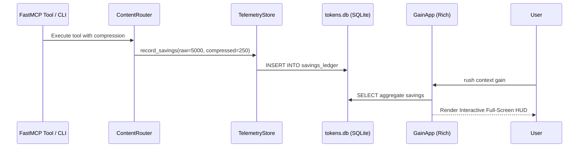

# Phase 45: Observability, Session Deduplication & Flagship Context Gain TUI

## Metadata
- **Phase ID**: `PHASE-45` (Phase 45 of Innovation Roadmap)
- **Phase Name**: Context Gain TUI Dashboard, Token Telemetry Ledger & Terse Persona Mode
- **Plan Version**: `v1.1.0`
- **Phase Implementation Version**: `v0.3.0-alpha.5`
- **Plan Status**: `READY_FOR_EXECUTION`
- **Source Report Path**: [`docs/rush-token-innovation-enhancement-report-plan.md`](file:///C:/Users/james/developer/rush-cli/docs/rush-token-innovation-enhancement-report-plan.md)
- **Governing ADRs**: [`ADR-0045`](file:///C:/Users/james/developer/rush-cli/docs/adr/0045-real-time-terminal-gain-hud-and-telemetry.md)
- **Repository Path**: `C:\Users\james\developer\rush-cli`
- **Baseline Branch**: `main`
- **Baseline Commit**: `e76c4035a6997b7e27dd603e81a625870bc2af87`
- **Application Version**: `0.3.0-alpha.4` -> `0.3.0-alpha.5`
- **Planned Implementation Branch**: `feat/phase-45-gain-tui-telemetry`
- **Planned Worktree Path**: `.rush/worktrees/phase-45-gain-tui`
- **Planned Final Commit Message**: `feat(phase-45): implement context gain TUI dashboard, telemetry ledger, and terse persona`
- **Phase Owner**: Developer Experience & Telemetry Engineer
- **Prerequisite Phases**: Phase 04 (`PHASE-44`)
- **Dependent Phases**: Phase 06 (`PHASE-46`)
- **Estimated Complexity**: Medium (10 Story Points)
- **Risk Level**: Low
- **Last Reviewed Date**: 2026-08-22

---

## 1. Phase Summary
Phase 05 provides terminal visibility and telemetry proof for Rush's Context Intelligence platform. It builds the interactive Rich full-screen terminal TUI (`rush context gain`), implements the local SQLite token economy telemetry ledger (`.rush/telemetry/tokens.db`), and introduces the terse persona output shaper (`rush context persona` / `--style terse`) cutting conversational filler by 40–60%.

---

## 2. Initial Goal
Provide undeniable visual and numerical proof of token savings and dollar cost reductions directly in the developer terminal while offering concise agent response modes.

---

## 3. End-State Outcome
1. **Interactive Terminal HUD**: Developers launch `rush context gain` to view live graphs of token savings, compression ratios, and estimated dollar savings across Claude, OpenAI, and Gemini models.
2. **Telemetry Ledger**: SQLite ledger records every distillation, skeletonization, and TOON serialization event in `.rush/telemetry/tokens.db`.
3. **Terse Persona Mode**: `--style terse` shapes FastMCP system instructions to enforce concise, bulleted responses without conversational fluff.

---

## 4. User and Agent Value
* **User Value**: Transparent insight into AI spend and token efficiency; faster reading speed with concise outputs.
* **Agent Value**: Telemetry self-inspection allows agents to report cost savings directly to users.

---

## 5. Scope Included
* `T09`: Terse Output Shaper & Persona Mode (`src/rush/token_economy/output_shaper.py`).
* `T10`: Context Gain TUI Dashboard & Telemetry Ledger (`src/rush/token_economy/tui_gain.py`, `src/rush/token_economy/telemetry.py`).

---

## 6. Scope Explicitly Excluded
* Blast radius graph traversal (deferred to Phase 06).
* Flaky test healing (deferred to Phase 07).

---

## 7. Current Repository State
* Phases 01–04 active.
* Rich 13.9.4 and SQLite WAL available.

---

## 8. Existing Behavior
No visual terminal dashboard for token efficiency; conversational agents output verbose greeting/summary paragraphs that consume unnecessary tokens.

---

## 9. Desired Behavior
Interactive full-screen terminal HUD renders token compression metrics in real-time. Terse persona trims 50%+ of output tokens.

---

## 10. Functional Requirements
* `FR-05-01`: `TelemetryStore` must record `raw_tokens`, `compressed_tokens`, `latency_ms`, and `provider`.
* `FR-05-02`: `rush context gain` must render a Rich Layout with charts, totals, and dollar savings.
* `FR-05-03`: `OutputShaper` must apply concise formatting rules when `--style terse` is set.

---

## 11. Non-Functional Requirements
* TUI render cycle $<30\text{ ms}$ (60 FPS smooth terminal rendering).
* Telemetry write overhead $<0.5\text{ ms}$ per event.

---

## 12. Invariants That Must Not Change
* **AGENTS.md Stdio Transport Invariant**: Rush is a stdio-only MCP server. Stdout is reserved strictly for JSON-RPC messages during FastMCP serve mode; all diagnostics, telemetry summaries, and logs belong on stderr. All external commands must execute via `run_subprocess()` with `stdin=DEVNULL`, preventing any child process from hijacking or corrupting the MCP stdio transport.
* **Transport Seam Equality**: CLI subcommands and FastMCP tool registrations must call the exact same underlying implementations in `src/rush/tools/`, `src/rush/token_economy/`, or `src/rush/codegraph/`. Never duplicate tool execution logic in the transport adapter layer.
* **Canonical ToolResult Shape**: All tools must emit structured results matching the canonical `ToolResult` shape (`tool`, `engine`, `version`, `status`, `duration_ms`, `summary`, `findings`), with optional `--format toon` wire serialization.
* Telemetry must never record private source code, secrets, or prompts (pure numerical metrics only).

---

---

## 13. Dependencies and Prerequisites
* Rich, SQLite, Phase 04 deliverables.

---

## 14. Exact Files Allowed to Modify

| File Path | Target Symbols / Sections | Permitted Change Type | Rationale |
|---|---|---|---|
| `src/rush/cli.py` | CLI Routing Groups | Modify | Register `rush context gain`, `rush context persona`. |
| `src/rush/mcp.py` | FastMCP Middleware | Modify | Inject `OutputShaper` into FastMCP system prompt. |
| `src/rush/token_economy/router.py` | Routing Logic | Modify | Hook telemetry recording. |

---

## 15. Exact Files Allowed to Create

| File Path | Purpose | Owner Subsystem | Tests Covering | Docs Describing |
|---|---|---|---|---|
| `src/rush/token_economy/telemetry.py` | SQLite telemetry ledger | Telemetry Subsystem | `test_telemetry.py` | `docs/specs/telemetry-ledger.md` |
| `src/rush/token_economy/tui_gain.py` | Rich full-screen gain dashboard | TUI Subsystem | `test_gain_tui.py` | `docs/USER_GUIDE.md` |
| `src/rush/token_economy/output_shaper.py` | Terse persona output shaper | Token Economy | `test_output_shaper.py` | `docs/specs/terse-persona.md` |

---

## 16. Exact Files That Are Read-Only
* `src/rush/integrations/graft.py`
* `src/rush/token_economy/toon/`
* `src/rush/token_economy/ccr_store.py`

---

## 17. Exact Files and Directories That Must Not Be Touched
* `src/rush/tools/ship/`
* `src/rush/memory/`

---

## 18. Required Symbols, Interfaces, Commands, and Schemas

```python
class TelemetryStore:
    def record_savings(self, tool_name: str, raw_tokens: int, compressed_tokens: int, duration_ms: float) -> None: ...
    def get_summary(self) -> dict[str, Any]: ...

class OutputShaper:
    def shape_response(self, text: str, style: str = "terse") -> str: ...
```

---

## 19. Agent Interaction Design
* FastMCP tool `rush_context_gain_stats()` returns numerical summary: `{"net_savings_tokens": 1420500, "dollar_savings_est": 4.26, "compression_ratio": 0.74}`.

---

## 20. Application Integration Design
* Wires into `src/rush/cli.py` and FastMCP middleware.

---

## 21. Data Flow and Control Flow



---

## 22. Error Handling and Fallback Behavior

| Error Code | Classification | Severity | Condition | Fallback Action |
|---|---|---|---|---|
| `ERR-TUI-NON-TTY` | Terminal | Info | Terminal is non-interactive (CI) | Fallback to flat markdown table |
| `ERR-TEL-WRITE-FAIL`| Telemetry | Warning | SQLite ledger locked | Write to in-memory ring buffer |

---

## 23. Logging and Observability
* Telemetry database located at `.rush/telemetry/tokens.db`.

---

## 24. Versioning and Compatibility
* Fully backward-compatible.

---

## 25. TDD Strategy (Red-Green-Refactor)
1. Write telemetry recording and dollar pricing calculation tests.
2. Write non-interactive fallback table rendering tests.
3. Write persona output shaping tests.

---

## 26. Ordered Implementation Tasks
- [ ] **TASK-05-01**: Implement `TelemetryStore` in `src/rush/token_economy/telemetry.py`.
- [ ] **TASK-05-02**: Implement `GainApp` Rich dashboard in `src/rush/token_economy/tui_gain.py`.
- [ ] **TASK-05-03**: Implement `OutputShaper` in `src/rush/token_economy/output_shaper.py`.
- [ ] **TASK-05-04**: Connect CLI commands and FastMCP tool.
- [ ] **TASK-05-05**: Run regression test suite and doc sync.

---

## 27. Test Plan
* `tests/test_telemetry.py`: Verify savings ledger insertion, aggregation, and dollar estimates.
* `tests/test_gain_tui.py`: Verify Rich layout generation and CI non-interactive fallback.
* `tests/test_output_shaper.py`: Verify `--style terse` formatting rules.

---

## 28. Documentation Updates

Every implementation of this phase MUST update the entire documentation matrix across all categories before committing:

### 1. Root & Reference Documentation
* docs/README.md: Add phase feature highlights and overview.
* docs/ARCHITECTURE.md: Document new subsystem architecture and data flow.
* docs/CLI_REFERENCE.md: Full syntax, arguments, flags, and exit codes for all new subcommands.
* docs/CLI_COOKBOOK.md: Real-world command workflows and recipe examples.
* docs/MCP_REFERENCE.md: Schemas and descriptions for all newly registered FastMCP tools.
* docs/CONFIGURATION.md: TOML configuration tables and environment variables.
* docs/TOOL_CATALOG.md: Catalog entries, tool maturity flags, and format options.
* docs/GLOSSARY.md & docs/getting-started/glossary.md: Define all new domain terms.
* docs/FAQ.md & docs/user-guide/faq.md: User and agent Q&A.

### 2. User & Agent Guides
* docs/USER_GUIDE.md: Core user walkthrough of new features.
* docs/AGENTIC_RUSH.md: Agent interaction protocols and tool call guidelines.
* docs/user-guide/advanced-checks.md & docs/user-guide/checking-code.md: Specific checking procedures.
* docs/user-guide/everyday-workflow.md & docs/user-guide/working-with-ai-agents.md: Day-to-day patterns.

### 3. Specifications & Workflows
* docs/specs/<feature>-spec.md: Formal wire and data architecture specifications.
* docs/workflows/<feature>-workflow.md: Step-by-step developer and agent workflows.

### 4. Vibecoding & Tutorials
* docs/VIBECODING.md & docs/vibecoding/*.md: Instant-feedback and token-diet patterns.
* docs/tutorials/*.md: Step-by-step project onboarding and PR preparation guides.

### 5. Developer, Maintainers & Safety
* docs/developer/architecture.md & docs/developer/source-tree.md: Directory map updates.
* docs/developer/tool-development.md & docs/developer/contributor-onboarding.md: Extensibility instructions.
* docs/developer/backlog.md & docs/developer/issues.md: Milestone progress status updates.
* docs/maintainers/*.md: Release playbooks and maintenance checklists.
* docs/SAFETY.md, docs/SECURITY.md, docs/CI_INTEGRATION.md, docs/RELEASE.md: Safety and pipeline guides.

## 29. Worktree Workflow

> [!IMPORTANT]
> **NO AUTOMATIC MERGE POLICY**: All implementation, tests, and documentation must be completed and committed exclusively on the dedicated feature branch inside the worktree. **DO NOT MERGE TO `main`**. Merging to `main` is strictly prohibited unless explicitly requested and approved by the user.
* **Worktree Path**: `.rush/worktrees/phase-45-gain-tui`
* **Branch**: `feat/phase-45-gain-tui-telemetry`
* **Creation Command**:
  ```bash
  git worktree add -b feat/phase-45-gain-tui-telemetry .rush/worktrees/phase-45-gain-tui main
  ```

---

## 30. Commit Requirements

> [!IMPORTANT]
> **COMMIT-ONLY MANDATE**: Commit all code, test suites, and the comprehensive 5-tier documentation matrix atomically to the feature branch. **DO NOT execute `git merge` or fast-forward `main`**. Stop after committing to the feature branch and present deliverables for user review and approval.
* **Commit Message**: `feat(phase-45): implement context gain TUI dashboard, telemetry ledger, and terse persona`

---

## 31. Validation Checklist
- [ ] `rush context gain` renders interactive Rich terminal HUD.
- [ ] Non-interactive environments fallback cleanly to plain text.
- [ ] Telemetry contains zero code or secret leaks.
- [ ] `scripts/sync_docs.py --check` passes with 100% parity.

---

## 32. Acceptance Criteria
* All telemetry and TUI tests pass with zero regressions.

---

## 33. Exit Criteria
* All tasks complete, tests green, worktree clean.

---

## 34. Risks and Mitigations
* *Risk*: Terminal resizing causes Rich layout exception. *Mitigation*: Wrap layout updates in exception handler with graceful re-render.

---

## 35. Rollback and Recovery
* Purge `.rush/telemetry/tokens.db`.

---

## 36. Final Phase Deliverables
* `src/rush/token_economy/telemetry.py`
* `src/rush/token_economy/tui_gain.py`
* `src/rush/token_economy/output_shaper.py`
* Complete unit test suite and user guide.

---

## 37. Open Questions and Decisions Required
* None.
