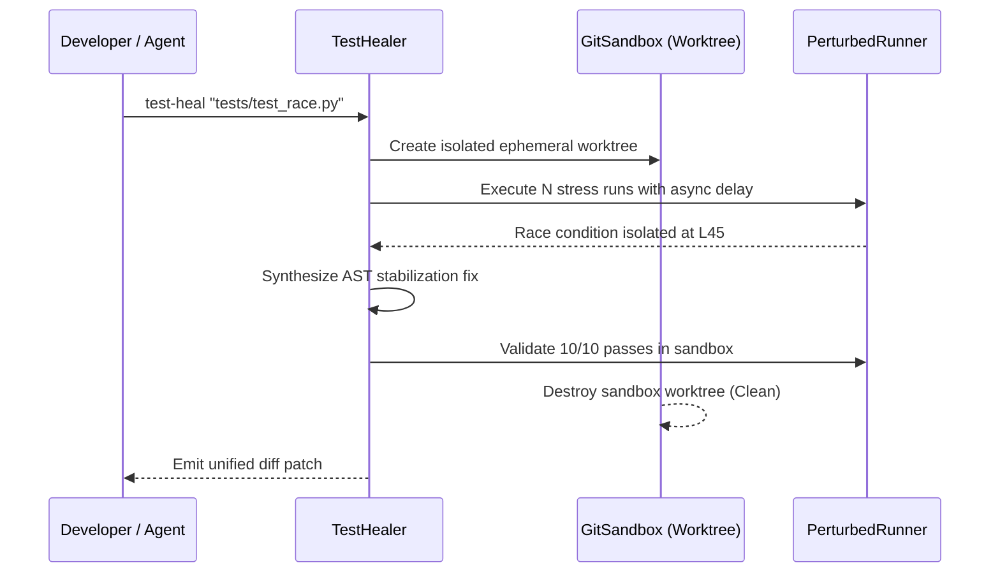

# Phase 47: Flaky Test Healer & Zero-Shot API Breaking Change Detector

## Metadata
- **Phase ID**: `PHASE-47` (Phase 47 of Innovation Roadmap)
- **Phase Name**: Autonomous Flaky Test Healer & Public API Breaking Change Detector
- **Plan Version**: `v1.1.0`
- **Phase Implementation Version**: `v0.3.0-alpha.7`
- **Plan Status**: `READY_FOR_EXECUTION`
- **Source Report Path**: [`docs/rush-token-innovation-enhancement-report-plan.md`](file:///C:/Users/james/developer/rush-cli/docs/rush-token-innovation-enhancement-report-plan.md)
- **Governing ADRs**: [`ADR-0021`](file:///C:/Users/james/developer/rush-cli/docs/adr/0021-ephemeral-git-worktree-sandboxing.md), [`ADR-0034`](file:///C:/Users/james/developer/rush-cli/docs/adr/0034-autonomous-flaky-test-stress-perturbation-and-self-healing.md)
- **Repository Path**: `C:\Users\james\developer\rush-cli`
- **Baseline Branch**: `main`
- **Baseline Commit**: `e76c4035a6997b7e27dd603e81a625870bc2af87`
- **Application Version**: `0.3.0-alpha.6` -> `0.3.0-alpha.7`
- **Planned Implementation Branch**: `feat/phase-47-test-heal-api-diff`
- **Planned Worktree Path**: `.rush/worktrees/phase-47-test-heal`
- **Planned Final Commit Message**: `feat(phase-47): implement autonomous flaky test healer and public API breaking change detector`
- **Phase Owner**: Reliability & API Contract Engineer
- **Prerequisite Phases**: Phase 06 (`PHASE-46`)
- **Dependent Phases**: Phase 08 (`PHASE-48`), Phase 09 (`PHASE-49`)
- **Estimated Complexity**: High (14 Story Points)
- **Risk Level**: Medium
- **Last Reviewed Date**: 2026-08-22

---

## 1. Phase Summary
Phase 07 equips Rush with autonomous test stabilization and API contract protection. It introduces the Autonomous Flaky Test Healer (`rush test-heal`), executing non-destructive stress perturbation in isolated ephemeral Git worktrees, and implements the Zero-Server Public API Signature Diff & Breaking Change Contract Detector (`rush api-diff`).

---

## 2. Initial Goal
Eliminate CI non-determinism from flaky tests without risking working-tree corruption, and catch breaking REST/gRPC/library changes before pull request merges.

---

## 3. End-State Outcome
1. **Autonomous Flaky Test Healer**: `rush test-heal --target <TEST>` creates a throwaway worktree (`.rush/worktrees/sandbox-<PID>`), perturbs execution timing/ordering, diagnoses root cause, synthesizes minimal AST stabilization fixes, and self-verifies.
2. **Public API Contract Differ**: `rush api-diff --base main` performs AST semantic diffing on public symbols and OpenAPI routes, detecting removed parameters, narrowed return types, and renamed routes.

---

## 4. User and Agent Value
* **User Value**: Clean CI runs without random retries; prevents accidental breaking changes for downstream SDK consumers.
* **Agent Value**: Agents can isolate and test experimental fixes in parallel sandboxes with zero danger of corrupting developer workspaces.

---

## 5. Scope Included
* `I05`: Flaky Test Stress Perturbation & Healer in Git Worktrees (`src/rush/tools/test_heal.py`, `src/rush/core/git_sandbox.py`).
* `I06`: Zero-Server Public API Signature Diff & Breaking Change Detector (`src/rush/tools/api_diff.py`).

---

## 6. Scope Explicitly Excluded
* Database migration drift (deferred to Phase 08).
* Swarm 3-way merge conflict resolution (deferred to Phase 09).

---

## 7. Current Repository State
* Phases 01–06 active.
* Tree-sitter and Subprocess Distillers available.

---

## 8. Existing Behavior
Flaky tests require manual timing adjustments and rerun guesswork; API breaking changes are discovered only after client applications crash in production.

---

## 9. Desired Behavior
1-command `rush test-heal` diagnoses and repairs async race conditions in a sandboxed worktree; `rush api-diff` blocks PR merges on breaking interface changes.

---

## 10. Functional Requirements
* `FR-07-01`: `GitSandbox` must create, isolate, and guarantee cleanup of `.rush/worktrees/sandbox-*`.
* `FR-07-02`: `TestHealer` must inject non-destructive perturbations (shuffle, async delay, resource pressure).
* `FR-07-03`: `ApiDiffer` must extract public signatures and compare against base Git ref.

---

## 11. Non-Functional Requirements
* Worktree creation and teardown $<500\text{ ms}$.
* API diff AST comparison $<100\text{ ms}$ across 1,000 public exports.

---

## 12. Invariants That Must Not Change
* **AGENTS.md Stdio Transport Invariant**: Rush is a stdio-only MCP server. Stdout is reserved strictly for JSON-RPC messages during FastMCP serve mode; all diagnostics, telemetry summaries, and logs belong on stderr. All external commands must execute via `run_subprocess()` with `stdin=DEVNULL`, preventing any child process from hijacking or corrupting the MCP stdio transport.
* **Transport Seam Equality**: CLI subcommands and FastMCP tool registrations must call the exact same underlying implementations in `src/rush/tools/`, `src/rush/token_economy/`, or `src/rush/codegraph/`. Never duplicate tool execution logic in the transport adapter layer.
* **Canonical ToolResult Shape**: All tools must emit structured results matching the canonical `ToolResult` shape (`tool`, `engine`, `version`, `status`, `duration_ms`, `summary`, `findings`), with optional `--format toon` wire serialization.
* Ephemeral worktrees must be cleaned up in `finally:` blocks even on SIGINT.
* Developer working directory must remain pristine.

---

---

## 13. Dependencies and Prerequisites
* Git CLI, Tree-sitter, Phase 06 deliverables.

---

## 14. Exact Files Allowed to Modify

| File Path | Target Symbols / Sections | Permitted Change Type | Rationale |
|---|---|---|---|
| `src/rush/cli.py` | CLI Routing Groups | Modify | Register `rush test-heal`, `rush api-diff`. |
| `src/rush/mcp.py` | FastMCP Tool Registrations | Modify | Register `rush_test_heal`, `rush_api_diff`. |

---

## 15. Exact Files Allowed to Create

| File Path | Purpose | Owner Subsystem | Tests Covering | Docs Describing |
|---|---|---|---|---|
| `src/rush/core/git_sandbox.py` | Ephemeral worktree isolation manager | Core Infrastructure | `test_git_sandbox.py` | `docs/specs/git-sandbox.md` |
| `src/rush/tools/test_heal.py` | Flaky test healer tool | Quality Tools | `test_test_heal.py` | `docs/tools/test_heal.md` |
| `src/rush/tools/api_diff.py` | API breaking change detector | Quality Tools | `test_api_diff.py` | `docs/tools/api_diff.md` |

---

## 16. Exact Files That Are Read-Only
* `src/rush/integrations/graft.py`
* `src/rush/token_economy/`
* `src/rush/tools/ship/`

---

## 17. Exact Files and Directories That Must Not Be Touched
* `src/rush/memory/`
* `src/rush/vibecoder/`

---

## 18. Required Symbols, Interfaces, Commands, and Schemas

```python
class GitSandbox:
    def __init__(self, base_ref: str = "HEAD", prefix: str = "sandbox"): ...
    def __enter__(self) -> Path: ...
    def __exit__(self, exc_type, exc_val, exc_tb) -> None: ...

class TestHealer:
    def diagnose_and_heal(self, test_path: str, runs: int = 10) -> dict[str, Any]: ...

class ApiDiffer:
    def diff_public_api(self, project_root: Path, base_ref: str = "main") -> list[dict[str, Any]]: ...
```

---

## 19. Agent Interaction Design
* FastMCP Tool `rush_test_heal(test_file="tests/test_async.py")` runs sandboxed diagnosis and returns diff patch.

---

## 20. Application Integration Design
* `rush api-diff` integrates with `rush ship semver` and GitHub Actions CI.

---

## 21. Data Flow and Control Flow



---

## 22. Error Handling and Fallback Behavior

| Error Code | Classification | Severity | Condition | Fallback Action |
|---|---|---|---|---|
| `ERR-HEAL-TIMEOUT` | Healing | Warning | Test does not stabilize after max iterations | Return failure report with logs |
| `ERR-SANDBOX-CREATE`| Git | Error | Unable to create ephemeral worktree | Abort and cleanup temporary files |

---

## 23. Logging and Observability
* Record test healing traces in `.rush/telemetry/test_heals.log`.

---

## 24. Versioning and Compatibility
* Fully backward-compatible.

---

## 25. TDD Strategy (Red-Green-Refactor)
1. Write sandboxed worktree lifecycle tests with forced exception cleanup.
2. Write flaky timing test simulations and assert successful diagnosis.
3. Write API signature diff tests with added, removed, and narrowed parameters.

---

## 26. Ordered Implementation Tasks
- [ ] **TASK-07-01**: Implement `GitSandbox` in `src/rush/core/git_sandbox.py`.
- [ ] **TASK-07-02**: Implement `TestHealer` in `src/rush/tools/test_heal.py`.
- [ ] **TASK-07-03**: Implement `ApiDiffer` in `src/rush/tools/api_diff.py`.
- [ ] **TASK-07-04**: Wire CLI commands and FastMCP tools.
- [ ] **TASK-07-05**: Run regression test suite and doc sync.

---

## 27. Test Plan
* `tests/test_git_sandbox.py`: Worktree creation, branch isolation, and guaranteed exception teardown.
* `tests/test_test_heal.py`: Async race condition diagnosis, stress loops, patch verification.
* `tests/test_api_diff.py`: Public function signature removal, parameter type narrowing, route drift.

---

## 28. Documentation Updates

Every implementation of this phase MUST update the entire documentation matrix across all categories before committing:

### 1. Root & Reference Documentation
* docs/README.md: Add phase feature highlights and overview.
* docs/ARCHITECTURE.md: Document new subsystem architecture and data flow.
* docs/CLI_REFERENCE.md: Full syntax, arguments, flags, and exit codes for all new subcommands.
* docs/CLI_COOKBOOK.md: Real-world command workflows and recipe examples.
* docs/MCP_REFERENCE.md: Schemas and descriptions for all newly registered FastMCP tools.
* docs/CONFIGURATION.md: TOML configuration tables and environment variables.
* docs/TOOL_CATALOG.md: Catalog entries, tool maturity flags, and format options.
* docs/GLOSSARY.md & docs/getting-started/glossary.md: Define all new domain terms.
* docs/FAQ.md & docs/user-guide/faq.md: User and agent Q&A.

### 2. User & Agent Guides
* docs/USER_GUIDE.md: Core user walkthrough of new features.
* docs/AGENTIC_RUSH.md: Agent interaction protocols and tool call guidelines.
* docs/user-guide/advanced-checks.md & docs/user-guide/checking-code.md: Specific checking procedures.
* docs/user-guide/everyday-workflow.md & docs/user-guide/working-with-ai-agents.md: Day-to-day patterns.

### 3. Specifications & Workflows
* docs/specs/<feature>-spec.md: Formal wire and data architecture specifications.
* docs/workflows/<feature>-workflow.md: Step-by-step developer and agent workflows.

### 4. Vibecoding & Tutorials
* docs/VIBECODING.md & docs/vibecoding/*.md: Instant-feedback and token-diet patterns.
* docs/tutorials/*.md: Step-by-step project onboarding and PR preparation guides.

### 5. Developer, Maintainers & Safety
* docs/developer/architecture.md & docs/developer/source-tree.md: Directory map updates.
* docs/developer/tool-development.md & docs/developer/contributor-onboarding.md: Extensibility instructions.
* docs/developer/backlog.md & docs/developer/issues.md: Milestone progress status updates.
* docs/maintainers/*.md: Release playbooks and maintenance checklists.
* docs/SAFETY.md, docs/SECURITY.md, docs/CI_INTEGRATION.md, docs/RELEASE.md: Safety and pipeline guides.

## 29. Worktree Workflow

> [!IMPORTANT]
> **NO AUTOMATIC MERGE POLICY**: All implementation, tests, and documentation must be completed and committed exclusively on the dedicated feature branch inside the worktree. **DO NOT MERGE TO `main`**. Merging to `main` is strictly prohibited unless explicitly requested and approved by the user.
* **Worktree Path**: `.rush/worktrees/phase-47-test-heal`
* **Branch**: `feat/phase-47-test-heal-api-diff`
* **Creation Command**:
  ```bash
  git worktree add -b feat/phase-47-test-heal-api-diff .rush/worktrees/phase-47-test-heal main
  ```

---

## 30. Commit Requirements

> [!IMPORTANT]
> **COMMIT-ONLY MANDATE**: Commit all code, test suites, and the comprehensive 5-tier documentation matrix atomically to the feature branch. **DO NOT execute `git merge` or fast-forward `main`**. Stop after committing to the feature branch and present deliverables for user review and approval.
* **Commit Message**: `feat(phase-47): implement autonomous flaky test healer and public API breaking change detector`

---

## 31. Validation Checklist
- [ ] Sandboxed worktree is 100% destroyed after execution.
- [ ] Flaky test healer detects timing races.
- [ ] API differ flags breaking parameter removals.
- [ ] `scripts/sync_docs.py --check` passes with 100% parity.

---

## 32. Acceptance Criteria
* All test healer, sandbox, and API diff tests pass cleanly.

---

## 33. Exit Criteria
* All tasks complete, tests green, worktree clean.

---

## 34. Risks and Mitigations
* *Risk*: Orphaned Git worktrees on crash. *Mitigation*: Register `atexit` and signal handlers in `GitSandbox`.

---

## 35. Rollback and Recovery
* Purge `.rush/worktrees/`; disable `tools.test_heal` in `rush.toml`.

---

## 36. Final Phase Deliverables
* `src/rush/core/git_sandbox.py`
* `src/rush/tools/test_heal.py`
* `src/rush/tools/api_diff.py`
* Complete unit test suite and reference documentation.

---

## 37. Open Questions and Decisions Required
* None.
