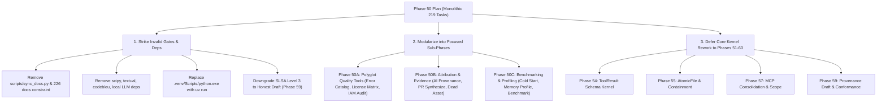

# Adversarial Review of Phase 50 Implementation Plan

**Target Document:** [`docs/phase-plans/phase-50-slsa-attestation-security-suite-flagship-plan.md`](file:///C:/Users/james/developer/rush-cli/docs/phase-plans/phase-50-slsa-attestation-security-suite-flagship-plan.md)
**Target Commit Baseline:** `13861ab73d767fb0002e12d8cef03763f391fc2b` (main)
**Review Date:** 2026-09-03
**Governing Skill & Protocol:** [`skills/adversarial-plan-review/SKILL.md`](file:///C:/Users/james/developer/rush-cli/skills/adversarial-plan-review/SKILL.md)
**Status:** Complete — **VERDICT: REJECT / BLOCKED PENDING ARCHITECTURAL RESTRUCTURING**

---

## 1. Executive Summary and Adjudication

An adversarial audit of the 12,735-line, 219-task Phase 50 implementation plan ([`phase-50-slsa-attestation-security-suite-flagship-plan.md`](file:///C:/Users/james/developer/rush-cli/docs/phase-plans/phase-50-slsa-attestation-security-suite-flagship-plan.md)) was conducted against the repository codebase, [`AGENTS.md`](file:///C:/Users/james/developer/rush-cli/AGENTS.md), [`pyproject.toml`](file:///C:/Users/james/developer/rush-cli/pyproject.toml), the repository remediation program ([`docs/developer/repository-remediation-plan.md`](file:///C:/Users/james/developer/rush-cli/docs/developer/repository-remediation-plan.md)), and the successor phase plans ([`phase-51`](file:///C:/Users/james/developer/rush-cli/docs/phase-plans/phase-51-remediation-scope-release-gates-plan.md) through [`phase-60`](file:///C:/Users/james/developer/rush-cli/docs/phase-plans/phase-60-maintainability-hotspot-reduction-plan.md)).

### Core Adjudication Verdict

**REJECT / EXECUTION BLOCKED.** The plan cannot be executed in its present state. It contains **4 Critical (P0) blockers**, **3 High (P1) architectural defects**, and **3 Medium (P2) governance contradictions**.

If executed unchanged, the plan will:
1. **Deadlock immediately at admission** due to demanding non-existent scripts (`scripts/sync_docs.py`) and failing baseline test thresholds (847 tests vs `>850` required).
2. **Fail 100% of CI and non-Windows runs** due to 834 hardcoded Windows executable paths (`.venv/Scripts/python.exe`).
3. **Violate repository architecture (§13)** by introducing heavy, fragile dependencies (`scipy`, `textual`, `codebleu`, local LLM runtimes) into a minimal-dependency, sub-5ms CLI.
4. **Perpetuate fraudulent security claims** by re-introducing unsupported SLSA Level 3 attestation assertions that repository remediation Finding R-013 explicitly banned.
5. **Directly collide with and invalidate Phases 51–60** by building 14 complex tool families on top of a vulnerable codebase while attempting ad-hoc, conflicting fixes for kernel infrastructure (atomic writes, permissions, option schemas) that Phases 54, 55, 57, and 58 are formally scheduled to remediate.

---

## 2. Claim Ledger and Verification Matrix

| Claim ID | Plan Location | Material Claim | Falsification / Empirical Finding | Status |
|---|---|---|---|---|
| **CL-01** | Line 34, 404 | `docs/developer/repository-remediation-plan.md` is absent; no requirement is invented or reduced from it. | **FALSIFIED.** The file exists and governs active development (Phases 51–60). Ignoring it produces direct architectural collisions. | **BROKEN** |
| **CL-02** | Line 32, 42, 116, 12717 | `scripts/sync_docs.py --check across 226 docs` is mandatory source behavior; absence is an admission blocker. | **FALSIFIED.** `scripts/sync_docs.py` does not exist in the repository. Markdown files in `docs/` total 319, not 226. Causes immediate deadlock. | **DEADLOCK** |
| **CL-03** | Lines 385, 416, 471+ (834 occurrences) | Checks must execute `.venv/Scripts/python.exe` and `.venv/Scripts/ruff.exe`. | **FALSIFIED.** Hardcodes Windows-only paths. Fails on Linux/macOS CI runners (`.venv/bin/python`). Breaks OS-independence. | **BROKEN** |
| **CL-04** | Line 27, 56, 212–213 | I16 provides verified hosted-builder SLSA Level 3 build provenance. | **FALSIFIED.** Rush is a local CLI/MCP server, not an isolated hosted build service. Local CLI cannot achieve SLSA Build L3; violates R-013. | **SECURITY VIOLATION** |
| **CL-05** | Line 114 | Rush must depend on `scipy`, `textual`, `pillow`, `codebleu`, `tree-sitter-language-pack`, `psutil`. | **FALSIFIED.** Violates `pyproject.toml` Architecture §13 (minimal deps, no pydantic) and AGENTS.md engine-discovery contract. | **ARCH VIOLATION** |
| **CL-06** | Lines 61, 62, 130–131 | I22 full-screen keyboard TUI and I21 JSX image optimization belong in Rush. | **FALSIFIED.** Violates AGENTS.md scope rules prohibiting UI design tools, visual canvases, and frontend build-step tooling. Risks MCP stdio corruption. | **SCOPE CREEP** |
| **CL-07** | Line 42, 12717 | Acceptance requires full suite `>850` tests; baseline is verified in P50-001. | **FALSIFIED.** Current main suite has exactly 847 tests. Baseline check fails immediately before any task can start. | **DEADLOCK** |
| **CL-08** | Lines 9, 143–367 | 219 tasks across 14 capability families can be executed in one monolithic phase. | **FALSIFIED.** 1.32 MB document, 12,735 lines. Unmanageable blast radius, context window exhaustion, and brittle repo-wide SHA manifests. | **UNEXECUTABLE** |
| **CL-09** | Line 11, 31, 139 | Tool matrix is exactly 38 current + 14 Phase 50 = 52 rows; 5 Phase 50 tools exist. | **FALSIFIED.** Ignores 20 of the 25 manual MCP tools in `src/rush/mcp.py` (Finding R-004), leaving them unmanaged. | **INCOMPLETE** |
| **CL-10** | Entire plan | Navigation uses Graft, but plan never rebuilds graph after adding 14 families. | **FALSIFIED.** Zero occurrences of `graft build`. Leaves repo context graph permanently out of sync. | **OMISSION** |

---

## 3. Detailed Adversarial Findings and Potential Fixes

### ADV-P50-001 (Severity: P0 - Critical)
**Title:** Critical Architecture & Sequencing Collision with Repository Remediation Program (Phases 51–60)
**Target Plan Section:** Section 1 (lines 7–11), Section 2 (line 34), Section 5 (lines 49–69), Section 9.1 (P50-001..P50-019, line 404).
**Attack Thesis & Evidence:**
The plan explicitly notes in line 34:
> *"Missing remediation source: docs/developer/repository-remediation-plan.md is absent from the isolated planning worktree; no requirement is invented from it and no source requirement is reduced."*

This premise is completely false in the actual repository. [`docs/developer/repository-remediation-plan.md`](file:///C:/Users/james/developer/rush-cli/docs/developer/repository-remediation-plan.md) is present, authoritative, and governs the active repository roadmap ([`docs/phase-plans/README.md`](file:///C:/Users/james/developer/rush-cli/docs/phase-plans/README.md)), which structures remediation into Phases 51 through 60.
Because the author operated in isolation without reading the remediation plan:
1. Phase 50 attempts to build 14 massive capability families on top of a codebase that currently has broken wheel packaging (R-001), leaking credential sanitization (R-002), plugin remote execution vulnerabilities (R-003), an unvalidated 25-tool MCP split (R-004), racy locks (R-009), and corruptible persistence (R-010).
2. Tasks P50-002 through P50-019 attempt an ad-hoc, competing implementation of atomic writes ([`common.py`](file:///C:/Users/james/developer/rush-cli/src/rush/tools/common.py)), option declarations ([`catalog.py`](file:///C:/Users/james/developer/rush-cli/src/rush/catalog.py)), and permission checks. These ad-hoc changes directly collide with Phase 54 ([`phase-54-tool-result-schema-kernel-plan.md`](file:///C:/Users/james/developer/rush-cli/docs/phase-plans/phase-54-tool-result-schema-kernel-plan.md)), Phase 55 ([`phase-55-atomic-file-physical-containment-plan.md`](file:///C:/Users/james/developer/rush-cli/docs/phase-plans/phase-55-atomic-file-physical-containment-plan.md)), Phase 57 ([`phase-57-invocation-scope-operations-cache-egress-plan.md`](file:///C:/Users/james/developer/rush-cli/docs/phase-plans/phase-57-invocation-scope-operations-cache-egress-plan.md)), and Phase 58 ([`phase-58-lock-persistence-patch-fail-closed-plan.md`](file:///C:/Users/james/developer/rush-cli/docs/phase-plans/phase-58-lock-persistence-patch-fail-closed-plan.md)).

**Failure Narrative & Consequence:**
If Phase 50 is executed, 14 feature families will be coupled to temporary, ad-hoc `common.py` atomic write helpers and unvalidated transport wrappers. When Phases 51–60 execute their remediation contracts, the entire Phase 50 implementation will be broken or have to be rewritten. Conversely, declaring Phase 50 a "flagship release" releases code with known critical security vulnerabilities.
**Potential Fix:**
1. Strike all claims that `repository-remediation-plan.md` is absent. Acknowledge the governing remediation roadmap.
2. Remove tasks P50-002 through P50-019 from Phase 50. Do not invent competing persistence or option primitives in `common.py`.
3. Re-sequence Phase 50: Phase 50 must either (a) implement only lightweight, read-only tools that conform strictly to existing [`base.py`](file:///C:/Users/james/developer/rush-cli/src/rush/tools/base.py) `ToolFn` contracts, or (b) be scheduled to consume the hardened kernel delivered by Phases 51–59 before declaring any flagship release.
4. Update [`docs/phase-plans/README.md`](file:///C:/Users/james/developer/rush-cli/docs/phase-plans/README.md) to clarify the relationship between Phase 50 innovation tools and Phases 51–60 remediation.
**Required Evidence for Closure:** Removal of competing primitives; alignment of Phase 50 contracts with Phase 54 (`ToolResultV1`) and Phase 55 (`AtomicFile`).

---

### ADV-P50-002 (Severity: P0 - Critical)
**Title:** Self-Deadlocking Admission & Exit Gate: Non-Existent `scripts/sync_docs.py`
**Target Plan Section:** Section 2 (line 32), Section 3 (line 42), Section 8.1 (lines 116–117), Section 10 (line 12717), Section 11 (line 12732), tasks P50-202/P50-203.
**Attack Thesis & Evidence:**
Section 2 explicitly establishes:
> *"Documentation sync: scripts/sync_docs.py --check across 226 docs remains required source behavior; its absence is a blocker, and scripts/update_phase_docs.py is not a substitute."*

Section 10 reiterates:
> *"Missing scripts/sync_docs.py, missing measurements, or any source-label/count contradiction is an explicit blocker."*

Empirical repository audit:
1. `scripts/sync_docs.py` **does not exist** in the repository. Only [`scripts/update_phase_docs.py`](file:///C:/Users/james/developer/rush-cli/scripts/update_phase_docs.py) exists.
2. The script is not introduced until task P50-203 (line 11,745). Yet Section 2 and Section 3 declare its absence an immediate admission blocker.
3. The count "226 docs" is fictitious. There are currently 319 Markdown documents in `docs/` alone, and 1,757 across the repository.
4. [`docs/phase-plans/README.md`](file:///C:/Users/james/developer/rush-cli/docs/phase-plans/README.md) Guardrail 4 explicitly prohibits this: *"Each phase names exact documentation files and required content. Do not rely on an undocumented or nonexistent bulk synchronization command."*

**Failure Narrative & Consequence:**
Any conforming automated runner or agent reading Section 2/3 will evaluate `scripts/sync_docs.py --check`, receive exit code 1 / command not found, and immediately abort before executing task P50-001. If admission is bypassed, task P50-203 will fail because synchronizing "226 docs" against a 319-doc directory is mathematically impossible.
**Potential Fix:**
1. Completely remove `scripts/sync_docs.py` and the "226 docs" requirement from Sections 1, 2, 3, 10, and 11.
2. Adhere strictly to Guardrail 4: explicitly enumerate the 14 tool documentation pages in `docs/tools/` and the specific reference documents (`CLI_REFERENCE.md`, `MCP_REFERENCE.md`, `TOOL_CATALOG.md`, `CONFIGURATION.md`).
3. Replace bulk doc-sync commands with a deterministic test in `tests/test_docs.py` that verifies that each tool in `TOOL_SPECS` has a corresponding markdown file in `docs/tools/`.
**Required Evidence for Closure:** Complete removal of `scripts/sync_docs.py` requirement; explicit path list for documentation deliverables.

---

### ADV-P50-003 (Severity: P0 - Critical)
**Title:** Portability Failure: 834 Hardcoded Windows Executable Paths Destroy CI and Cross-Platform Execution
**Target Plan Section:** Section 9 (all 219 tasks: lines 385, 416, 418, 471, 498, 523, 606, 631, etc.).
**Attack Thesis & Evidence:**
Across Section 9's executable checks, the string `.venv/Scripts/python.exe` appears **834 times**, and `.venv/Scripts/ruff.exe` appears over 200 times.
The string `.venv/bin/python` appears **0 times**.
Empirical repository evidence:
1. [`pyproject.toml`](file:///C:/Users/james/developer/rush-cli/pyproject.toml) line 15 explicitly declares `"Operating System :: OS Independent"`.
2. On Linux, macOS, WSL, and GitHub Actions Linux runners, Python virtual environments place executables in `.venv/bin/`, not `.venv/Scripts/`.
3. Executing `.venv/Scripts/python.exe` on any POSIX system immediately results in `ENOENT (No such file or directory)`.

**Failure Narrative & Consequence:**
Every single check block in all 219 tasks fails instantly when run in CI or on any developer machine running Linux or macOS. The plan cannot be verified or executed in standard CI pipelines.
**Potential Fix:**
1. Replace all hardcoded `.venv/Scripts/python.exe` and `.venv/Scripts/ruff.exe` invocations with standard, platform-agnostic commands: `uv run python -m pytest ...` and `uv run ruff ...`.
2. Alternatively, parameterize the test runner command via standard shell expansion: `$PYTHON -m pytest ...` where `$PYTHON` resolves appropriately per platform.
**Required Evidence for Closure:** Zero occurrences of `.venv/Scripts/` in plan check blocks; verified execution via `uv run` on both Windows and POSIX.

---

### ADV-P50-004 (Severity: P0 - Critical)
**Title:** Attestation Hallucination: Unattainable SLSA Level 3 Claims Violate Supply-Chain Security (R-013)
**Target Plan Section:** Section 2 (line 27), Section 5 (line 56), Section 9.1 (tasks P50-056..P50-067).
**Attack Thesis & Evidence:**
The plan asserts:
> *"D50-02: Reject unsigned provenance; I16 retains signed Statement v1/SLSA v1 and hosted-builder Level 3 evidence."* (line 27)
> Task P50-066/P50-067: *"pin hosted-builder Level 3 trust policy... implement hosted-builder Level 3 trust policy and installed readiness"*

Falsification from primary standards and repo findings:
1. **SLSA v1.0 Specification:** Build Level 3 requires that the build runs on an isolated, ephemeral, hermetic build platform where the platform itself (e.g., GitHub Actions Trusted Builder, Google Cloud Build) generates and signs the attestation. A local build tool running on a developer's machine or within the user's workload job cannot grant SLSA Level 3 because the build process can tamper with the environment and the signing key.
2. **Repository Remediation Finding R-013:** [`docs/developer/repository-remediation-plan.md`](file:///C:/Users/james/developer/rush-cli/docs/developer/repository-remediation-plan.md) explicitly warns against this exact defect:
   > *"Finding R-013: The tool claims SLSA Level 3 while generating unsigned local JSON... Statement shape is being conflated with attained assurance."*
3. **Phase 59 Remediation Contract:** [`docs/phase-plans/phase-59-provenance-engine-conformance-plan.md`](file:///C:/Users/james/developer/rush-cli/docs/phase-plans/phase-59-provenance-engine-conformance-plan.md) establishes that local output is an **explicit unsigned provenance draft** by default, and never claims Level 3.
4. **Key Management Invariant:** [`AGENTS.md`](file:///C:/Users/james/developer/rush-cli/AGENTS.md) and Phase 59 prohibit live key management and signing operations during testing. Phase 50 attempts to mandate Cosign v3, Git-SSH, and Ed25519 signing without a secure hosted infrastructure.

**Failure Narrative & Consequence:**
Implementing `rush attest` with claims of SLSA Level 3 assurance creates false security confidence and regulatory/compliance failure. Consumers relying on `rush attest` will believe they have Level 3 supply-chain integrity when they have unverified local assertions.
**Potential Fix:**
1. Strip all claims of "SLSA Level 3" generation from Phase 50.
2. Align `rush attest` directly with Phase 59: generate an honest, unpadded in-toto Statement v1 with SLSA v1.0 Provenance predicate marked explicitly as an unsigned draft.
3. Replace the local commit-string hash substitution with the SHA-256 digest of the actual built artifact (wheel or sdist).
4. Restrict any cryptographic signature checks to verification of external attestations against user-configured public keys, without claiming that Rush is an SLSA L3 builder.
**Required Evidence for Closure:** Removal of "Level 3" generation claims; alignment with Phase 59 unsigned draft schema.

---

### ADV-P50-005 (Severity: P1 - High)
**Title:** Massive Dependency Bloat Violates Architecture §13 and Engine Isolation
**Target Plan Section:** Section 8.1 (line 114), Section 9.1 (P50-002, P50-019).
**Attack Thesis & Evidence:**
Section 8.1 mandates admitting the following dependencies:
`codebleu>=0.7,<0.8`, `tree-sitter-language-pack>=1.15,<2`, `license-expression>=30.4,<31`, `python-hcl2>=8.1,<9`, `psutil>=7.2,<8`, `textual>=8.2,<9`, `scipy>=1.18,<2`, `pillow==12.3.0`, plus optional extras `onnxruntime`, `onnxruntime-gpu`, and `llama-cpp-python`.
Empirical repository contradictions:
1. [`pyproject.toml`](file:///C:/Users/james/developer/rush-cli/pyproject.toml) line 22 states: `# Architecture §13: stdlib tomllib + hand-rolled (no pydantic) — keep deps minimal`. The architecture deliberately avoids even `pydantic` to ensure sub-5ms cold starts.
2. `scipy` is a massive ~35MB binary wheel (150MB unpacked) requiring Fortran/C BLAS/LAPACK runtimes. Phase 50 demands it solely for benchmark statistics (mean, stdev, p95, Mann-Whitney U). Python 3.12's stdlib `statistics` already provides complete descriptive statistics and distributions.
3. `AGENTS.md` explicitly rules:
   > *"Quality engines are discovered from the environment, not bundled as Rush dependencies. A missing engine returns a structured skipped result."*
4. Bundling local LLM runtimes (`llama-cpp-python`, `onnxruntime`) as package dependencies or extras violates engine discovery. `llama-cpp-python` requires native C++ compilation (CMake) when wheels are unavailable, creating constant install failures.
5. `codebleu` is an academic NLP metric library that pulls heavy grammar bindings, violating AGENTS.md anti-patterns: *"Do not substitute academic jargon for practical value."*

**Failure Narrative & Consequence:**
Package install times will explode, wheel sizes will exceed 100MB+, and installations on standard developer environments without C++ build tools will fail. The <5ms cold-start requirement in Section 3 will be permanently broken.
**Potential Fix:**
1. Drop `scipy`. Implement benchmark statistics using Python 3.12 stdlib `statistics` and `math`.
2. Drop `codebleu`. Use AST outline comparison (via existing `tree-sitter`) and unit test assertions instead of NLP evaluation metrics.
3. Decouple local LLM evaluation (I24): discover external runners (`ollama`, `llama-cli`, `onnxruntime`) from PATH. Return `status="skipped"` if absent, exactly as Rush does for `ruff`, `eslint`, and `mypy`.
4. Drop `textual`. Produce clean, streaming ANSI/Rich output or structured JSON rather than full-screen TUI widgets.
**Required Evidence for Closure:** Zero additions of `scipy`, `textual`, or `codebleu` to `pyproject.toml` dependencies.

---

### ADV-P50-006 (Severity: P1 - High)
**Title:** Scope Creep: Full-Screen TUI and Frontend Optimization Violate AGENTS.md Invariants
**Target Plan Section:** Section 5 (lines 61, 62, 65), Section 8.2 (lines 131, 132, 135), Section 9 (I21 media_opt, I22 tui_diff, I27 dead_asset).
**Attack Thesis & Evidence:**
Phase 50 incorporates:
- **I22 (TUI Diff):** Full-screen keyboard interactive terminal UI with charts using `textual`.
- **I21 (Media Opt):** Image conversion (WebP/AVIF) and rewriting JSX/HTML `` tags.
- **I27 (Dead Asset):** Building full CSS AST graphs and executing file pruning ("guarded prune").

Contradictions with [`AGENTS.md`](file:///C:/Users/james/developer/rush-cli/AGENTS.md):
1. *"Scope boundaries: No UI/Frontend design: Rush is strictly a local CLI, FastMCP server, and backend/systems quality substrate. Never propose or build UI design tools, visual mockups, color/theme pickers, or Figma-style visual canvases."*
2. *"Rush is a local CLI and stdio-only MCP server. stdout is JSON-RPC while rush mcp serve is running; diagnostics and logs belong on stderr."*
3. *"Workflow tools must never rewrite Git history, install hooks, create tags, publish releases, or upload packages without explicit user-controlled flags."*

**Failure Narrative & Consequence:**
1. An interactive TUI framework (`textual`) takes control of terminal screen buffers and alternate screens. In environments where Rush runs as a FastMCP server over stdio, any stray control sequences written to stdout corrupt JSON-RPC messaging and crash the agent session.
2. WebP/AVIF asset conversion and JSX markup editing turn Rush into a frontend web asset bundler, diluting its mission as a fast systems quality substrate.
**Potential Fix:**
1. Drop I22 full-screen TUI. Replace with standard non-interactive diff rendering via `rich` or canonical JSON metrics.
2. Re-scope I21 to be strictly read-only inspection of layout metadata (e.g. flagging missing `width`/`height` attributes to prevent CLS), without performing image compression or rewriting code.
3. Ensure I27 (Dead Asset) is strictly a read-only reporting tool; remove all disk pruning and deletion capabilities.
**Required Evidence for Closure:** Removal of `textual` and TUI app dependencies; verification that I21 and I27 are strictly read-only quality analyzers.

---

### ADV-P50-007 (Severity: P1 - High)
**Title:** Unexecutable Monolithic Scale: 219 Tasks in a Single 12,735-Line Phase Plan
**Target Plan Section:** Section 8.3 (Exhaustive task registry), Section 9 (Tasks P50-001 through P50-219).
**Attack Thesis & Evidence:**
1. The plan spans **12,735 lines** and **219 sequential tasks** with rigid pre/post-task SHA-256 repository manifest assertions.
2. By contrast, every other phase in Rush ([`phase-41`](file:///C:/Users/james/developer/rush-cli/docs/phase-plans/phase-41-foundations-bpe-distillers-base-ship-plan.md) through [`phase-60`](file:///C:/Users/james/developer/rush-cli/docs/phase-plans/phase-60-maintainability-hotspot-reduction-plan.md)) is between 250 and 800 lines (15 to 30 tasks).
3. Attempting to execute 14 distinct feature families plus shared kernel refactoring in one monolithic phase guarantees that a minor failure in task 15 halts all subsequent 204 tasks.
4. The plan exceeds standard LLM context windows, requiring massive truncation and causing context degradation during execution.

**Failure Narrative & Consequence:**
Agents attempting to execute this plan will experience context thrashing, repeated halts due to cascading pre-task manifest mismatches, and will fail to complete the phase.
**Potential Fix:**
1. Deconstruct Phase 50 into smaller, focused sub-phases (e.g., Phase 50A: Error Catalog & Licensing, Phase 50B: Provenance & Attribution, Phase 50C: Performance & Benchmarking), each capped at 15–25 tasks.
2. Replace brittle full-tree SHA-256 manifest checks with targeted git path checks for the specific files modified by each task.
**Required Evidence for Closure:** Decomposition of Phase 50 into manageable phase units under 1,000 lines each.

---

### ADV-P50-008 (Severity: P2 - Medium)
**Title:** Baseline Test Count Inconsistency: Current Suite Has 847 Tests vs `>850` Required Threshold
**Target Plan Section:** Section 3 (line 42), Section 10 (line 12717), Section 11 (line 12732).
**Attack Thesis & Evidence:**
1. Section 3 sets an absolute acceptance threshold: `full suite >850 tests. The companion 700+ threshold is a lower historical minimum and cannot replace >850.`
2. Task P50-001 line 385 requires: `Run ... pytest ... Record each exit and failure without repair. Stop and report a blocker if baseline failures.`
3. Running pytest on the current repository (`main @ 13861ab`) yields:
   `847 passed, 1 warning in 33.51s`.
4. The baseline count is **847**, which is `<= 850`.

**Failure Narrative & Consequence:**
The plan immediately triggers its own blocker in P50-001 or at the admission gate because the existing test count (847) fails the mandatory `>850` test threshold. Furthermore, after adding 14 new feature families, an acceptance threshold of `>850` provides zero enforcement that new tests were actually added.
**Potential Fix:**
1. Correct the baseline test count in P50-001 to 847.
2. Establish a dynamic threshold: the completed phase must reach at least `847 + N` tests (e.g., `>1,000` tests), verifying that each new family adds verified test coverage.
**Required Evidence for Closure:** Updated baseline in P50-001 matching 847; updated acceptance threshold reflecting the delta of newly added tests.

---

### ADV-P50-009 (Severity: P2 - Medium)
**Title:** Incomplete Transport Coverage: Neglect of 20 Non-Catalog MCP Operations (R-004)
**Target Plan Section:** Section 2 (line 31), Section 8.2 (Applicability matrix), Section 9.1 (P50-008, P50-009).
**Attack Thesis & Evidence:**
1. Phase 50 bases its transport arithmetic on "38 current + 14 Phase 50 = 52 capability rows", asserting that only 5 Phase 50 tools exist outside the catalog (`attest`, `dead_asset`, `iam_audit`, `license_matrix`, `pr_synthesize`).
2. In reality, [`src/rush/mcp.py`](file:///C:/Users/james/developer/rush-cli/src/rush/mcp.py) lines 58–427 registers **25 manual extra operations** (e.g. `mcp_rush_ship_clean`, `mcp_rush_ship_env`, `mcp_rush_flaky_history`, etc.).
3. Phase 50 leaves 20 of these 25 manual tools completely unaddressed and unmanaged.

**Failure Narrative & Consequence:**
Phase 50 claims to establish transport parity and catalog alignment, but leaves 20 untyped, unvalidated MCP endpoints running in production, perpetuating Finding R-004.
**Potential Fix:**
1. Acknowledge that the comprehensive 25-tool MCP consolidation is the responsibility of Phase 57 ([`phase-57-invocation-scope-operations-cache-egress-plan.md`](file:///C:/Users/james/developer/rush-cli/docs/phase-plans/phase-57-invocation-scope-operations-cache-egress-plan.md)).
2. In Phase 50, ensure that new tools register strictly through [`src/rush/catalog.py`](file:///C:/Users/james/developer/rush-cli/src/rush/catalog.py) `TOOL_SPECS` and [`src/rush/tools/__init__.py`](file:///C:/Users/james/developer/rush-cli/src/rush/tools/__init__.py) `ALL_TOOLS`, without adding further ad-hoc functions to `mcp.py`.
**Required Evidence for Closure:** Zero manual endpoint registrations added to `mcp.py`; delegation of legacy MCP consolidation to Phase 57.

---

### ADV-P50-010 (Severity: P2 - Medium)
**Title:** Failure to Refresh Graft Context Graph After Broad Structural Additions
**Target Plan Section:** Entire document; Section 9 task cards; Section 10 & 11 delivery gates.
**Attack Thesis & Evidence:**
1. [`AGENTS.md`](file:///C:/Users/james/developer/rush-cli/AGENTS.md) specifies: *"After big code changes, refresh the graph with graft build (deterministic, no API key, $0)."*
2. Phase 50 introduces dozens of new files, 14 capability modules, and over a hundred tests.
3. The string `graft build` appears **0 times** in the entire 12,735-line plan.

**Failure Narrative & Consequence:**
Upon completion of Phase 50, the `graft/` context index will be completely desynchronized from the source code, causing future agents relying on `graft ask` or `graft skeleton` to receive obsolete file:line spans and miss all Phase 50 symbols.
**Potential Fix:**
Add an explicit `graft build` step to task P50-210, P50-217, and the Section 10 delivery gate, verifying that the resulting `graft/` index is clean and updated.
**Required Evidence for Closure:** Inclusion of `graft build` in final delivery checks.

---

## 4. Remediation Action Plan & Restructuring Roadmap

To convert the rejected Phase 50 plan into an executable, safe, and compliant engineering roadmap, the following actions must be taken:

### Action Items Summary
1. **De-duplicate from Remediation:** Strip tasks P50-001..P50-019 of ad-hoc persistence and schema hacks. Let Phases 54, 55, 57, and 58 provide the verified kernel infrastructure.
2. **Eliminate Ghost Commands:** Drop `scripts/sync_docs.py`. Explicitly list markdown deliverables in `docs/tools/`.
3. **Ensure Cross-Platform Portability:** Switch all check commands to `uv run python -m pytest ...` and `uv run ruff ...`.
4. **Honest Attestation:** Adopt Phase 59's unsigned provenance draft model; eliminate fabricated SLSA Level 3 claims.
5. **Trim Dependency Bloat:** Rely on Python 3.12 stdlib `statistics`, eliminate `scipy` and `textual`, and use environment discovery for external engines.
6. **Break into Manageable Units:** Split the 219 tasks into 3 smaller, self-contained sub-phases (15–25 tasks each).
