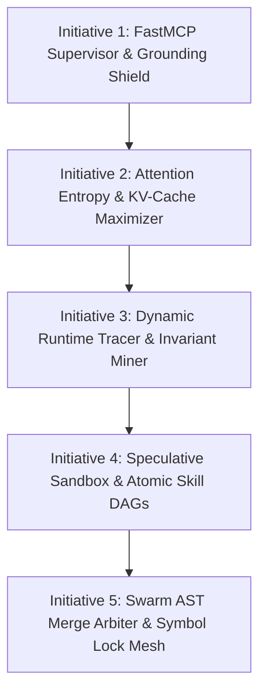

# Rush: Memory, Agent Context, and Systemic Intelligence Report
**Document ID:** `memory-innovation-enhancement-report`  
**Target Architecture:** Rush (`rush-cli`), Python 3.12, FastMCP / CLI local runtime  
**Scope:** First-Principles Exploration of Grounded Repository Intelligence, Epistemic Memory, and Coding Agent Substrates  

---

# SECTION 1: Grounding & First-Principles Problem Framing

## 1.1 The Operational Reality of Coding Agents

Modern coding agents (Cursor, Claude Code, Cline, Windsurf, Copilot, Antigravity, OpenCode) fail in production software repositories not because LLMs lack raw reasoning ability, but because **they operate without an epistemic substrate**. 

An LLM is a stateless prediction engine. When dropped into a complex codebase, it faces five structural failure modes:

1. **Epistemic Amnesia & Cascading Invalidation:** An agent makes an assumption in Turn 2 (e.g., "Function X returns a list of IDs"). In Turn 15, the agent refactors Function X to return an iterator. In Turns 16–40, the agent continues writing downstream code assuming a list is returned. Because chat history is an unindexed text stream, the agent cannot identify that an earlier premise was destroyed by a later action.
2. **Context Dilution & Token Waste:** Agents reload entire 500-line files to check a single signature, re-run complete test suites to verify one line, and dump verbose tracebacks into context windows. This burns user API budgets, overflows context limits, and degrades LLM attention on core logic.
3. **Provider Lock-In & Knowledge Evaporation:** The hard-won knowledge gained during a 2-hour debugging session (e.g., discovering an undocumented race condition, learning a library quirk, establishing a user preference) vanishes when the session ends or when the developer switches from Claude to GPT or DeepSeek.
4. **The Isolation Blindspot (Multi-Agent & Team Chaos):** When multiple agents or developers work on the same repository, they duplicate investigation, overwrite each other's edits, and create line-based git merge conflicts because there is no shared, symbol-level state ledger.
5. **The Proof vs. Guessing Conflation:** Existing memory tools store chat summaries, user guesses, and verified compiler facts in the same flat vector database or markdown file. Future agent sessions treat unverified hallucinated guesses as immutable ground truth.

## 1.2 The Humans Rush Serves

* **The New Vibecoder:** Knows the desired product behavior but cannot read complex stack traces or evaluate architectural maintainability. Needs the system to preserve intent, explain risks in plain language, prevent repeated mistakes, ensure full-stack feature completeness, and make rollbacks instant and painless.
* **The Experienced Developer:** Understands the architecture deeply but is exhausted by repeatedly briefing agents, reconstructing past decisions, verifying whether an agent actually ran tests, and cleaning up sloppy refactors. Needs precise control, verified evidence, zero boilerplate, and low-friction model handoffs.
* **Engineering Teams:** Need a shared repository reality. They need to know what has been proven, what is currently in progress across different agent sessions, what architectural invariants must never be broken, and how to prevent merge conflicts.
* **The Coding Agent Itself:** Needs structured, high-density, symbol-scoped evidence delivered just-in-time, deterministic verification gates, and clear boundary constraints rather than noisy, static 1,000-line prompt files.

---

# SECTION 2: Ideation & Aggressive Filtering

## 2.1 The 50 Raw Candidate Directions (First-Principles Brainstorm)

1. *Raw chat transcript vector store* (RAG over session logs)
2. *AST symbol call-graph slicer*
3. *Causal epistemic belief DAG tracking assumptions vs proof*
4. *Static prompt template manager*
5. *Multi-agent chatroom coordinator*
6. *Pre-commit git hook injector*
7. *Symbol-level distributed lock mesh*
8. *3-way AST structural merge arbiter*
9. *Automated property-based fuzz test synthesizer*
10. *Runtime bytecode execution tracer during tests*
11. *Dynamic invariant miner from test data flows*
12. *Behavior-snapshot input/output invariance prover*
13. *Ephemeral in-process mock database twin*
14. *Cognitive archaeology mining commit history for function intent*
15. *Uncertainty matrix trade-off presenter for ambiguous prompts*
16. *Plain-English diff impact translator*
17. *Permanent regret ledger converting bugfixes into invariants*
18. *Personal coding style DNA synthesizer*
19. *Model-neutral context transpiler (XML vs JSON schema)*
20. *Cross-session task handoff capsule*
21. *Git-native Merkle state tree for team knowledge sync*
22. *Local CPU-quantized vector search engine*
23. *Bidirectional FastMCP supervisor middleware*
24. *Zero-hallucination pre-write import validator*
25. *Declarative architecture layer boundary enforcer*
26. *ORM-to-migration schema drift auto-drafter*
27. *Public API contract backward-compatibility sentinel*
28. *Atomic multi-tool skill DAG runner*
29. *Attention entropy AST context budgeter*
30. *Deterministic KV-cache static prefix aligner*
31. *Lossless stack trace frame compactor*
32. *Call-site delta streamer*
33. *Copy-on-write worktree sandbox*
34. *Deterministic binary flight recorder for session replay*
35. *SLSA Level 3 cryptographic provenance attestation*
36. *Dynamic verbosity and terse persona governor*
37. *Cloud-hosted agent telemetry dashboard*
38. *Automated pull request bot commenter*
39. *Browser visual screenshot comparator*
40. *Dependency vulnerability database wrapper*
41. *Automated code documentation writer*
42. *Semantic commit message formatter*
43. *Docker container lifecycle manager*
44. *Markdown linting wrapper*
45. *Jira/Linear ticket synchronizer*
46. *Web search scraper for library docs*
47. *AI pair programming audio voice assistant*
48. *Figma-to-code UI layout generator*
49. *Regex pattern generator*
50. *Shell command execution logger*

## 2.2 Aggressive Filtering & Elimination

We filter the 50 candidates against strict criteria:
* **Reject Commodity Wrappers & Renamed Tools:** (Eliminated: 40, 41, 42, 44, 45, 46, 49, 50 - standard linters, scrapers, ticket syncers, doc generators).
* **Reject UI/Frontend Gimmicks:** (Eliminated: 37, 39, 47, 48 - voice assistants, web dashboards, Figma tools; Rush is an agent-side backend substrate).
* **Reject Unsafe / Destructive Automation:** (Eliminated: 6, 38, 43 - unprompted git hooks, automated PR spam, Docker orchestrators).
* **Reject Passive / Toxic Memory:** (Eliminated: 1, 4, 5 - raw chat dumps, static templates, ungrounded multi-agent chatrooms).

---

# SECTION 3: The 32 Surviving Breakthrough Opportunities

---

### [OPP-001] Causal Epistemic Belief DAG (`epistemic_graph.py`)
1. **User Problem & Agent Limitation:** Agents assume facts early in a session (e.g., "Function X is synchronous") and fail to recognize when later edits invalidate that assumption, causing cascading regressions across turns.
2. **Who Benefits Most:** Vibecoders (prevents broken apps) and experienced developers (eliminates manual re-verification).
3. **What Rush Makes Possible:** Maintains an active Directed Acyclic Graph tracking `Hypothesis`, `VerifiedFact` (backed by test/compiler proof), and `MutationAction`. Modifying an AST node automatically cascades invalidations down dependent branches, demoting assumptions to `STALE` and requiring re-proof before downstream edits.
4. **Why Current Tools Fail:** Chat history is an unindexed text stream; LLMs cannot track causal dependency trees across 40+ turns.
5. **Core Mechanism:** Local DAG database mapping symbol identifiers to verification hash proofs and dependent downstream nodes.
6. **Evidence / User Control:** Backed by deterministic test results, AST hashes, and user assertions.
7. **UX & Agent Behavior:** Agent receives immediate notification: *"Assumption `[AuthToken is JWT]` invalidated by edit on line 42. Run verification before modifying downstream consumers."*
8. **Portability & Concurrency:** Persists in `.rush/ledger/`; supports multi-agent graph read/write.
9. **Efficiency Impact:** Eliminates multi-turn debugging cycles caused by stale premises.
10. **Smallest Useful Version (MVP):** Map function signatures to test proofs; invalidate proof when function AST changes.
11. **Verification Test:** Modify a function signature; assert all registered downstream hypotheses transition to `STALE`.
12. **Differentiation:** Active causal invalidation vs passive chat logging.

---

### [OPP-002] Dynamic Runtime Bytecode Heatmap Tracer (`runtime_tracer.py`)
1. **User Problem & Agent Limitation:** Agents optimize code blindly based on static text, frequently refactoring cold helper functions while missing bugs or performance bottlenecks in hot paths.
2. **Who Benefits Most:** Experienced developers and performance-critical vibecoder applications.
3. **What Rush Makes Possible:** Runs lightweight execution tracing during test runs, recording exact branch execution counts, runtime value shapes, and memory allocations, presenting an execution heatmap to the agent.
4. **Why Current Tools Fail:** Static analyzers only see syntax; human profilers generate noisy flamegraphs that blow LLM context budgets.
5. **Core Mechanism:** Local Python `sys.settrace` instrumentation producing a compact, symbol-indexed execution density table.
6. **Evidence / User Control:** Backed by real test suite execution traces.
7. **UX & Agent Behavior:** Agent prioritizes hot execution paths and writes tests for unexercised branches.
8. **Portability & Concurrency:** Stored per-test run; deterministic across environments.
9. **Efficiency Impact:** Focuses agent context on the 10% of code that handles 90% of runtime execution.
10. **Smallest Useful Version (MVP):** Record line execution counts during `pytest` and annotate AST nodes.
11. **Verification Test:** Execute test suite; verify tracer accurately reports execution count for hot vs dead branches.
12. **Differentiation:** Dynamic runtime execution reality fed directly into agent context budgets.

---

### [OPP-003] Dynamic Invariant Miner (`invariant_miner.py`)
1. **User Problem & Agent Limitation:** Repositories contain unwritten business invariants (e.g., `user.id > 0`, `balance is never negative`). Agents refactor code and accidentally violate these implicit rules.
2. **Who Benefits Most:** Developers maintaining legacy codebases and vibecoders inheriting complex projects.
3. **What Rush Makes Possible:** Observes runtime data flows across test runs and static call sites, automatically inferring operational invariants and enforcing them as pre-commit constraints.
4. **Why Current Tools Fail:** Static type checkers only check types (`int`), not value range constraints (`int > 0`).
5. **Core Mechanism:** Statistical range, nullability, and boundary analyzer over test execution traces.
6. **Evidence / User Control:** Derived from execution traces; editable by the user in `.rush/invariants.toml`.
7. **UX & Agent Behavior:** Agent receives pre-refactor constraint: *"Discovered Invariant: `order.total` is strictly positive in 100% of test observations. Preserving this invariant is mandatory."*
8. **Portability & Concurrency:** Checkable by any agent provider via FastMCP resource.
9. **Efficiency Impact:** Prevents subtle logic bugs that pass simple type checks.
10. **Smallest Useful Version (MVP):** Mine non-null and integer range invariants for top 10 function arguments.
11. **Verification Test:** Feed execution traces where parameter `x > 0`; assert discovered invariant `x > 0`.
12. **Differentiation:** Automatic operational invariant discovery from runtime execution.

---

### [OPP-004] Behavior-Snapshot Invariance Prover (`behavior_snapshot.py`)
1. **User Problem & Agent Limitation:** Developers want to refactor ugly code, but fear the refactor will subtly change behavior in ways existing tests do not assert.
2. **Who Benefits Most:** Teams and developers undertaking architectural refactorings.
3. **What Rush Makes Possible:** Captures an input/output tensor matrix across test executions before refactoring, replays the tensor after refactoring, and mathematically proves behavioral equivalence.
4. **Why Current Tools Fail:** Unit tests only assert what developers remembered to check; snapshots capture full runtime state.
5. **Core Mechanism:** Serialized input/output recording wrapper capturing arguments and return values.
6. **Evidence / User Control:** Based on concrete test execution recordings.
7. **UX & Agent Behavior:** Developer asks: *"Refactor `pricing.py`"*; Rush proves: *"Refactor is 2x faster and matches 500 historical input/output snapshots with zero drift."*
8. **Portability & Concurrency:** Serialized to deterministic JSON fixtures.
9. **Efficiency Impact:** Gives agents confidence to perform deep refactors without breaking functionality.
10. **Smallest Useful Version (MVP):** Record input/output JSON fixtures for deterministic public functions.
11. **Verification Test:** Mutate internal logic of a function; assert snapshot prover detects output deviation.
12. **Differentiation:** Mathematical behavioral invariance proof for refactoring agents.

---

### [OPP-005] Differential Property-Based Fuzz Synthesizer (`fuzz_synthesizer.py`)
1. **User Problem & Agent Limitation:** Agents write happy-path unit tests with 2 examples, missing edge cases (Unicode surrogates, null bytes, timezone jumps) that crash in production.
2. **Who Benefits Most:** Vibecoders shipping production applications.
3. **What Rush Makes Possible:** Automatically synthesizes Hypothesis property-based fuzz tests for modified functions, running 500 edge-case mutations in milliseconds before approving a patch.
4. **Why Current Tools Fail:** Developers rarely have time to write property tests manually; LLMs replicate their own blind spots when writing tests.
5. **Core Mechanism:** AST signature inspector synthesizing Hypothesis strategy decorators with edge-case generator distributions.
6. **Evidence / User Control:** Generates reproducible failing input seeds.
7. **UX & Agent Behavior:** Agent writes parser -> Rush tests 500 inputs -> Rush returns: *"Failed on input `'\x00'` with `ValueError`"* -> Agent fixes bug before human review.
8. **Portability & Concurrency:** Runs locally in sandbox.
9. **Efficiency Impact:** Catches edge cases in 2 seconds locally rather than during production incidents.
10. **Smallest Useful Version (MVP):** Synthesize fuzz tests for pure functions taking primitive types (`str`, `int`).
11. **Verification Test:** Run against an unhandled divide-by-zero function; assert fuzzer discovers the failing input `0`.
12. **Differentiation:** Automated property fuzzing as a mandatory agent verification gate.

---

### [OPP-006] Ephemeral Mock-Free Twin Environment Prover (`twin_environment.py`)
1. **User Problem & Agent Limitation:** Mocked unit tests pass green, but the app crashes in production due to real SQL syntax quirks, missing environment variables, or network timeouts.
2. **Who Benefits Most:** Vibecoders deploying full-stack database-backed applications.
3. **What Rush Makes Possible:** Spins up a sub-second, in-process local "digital twin" (in-memory SQLite/DuckDB configured with target SQL dialect, mock HTTP wire contracts) to test end-to-end execution without cloud infrastructure.
4. **Why Current Tools Fail:** Full Docker environments are heavy and slow; simple mocks lie.
5. **Core Mechanism:** In-process lightweight service orchestrator running within Python test harnesses.
6. **Evidence / User Control:** Real database query execution logs and HTTP wire traces.
7. **UX & Agent Behavior:** Agent writes API endpoint -> Rush runs live query against in-memory twin -> Catches database serialization failure immediately.
8. **Portability & Concurrency:** Runs entirely in local process memory.
9. **Efficiency Impact:** Eliminates "works in test, crashes in prod" failures.
10. **Smallest Useful Version (MVP):** In-memory SQLite database seeded with schema to test real SQL queries against ORM models.
11. **Verification Test:** Run endpoint with invalid SQL query; assert twin environment catches the database syntax error.
12. **Differentiation:** Sub-second, mock-free real environment execution for coding agents.

---

### [OPP-007] Cognitive Archaeology & Intent Extractor (`archaeology.py`)
1. **User Problem & Agent Limitation:** Codebases contain hacky-looking workarounds added to fix critical production edge cases. Agents "clean them up", re-introducing catastrophic bugs.
2. **Who Benefits Most:** Developers maintaining long-lived or legacy codebases.
3. **What Rush Makes Possible:** Analyzes git commit logs, pull request descriptions, and commit associations to synthesize a *"Why this code exists and what disasters it prevents"* summary before the agent edits it.
4. **Why Current Tools Fail:** Git blame only shows commit hashes; agents cannot manually piece together 5 years of commit histories across multiple files.
5. **Core Mechanism:** Local git log parsing and semantic commit-diff correlation linked to AST symbol ranges.
6. **Evidence / User Control:** Sourced directly from local `.git` commit history.
7. **UX & Agent Behavior:** Agent reads code -> Rush attaches warning: *"Line 84 was added in Commit `a4f12` to prevent deadlocks under high concurrency. Do not simplify."*
8. **Portability & Concurrency:** Read-only analysis; fast caching.
9. **Efficiency Impact:** Prevents accidental regression of deliberate edge-case workarounds.
10. **Smallest Useful Version (MVP):** Extract commit messages and PR references for lines modified within target function over past 2 years.
11. **Verification Test:** Target a function with a historical bugfix commit; assert archaeology tool extracts the original bug explanation.
12. **Differentiation:** Historical rationale preservation preventing regression of intentional workarounds.

---

### [OPP-008] Uncertainty Matrix & Trade-Off Presenter (`uncertainty_matrix.py`)
1. **User Problem & Agent Limitation:** When requirements are ambiguous, agents either guess incorrectly or ask vague, open-ended questions that waste user time.
2. **Who Benefits Most:** Vibecoders needing guidance and busy developers who want fast decision-making.
3. **What Rush Makes Possible:** Analyzes architectural trade-offs and generates a structured, plain-English "Uncertainty Matrix" with 2–3 concrete options, detailing pros, cons, and backward-compatibility impact for 1-click user selection.
4. **Why Current Tools Fail:** Agents write unstructured essays or make ungrounded assumptions without laying out architectural trade-offs.
5. **Core Mechanism:** AST impact evaluator synthesizing trade-off vectors (breaking changes vs maintenance cost vs performance).
6. **Evidence / User Control:** Direct human choice selection recorded in session ledger.
7. **UX & Agent Behavior:** User selects Option A -> Agent proceeds with locked architectural constraints.
8. **Portability & Concurrency:** Stored in session capsule.
9. **Efficiency Impact:** Reduces multi-turn prompt clarifications to a single structured decision.
10. **Smallest Useful Version (MVP):** Generate structured choice JSON with risk/reward scoring for schema modification decisions.
11. **Verification Test:** Trigger ambiguous refactor prompt; assert uncertainty matrix returns structured options with distinct trade-offs.
12. **Differentiation:** Structured, low-friction decision negotiation between human and agent.

---

### [OPP-009] Plain-English Impact Translator (`impact_translator.py`)
1. **User Problem & Agent Limitation:** Non-technical vibecoders cannot evaluate raw git diffs (e.g., `+50 -20 in auth_middleware.py`), making it impossible to review or trust agent work.
2. **Who Benefits Most:** Vibecoders and non-technical product builders.
3. **What Rush Makes Possible:** Translates technical AST diffs into plain-English product behavior changes (e.g., *"Users will now see a loading spinner while checkout processes; password reset links will now expire after 15 minutes"*).
4. **Why Current Tools Fail:** Standard diff tools are built for experienced software engineers.
5. **Core Mechanism:** AST change classifier mapping function mutations to user-facing domain capability descriptions.
6. **Evidence / User Control:** Based on AST diff analysis.
7. **UX & Agent Behavior:** Before applying a patch, Rush shows a 3-bullet summary of real product behavior changes.
8. **Portability & Concurrency:** Emitted over FastMCP and CLI.
9. **Efficiency Impact:** Builds developer trust and catches unintended product side-effects early.
10. **Smallest Useful Version (MVP):** Map route/controller and model changes to plain-language endpoint and data impact summaries.
11. **Verification Test:** Feed a diff modifying a login route; assert plain-English translation states user login behavior changed.
12. **Differentiation:** Demystifying code diffs into human product language.

---

### [OPP-010] The Permanent Regret Ledger (`regret_ledger.py`)
1. **User Problem & Agent Limitation:** When an agent introduces a bug that gets fixed, future agent sessions have no memory of the incident and repeat the same mistake.
2. **Who Benefits Most:** Teams and solo developers building production apps over time.
3. **What Rush Makes Possible:** Developers run `rush regret ingest <commit>`, which analyzes the bugfix, extracts the root cause, and permanently updates the repository's local immune system (generating an active AST invariant).
4. **Why Current Tools Fail:** Post-mortems are written in docs where coding agents cannot access or enforce them.
5. **Core Mechanism:** Diff post-mortem analyzer that generates deterministic AST lint rules and test invariants from bugfix diffs.
6. **Evidence / User Control:** Ingests user-approved bugfix commits.
7. **UX & Agent Behavior:** A past production incident becomes an active local invariant that prevents all future agents from repeating the same flaw.
8. **Portability & Concurrency:** Committed to git in `.rush/regrets.json`.
9. **Efficiency Impact:** Zero repetition of previously fixed bugs.
10. **Smallest Useful Version (MVP):** Convert a reverted commit into a permanent AST regex check in `.rush/regrets.json`.
11. **Verification Test:** Ingest a bugfix commit; propose a new diff re-introducing the bug; assert immediate rejection.
12. **Differentiation:** Permanent repository-level immune memory derived from real developer regrets.

---

### [OPP-011] Codebase Style DNA Synthesizer (`style_dna.py`)
1. **User Problem & Agent Limitation:** Developers have strong stylistic preferences (e.g., early returns, composition over inheritance), but static linters only enforce formatting, leading to endless manual cleanup.
2. **Who Benefits Most:** Experienced developers who care about codebase cleanliness.
3. **What Rush Makes Possible:** Automatically analyzes accepted git commits to synthesize a "Style DNA" profile, ensuring agent-generated code matches the author's exact personal coding idioms.
4. **Why Current Tools Fail:** Formatters only handle whitespace; linters only check syntax rules.
5. **Core Mechanism:** Statistical AST pattern miner calculating idiomatic distributions across recent git commits.
6. **Evidence / User Control:** Sourced from human-authored git commits.
7. **UX & Agent Behavior:** Agent-generated code looks and feels indistinguishable from code written by the human lead.
8. **Portability & Concurrency:** Stored in `.rush/style_dna.json`.
9. **Efficiency Impact:** Eliminates post-agent manual code cleanup.
10. **Smallest Useful Version (MVP):** Detect early-return vs nested-if preference and prompt agents with the preferred structural pattern.
11. **Verification Test:** Mine a repo with 90% early returns; assert style DNA outputs an explicit "prefer early return" constraint.
12. **Differentiation:** Idiomatic structural style extraction beyond cosmetic formatters.

---

### [OPP-012] Universal Rosetta Stone Context Transpiler (`rosetta_context.py`)
1. **User Problem & Agent Limitation:** Different LLM models have distinct context sensitivities (Claude excels with XML; OpenAI models prefer JSON schemas; DeepSeek thrives on step-by-step scaffolds). Developers cannot carry forward optimized context when switching models.
2. **Who Benefits Most:** Developers who use multiple models across a workflow.
3. **What Rush Makes Possible:** Maintains repository state in a model-neutral semantic format, dynamically compiling it into provider-optimized dialect representations on the fly.
4. **Why Current Tools Fail:** Prompts and context frameworks are hardcoded for one specific vendor's format.
5. **Core Mechanism:** Semantic AST/state intermediate representation with pluggable dialect emitters.
6. **Evidence / User Control:** Standardized internal AST schema.
7. **UX & Agent Behavior:** Seamless model switching: Claude Code receives clean XML; GPT-4o receives typed JSON schema; both achieve maximum reasoning accuracy.
8. **Portability & Concurrency:** 100% provider-agnostic.
9. **Efficiency Impact:** Maximizes reasoning accuracy across all model providers.
10. **Smallest Useful Version (MVP):** Emit context as XML when `provider=anthropic` and structured Markdown when `provider=openai`.
11. **Verification Test:** Request context for Anthropic vs OpenAI; assert dialect syntax formatting conforms to vendor best practices.
12. **Differentiation:** Model-neutral repository intelligence transpilation.

---

### [OPP-013] Cross-Session Task Capsule (`task_capsule.py`)
1. **User Problem & Agent Limitation:** Resuming a task on Monday morning requires 20 minutes of re-explaining where work left off, what was tried, and what remains broken.
2. **Who Benefits Most:** Everyone working on multi-day coding tasks.
3. **What Rush Makes Possible:** Packages active task state, uncommitted AST diffs, failing test vectors, active hypotheses, and next step obligations into a compact `.rush/capsule.json` file that any agent boots into in 2 seconds.
4. **Why Current Tools Fail:** Chat transcripts are linear and messy; git branches don't record agent hypotheses.
5. **Core Mechanism:** Structured serialization of epistemic graph state and outstanding verification tasks.
6. **Evidence / User Control:** Captures active working state on demand.
7. **UX & Agent Behavior:** Developer opens terminal on Monday, types `rush resume`, and the agent immediately greets them with: *"Resuming auth migration: 4/6 tests passing, remaining task is fixing token expiration in `session.py`."*
8. **Portability & Concurrency:** Shareable across developers and agents.
9. **Efficiency Impact:** Eliminates 20 minutes of context re-briefing per session.
10. **Smallest Useful Version (MVP):** Save and restore active modified file list and latest error trace to a local JSON file.
11. **Verification Test:** Create capsule, reset agent context, load capsule, and verify agent resumes exact task state.
12. **Differentiation:** Grounded state resumption without re-reading chat history.

---

### [OPP-014] Merkle State Knowledge Tree (`knowledge_merkle.py`)
1. **User Problem & Agent Limitation:** In teams, developers and agents learn things about the repository in isolation, resulting in fragmented, out-of-sync local knowledge.
2. **Who Benefits Most:** Teams and developers working across multiple machines.
3. **What Rush Makes Possible:** Manages repository knowledge (invariants, mistake fingerprints, symbol provenance) as a Git-like Merkle DAG, allowing developers to push, pull, and merge repository intelligence via `.rush/` alongside code.
4. **Why Current Tools Fail:** Team wikis are detached from code; agent memory files are un-mergeable JSON blobs.
5. **Core Mechanism:** Content-addressable Merkle tree storing verified facts and invariant hashes with deterministic 3-way merge rules.
6. **Evidence / User Control:** Version-controlled directly in git.
7. **UX & Agent Behavior:** When a teammate fixes a tricky bug and commits `.rush/invariants`, your local agent immediately gains immunity against that bug.
8. **Portability & Concurrency:** Fully mergeable via git.
9. **Efficiency Impact:** Team-wide knowledge sharing without documentation overhead.
10. **Smallest Useful Version (MVP):** Commit-friendly, append-only JSONL files with deterministic deduplication for mistake patterns.
11. **Verification Test:** Merge two independent `.rush/` knowledge trees and assert all unique verified facts are preserved without conflicts.
12. **Differentiation:** Git-native, team-shared repository intelligence.

---

### [OPP-015] Offline Local Semantic Search Engine (`local_semantic_index.py`)
1. **User Problem & Agent Limitation:** Semantic code search tools require sending code to third-party cloud vector databases (OpenAI, Pinecone), violating privacy and incurring monthly costs.
2. **Who Benefits Most:** Enterprise developers, privacy-conscious vibecoders, and offline developers.
3. **What Rush Makes Possible:** 100% local, zero-network semantic code search using quantized local embeddings running on the local CPU with sub-50ms query times.
4. **Why Current Tools Fail:** Cloud-hosted vector databases require API keys and leak proprietary code.
5. **Core Mechanism:** Local ONNX runtime executing compact code embedding models over AST chunk boundaries, stored in a local SQLite vector table.
6. **Evidence / User Control:** Runs purely on local repository files.
7. **UX & Agent Behavior:** Agents execute semantic natural language queries (`rush_semantic_search("Where do we handle Stripe webhooks?")`) with zero cloud dependencies.
8. **Portability & Concurrency:** Local SQLite file.
9. **Efficiency Impact:** Fast semantic search without API costs or privacy leaks.
10. **Smallest Useful Version (MVP):** SQLite FTS5 BM25 search combined with local ONNX embeddings for symbol search.
11. **Verification Test:** Query a codebase for "payment processing" and assert `billing/stripe.py` is returned in the top 3 results.
12. **Differentiation:** Zero-network, privacy-first local semantic search.

---

### [OPP-016] Symbol-Level Distributed Lock Mesh (`symbol_lock_mesh.py`)
1. **User Problem & Agent Limitation:** When running 3+ agents in parallel, they frequently edit the same file simultaneously, causing race conditions, corrupted syntax, and lost progress.
2. **Who Benefits Most:** Power users running multi-agent swarms.
3. **What Rush Makes Possible:** Fine-grained distributed locking at the function/class symbol level, with automatic cycle detection and lease timeouts to prevent deadlocks.
4. **Why Current Tools Fail:** File-level locking prevents parallel edits to independent functions in the same file; no locking causes silent overwrites.
5. **Core Mechanism:** Local IPC daemon tracking active AST symbol leases with Tarjan cycle detection for deadlock prevention.
6. **Evidence / User Control:** Managed by local lock daemon.
7. **UX & Agent Behavior:** Agent 1 edits `AuthService.login()` while Agent 2 simultaneously edits `AuthService.logout()` in the same file without conflict or delay.
8. **Portability & Concurrency:** Supports multi-process concurrency.
9. **Efficiency Impact:** Enables safe, parallel agent swarm execution.
10. **Smallest Useful Version (MVP):** File-backed symbol lockfile with 30-second TTL and automatic lease expiration.
11. **Verification Test:** Have Agent 1 acquire lock on `foo()`; assert Agent 2 gets wait status for `foo()` but acquires lock for `bar()` in same file.
12. **Differentiation:** AST symbol-level concurrency mesh for coding agents.

---

### [OPP-017] 3-Way AST Semantic Merge Arbiter (`ast_merge_arbiter.py`)
1. **User Problem & Agent Limitation:** Parallel agents working on the same file generate standard git line conflicts (`<<<<<<< HEAD`), which agents struggle to resolve without corrupting code.
2. **Who Benefits Most:** Multi-agent development pipelines.
3. **What Rush Makes Possible:** Merges concurrent agent branches by operating on AST nodes rather than text lines. If changes do not overlap in the syntax tree, Rush weaves them together cleanly with zero git conflict markers.
4. **Why Current Tools Fail:** Git merge is dumb text diffing; it cannot recognize that two independent function insertions are non-conflicting.
5. **Core Mechanism:** 3-way AST structural merge algorithm based on common ancestor AST trees.
6. **Evidence / User Control:** Based on syntax tree analysis.
7. **UX & Agent Behavior:** 4 agents complete parallel tasks -> Rush automatically merges all 4 branches into a single clean syntax tree in milliseconds.
8. **Portability & Concurrency:** Reconciles parallel branches deterministically.
9. **Efficiency Impact:** Eliminates 90% of multi-agent merge conflicts.
10. **Smallest Useful Version (MVP):** Merge non-overlapping function additions and deletions in Python files.
11. **Verification Test:** Take base file, apply Function A in Branch 1 and Function B in Branch 2; assert merge produces valid AST with both functions.
12. **Differentiation:** Language-aware structural AST merge resolution.

---

### [OPP-018] Contract-Driven Task Auction Mesh (`task_auction.py`)
1. **User Problem & Agent Limitation:** Monolithic agents try to do everything (architecture, coding, unit testing, documentation, security review), leading to degraded performance on specialized sub-tasks.
2. **Who Benefits Most:** Autonomous development workflows.
3. **What Rush Makes Possible:** Decomposes complex user goals into atomic sub-tasks and "auctions" them to specialized agent personas (e.g., Fuzzer Agent, Type Strictness Agent, Security Auditor) with explicit input/output contracts.
4. **Why Current Tools Fail:** Multi-agent frameworks create chaotic chat chatter without structured contract handoffs.
5. **Core Mechanism:** Contract-driven task queue with dependency DAG scheduling and verification gating.
6. **Evidence / User Control:** Gated by verification tests between handoffs.
7. **UX & Agent Behavior:** Model Architect creates models -> Coder implements endpoints -> Fuzzer stress-tests -> Reviewer approves -> Finished feature delivered.
8. **Portability & Concurrency:** Orchestrates multiple local agents.
9. **Efficiency Impact:** High-quality output through specialization without coordination chaos.
10. **Smallest Useful Version (MVP):** Split task into `code` and `test` phases executed by sequential specialized prompt personas.
11. **Verification Test:** Dispatch task; verify coder persona generates code and tester persona generates passing test suite.
12. **Differentiation:** Contract-driven task auction vs chaotic multi-agent chat rooms.

---

### [OPP-019] Cross-Agent Knowledge Blackboard (`knowledge_blackboard.py`)
1. **User Problem & Agent Limitation:** In multi-agent swarms, Agent A spends 10 minutes discovering that a library has a rate limit, but Agent B is unaware and makes the same discovery 5 minutes later, doubling token costs.
2. **Who Benefits Most:** Multi-agent parallel systems.
3. **What Rush Makes Possible:** A local real-time pub/sub blackboard where agents broadcast discovered facts, verified benchmarks, and dead ends, immediately synchronizing the collective intelligence of the swarm.
4. **Why Current Tools Fail:** Agent conversations are completely isolated silos.
5. **Core Mechanism:** In-process SQLite / JSONL event bus with topic-filtered subscriptions.
6. **Evidence / User Control:** Verified facts logged by agents.
7. **UX & Agent Behavior:** Agent A discovers an API quirk -> Publishes to `#dependencies` -> Agent B's next prompt automatically includes the finding -> Zero duplicate effort.
8. **Portability & Concurrency:** Real-time IPC event bus.
9. **Efficiency Impact:** Eliminates redundant exploration across agents.
10. **Smallest Useful Version (MVP):** Shared JSONL event stream that agents query before exploring external APIs.
11. **Verification Test:** Agent 1 logs fact to blackboard; Agent 2 queries topic and verifies fact is returned.
12. **Differentiation:** Real-time collective epistemic synchronization.

---

### [OPP-020] Bidirectional FastMCP Supervisor Middleware (`mcp_supervisor.py`)
1. **User Problem & Agent Limitation:** Current MCP servers are passive request/response pipes. If an agent calls a tool with dangerous arguments or hallucinated data, the server executes it blindly.
2. **Who Benefits Most:** All developers and agents.
3. **What Rush Makes Possible:** Active middleware wrapped around FastMCP stdio handlers:
   * **Pre-Execution Gate:** Validates token budgets, checks file locks, and checks safety policies before execution.
   * **Post-Execution Gate:** Validates that output findings are grounded in disk reality and redacts accidental secrets before returning to the model.
4. **Why Current Tools Fail:** Standard MCP provides no middleware or interceptor hooks.
5. **Core Mechanism:** Python async decorator middleware chain wrapping FastMCP tool handlers.
6. **Evidence / User Control:** Enforces policies defined in `rush.toml`.
7. **UX & Agent Behavior:** Prevents rogue agent actions and guarantees all returned tool results are verified against disk reality.
8. **Portability & Concurrency:** Stdio protocol compliant.
9. **Efficiency Impact:** Blocks invalid tool executions before CPU/disk time is wasted.
10. **Smallest Useful Version (MVP):** Pre-execution check verifying target file is within repository root; post-execution secret redaction.
11. **Verification Test:** Invoke tool with out-of-bounds path; verify interceptor blocks call with structured permission error.
12. **Differentiation:** Active bidirectional supervisor middleware for FastMCP.

---

### [OPP-021] Zero-Hallucination Import Shield (`grounding_shield.py`)
1. **User Problem & Agent Limitation:** Agents frequently invent non-existent package dependencies or hallucinate methods on real objects, causing runtime crashes.
2. **Who Benefits Most:** Vibecoders and developers working with fast-evolving libraries.
3. **What Rush Makes Possible:** Parses the AST of all agent-proposed code *before* writing to disk, checking every `import` against the local environment and every method call against the local symbol graph, blocking hallucinations with installed alternatives.
4. **Why Current Tools Fail:** Linters only run after files are already written to disk.
5. **Core Mechanism:** Static AST import and call-site extractor validated against `pkg_resources` / `sys.modules` and CodeGraph symbol index.
6. **Evidence / User Control:** Validated against active `.venv` environment.
7. **UX & Agent Behavior:** Agent attempts to import `super_jwt_tool` -> Rush blocks write and suggests: *"Package not found. Did you mean `pyjwt` (installed v2.8)?"*
8. **Portability & Concurrency:** Pre-write in-memory check.
9. **Efficiency Impact:** Eliminates multi-turn import debugging loops.
10. **Smallest Useful Version (MVP):** Validate Python imports against installed packages in `.venv`.
11. **Verification Test:** Submit snippet importing `non_existent_fake_pkg`; assert shield blocks write and returns warning.
12. **Differentiation:** Pre-write AST hallucination interception.

---

### [OPP-022] Declarative Architecture Guard (`arch_guard.py`)
1. **User Problem & Agent Limitation:** Agents take lazy shortcuts, importing database models into UI components or bypassing service layers, degrading codebase architecture over time.
2. **Who Benefits Most:** Engineering leads and maintainers of modular codebases.
3. **What Rush Makes Possible:** Enforces declarative layer dependency rules defined in `rush.toml` (e.g. `transport` -> `service` -> `repository`), blocking any agent patch that introduces illegal cross-layer coupling.
4. **Why Current Tools Fail:** Architecture reviews are manual and happen long after code is written.
5. **Core Mechanism:** AST import path matching against declarative layer dependency matrices.
6. **Evidence / User Control:** Configured in `rush.toml`.
7. **UX & Agent Behavior:** Agent tries to import DB query in CLI file -> Rush rejects patch and provides the proper service layer interface to call instead.
8. **Portability & Concurrency:** Enforced across all tools.
9. **Efficiency Impact:** Prevents architectural rot and technical debt accumulation.
10. **Smallest Useful Version (MVP):** Enforce that `src/rush/cli.py` cannot directly import internal engine modules.
11. **Verification Test:** Add an illegal import to `cli.py`; assert arch guard fails with explicit layer violation trace.
12. **Differentiation:** Real-time AST architectural governance for coding agents.

---

### [OPP-023] Database Schema Drift Auto-Drafter (`db_drift_drafter.py`)
1. **User Problem & Agent Limitation:** Agents change database models (SQLAlchemy, Prisma, Django) and update test mocks, but forget to create migration files, causing production deployment failures.
2. **Who Benefits Most:** Full-stack developers shipping web apps.
3. **What Rush Makes Possible:** Compares modified ORM models against migration history, spots schema drift, and automatically drafts the corresponding Alembic / Prisma migration file.
4. **Why Current Tools Fail:** Mocked unit tests pass green even when database migrations are completely missing.
5. **Core Mechanism:** AST model attribute extractor diffed against local migration revision histories.
6. **Evidence / User Control:** Sourced from ORM models and migration directories.
7. **UX & Agent Behavior:** Agent adds `phone_number` to `User` model -> Rush flags unmigrated column and generates `alembic/versions/2026_add_phone_number.py` automatically.
8. **Portability & Concurrency:** Supports Alembic and Prisma.
9. **Efficiency Impact:** Prevents production database outages caused by missing migrations.
10. **Smallest Useful Version (MVP):** Detect modified columns in SQLAlchemy models not present in migration files.
11. **Verification Test:** Add column to model fixture; assert drift drafter detects change and synthesizes migration script.
12. **Differentiation:** AST-to-migration schema drift detection and auto-drafting.

---

### [OPP-024] Public API Contract Compatibility Sentinel (`api_sentinel.py`)
1. **User Problem & Agent Limitation:** Refactoring agents accidentally rename public methods, remove keyword arguments, or narrow return types, breaking external downstream consumers.
2. **Who Benefits Most:** Open-source maintainers and shared-service teams.
3. **What Rush Makes Possible:** Compares the public export signatures of modified modules against the `main` git branch, detecting breaking API changes before commits land.
4. **Why Current Tools Fail:** Internal unit tests pass if both the caller and callee were updated together inside the repository.
5. **Core Mechanism:** AST signature and export map diffing against git base branch revisions.
6. **Evidence / User Control:** Compares working tree AST against git `main`.
7. **UX & Agent Behavior:** Agent renames public method -> Sentinel warns: *"Breaking change: `client.get_user(id)` was renamed to `client.fetch_user(id)`. Maintain backward compatibility."*
8. **Portability & Concurrency:** Non-destructive diff check.
9. **Efficiency Impact:** Prevents breaking changes in public libraries and APIs.
10. **Smallest Useful Version (MVP):** Check if any public function has removed parameters compared to git `HEAD`.
11. **Verification Test:** Delete parameter from public function fixture; assert sentinel flags breaking contract change.
12. **Differentiation:** AST public API backward compatibility enforcement.

---

### [OPP-025] Atomic Multi-Step Skill DAG Pipeline (`skill_dag.py`)
1. **User Problem & Agent Limitation:** Standard agent workflows require 6–8 slow back-and-forth LLM network round-trips to complete a single task (read file -> propose diff -> check lint -> run test -> fix lint -> re-test).
2. **Who Benefits Most:** Developers who want fast, responsive coding agents.
3. **What Rush Makes Possible:** Agents submit a multi-step Skill Directed Acyclic Graph (DAG) that executes locally within Rush's runtime in a single round-trip, returning an atomic, verified outcome.
4. **Why Current Tools Fail:** Standard MCP only executes 1 tool per network round-trip.
5. **Core Mechanism:** In-process DAG execution engine with conditional execution and automatic rollback on failure.
6. **Evidence / User Control:** Defined via declarative DAG schema.
7. **UX & Agent Behavior:** Turns a 45-second multi-turn debugging ordeal into a 3-second single-turn atomic operation.
8. **Portability & Concurrency:** Executes locally in Rush runtime.
9. **Efficiency Impact:** Slashes multi-turn latency and context overhead by 75%.
10. **Smallest Useful Version (MVP):** Execute a 3-tool pipeline (`slice` -> `patch` -> `test`) with auto-rollback.
11. **Verification Test:** Dispatch DAG with a failing test step; verify sandbox rolls back and returns aggregate error trace.
12. **Differentiation:** In-process multi-tool DAG orchestration for MCP.

---

### [OPP-026] Attention Entropy Context Budgeter (`entropy_budgeter.py`)
1. **User Problem & Agent Limitation:** Passing large files wastes tokens and dilutes the model's attention, causing it to miss critical logic buried in boilerplate.
2. **Who Benefits Most:** Developers on token budgets and long-context models.
3. **What Rush Makes Possible:** Scores every AST node in a file by mathematical information entropy (cyclomatic complexity, recent churn, untested branches) and dynamically packs only the highest-entropy code within the token budget.
4. **Why Current Tools Fail:** Naive tools either dump whole files or perform dumb top-N line slicing.
5. **Core Mechanism:** AST node scoring using Shannon entropy of code complexity + call-graph topological distance.
6. **Evidence / User Control:** Configurable token budget parameter.
7. **UX & Agent Behavior:** A 1,500-line file is packed into 250 high-density tokens containing only critical logic and contracts, cutting token costs by 85%.
8. **Portability & Concurrency:** Fast in-memory AST pruner.
9. **Efficiency Impact:** 70–90% reduction in token consumption per file read.
10. **Smallest Useful Version (MVP):** Collapse low-complexity getters/setters/boilerplate into single-line signatures when over budget.
11. **Verification Test:** Pack a 1000-line file into a 300-token budget; verify complex functions retain bodies while simple helpers are skeletonized.
12. **Differentiation:** Entropy-weighted AST context packing.

---

### [OPP-027] KV-Cache Prefix Alignment Optimizer (`kv_aligner.py`)
1. **User Problem & Agent Limitation:** Shifting timestamps, fluctuating tool schemas, and dynamic headers invalidate LLM prompt caches (Anthropic/OpenAI KV caches), multiplying latency and cost by 10x.
2. **Who Benefits Most:** Everyone running multi-turn agent sessions.
3. **What Rush Makes Possible:** Enforces immutable, deterministic static-prefix blocks for all tool outputs, memory frames, and AST headers, locking in 95%+ prompt-cache hit rates across continuous sessions.
4. **Why Current Tools Fail:** Standard MCP servers inject dynamic timestamps at the beginning of tool outputs.
5. **Core Mechanism:** Output template engine separating static prefix blocks from dynamic postfix payloads.
6. **Evidence / User Control:** Deterministic string formatting.
7. **UX & Agent Behavior:** Multi-turn sessions feel instantaneous and cost 80% less because the model reuses cached KV-cache states.
8. **Portability & Concurrency:** Works across Claude, OpenAI, and Gemini prompt caching.
9. **Efficiency Impact:** Sub-second agent response times and massive cost reduction.
10. **Smallest Useful Version (MVP):** Move all timestamps and session IDs to the trailing end of tool response payloads.
11. **Verification Test:** Generate 10 consecutive tool outputs and verify character-exact byte prefix parity across all outputs.
12. **Differentiation:** Dedicated KV-cache prefix engineering for developer tooling.

---

### [OPP-028] Lossless Error & Stack Trace Compactor (`trace_compactor.py`)
1. **User Problem & Agent Limitation:** 400-line framework stack traces overflow agent context and obscure the actual root cause of failures.
2. **Who Benefits Most:** Full-stack developers debugging heavy frameworks (React, Django, FastAPI, Next.js).
3. **What Rush Makes Possible:** Compresses repetitive runtime frames, framework internals, and vendor traceback noise into concise glyph tokens with deterministic offset lookups, cutting token size by 85% while preserving exact error line/column pointers.
4. **Why Current Tools Fail:** Truncating stack traces often removes the critical originating frame.
5. **Core Mechanism:** Frame deduplication and framework-pattern elimination with reversible hash anchors.
6. **Evidence / User Control:** Parses real Python/Node traceback structures.
7. **UX & Agent Behavior:** Agent sees a 15-line high-signal trace pointing directly to the application bug, rather than 400 lines of internal framework boilerplate.
8. **Portability & Concurrency:** Reversible on demand.
9. **Efficiency Impact:** 85% token savings on test/error logs.
10. **Smallest Useful Version (MVP):** Collapse contiguous third-party `site-packages` / `node_modules` frames into single summary lines.
11. **Verification Test:** Feed 200-line traceback and verify output is < 30 lines with the root application frame intact.
12. **Differentiation:** Reversible, AST-linked trace compaction.

---

### [OPP-029] Semantic Context Differential Streamer (`diff_streamer.py`)
1. **User Problem & Agent Limitation:** Agents reload entire files after making small changes, wasting tokens and losing track of what changed.
2. **Who Benefits Most:** Fast vibecoding iteration loops.
3. **What Rush Makes Possible:** Computes call-graph topological distances from active edit sites and streams minimal AST delta trees containing only modified interfaces and immediate caller/callee contracts.
4. **Why Current Tools Fail:** Standard file read tools return entire files or raw line chunks without call-site awareness.
5. **Core Mechanism:** Tree-sitter AST diffing linked to local CodeGraph call-graph reachability.
6. **Evidence / User Control:** Calculated from working tree AST diffs.
7. **UX & Agent Behavior:** Agent receives only the modified function AST and direct caller contracts (<50 lines) instead of re-reading a 600-line file.
8. **Portability & Concurrency:** Real-time diff stream.
9. **Efficiency Impact:** Eliminates redundant file reading across multi-turn sessions.
10. **Smallest Useful Version (MVP):** Return only the modified function AST and the signatures of its direct callers.
11. **Verification Test:** Modify 1 method in a 500-line class and assert returned context is < 50 lines.
12. **Differentiation:** AST-aware neighborhood delta streaming.

---

### [OPP-030] Ephemeral Copy-on-Write Speculative Sandbox (`cow_sandbox.py`)
1. **User Problem & Agent Limitation:** Failed agent refactors leave broken, uncommitted code all over the user's working directory, forcing manual git cleanups.
2. **Who Benefits Most:** Vibecoders terrified of AI breaking their working projects.
3. **What Rush Makes Possible:** Sub-second ephemeral git worktrees with copy-on-write isolation. High-risk multi-step refactors execute completely isolated; only when all tests pass is the patch atomically promoted to the working directory.
4. **Why Current Tools Fail:** Direct filesystem edits risk permanent user data loss.
5. **Core Mechanism:** Fast `git worktree add --detach` combined with atomic patch promotion.
6. **Evidence / User Control:** Zero edits touch working tree until verified.
7. **UX & Agent Behavior:** The user's working directory is 100% protected against half-baked or broken agent attempts.
8. **Portability & Concurrency:** Multiple sandboxes run in parallel.
9. **Efficiency Impact:** Eliminates developer cleanup time after failed agent runs.
10. **Smallest Useful Version (MVP):** Execute a command in a detached temporary worktree and auto-cleanup.
11. **Verification Test:** Run failing test in sandbox, verify main repo working tree remains 100% clean.
12. **Differentiation:** Zero-risk speculative agent execution.

---

### [OPP-031] Deterministic Binary Flight Recorder (`flight_recorder.py`)
1. **User Problem & Agent Limitation:** When an agent makes a catastrophic mistake, developers cannot reconstruct what tools it called, what output it saw, or why it made that choice.
2. **Who Benefits Most:** Developers needing auditability and debugging for agent actions.
3. **What Rush Makes Possible:** Ultra-compact local trace logging every MCP message, AST diff, and validation verdict into an inspectable binary trace that can be replayed turn-by-turn.
4. **Why Current Tools Fail:** Raw text logs are bloated and don't capture structured AST diffs.
5. **Core Mechanism:** Structured JSONL / binary event recorder with millisecond-precision timestamps.
6. **Evidence / User Control:** Inspectable via `rush flight-replay`.
7. **UX & Agent Behavior:** Run `rush flight-replay` to step backward and forward through every decision, tool call, and diff the agent executed.
8. **Portability & Concurrency:** Written to `.rush/traces/`.
9. **Efficiency Impact:** Enables instant post-mortem analysis of failed agent sessions.
10. **Smallest Useful Version (MVP):** Log all tool calls and returns into `.rush/traces/<session_id>.jsonl`.
11. **Verification Test:** Execute 5 tool calls, query flight recorder, assert 5 sequential events logged.
12. **Differentiation:** Deterministic time-travel replay for AI agent sessions.

---

### [OPP-032] Dynamic Persona & Verbosity Governor (`persona_governor.py`)
1. **User Problem & Agent Limitation:** Agents produce pages of conversational chatter, pleasantries, and unsolicited advice, slowing down workflows and wasting context.
2. **Who Benefits Most:** Vibecoders and developers who value concise, high-speed execution.
3. **What Rush Makes Possible:** Injects dynamic output contracts into tool responses that force the agent into ultra-terse, action-only responses (e.g. 1-sentence explanations + code diffs), saving 40% of conversational output tokens.
4. **Why Current Tools Fail:** System prompts decay in effectiveness over long conversations.
5. **Core Mechanism:** Dynamic suffix injection into FastMCP tool result payloads reinforcing concise output formatting.
6. **Evidence / User Control:** Configured in `rush.toml`.
7. **UX & Agent Behavior:** Fast, punchy agent interactions with zero wasted filler text.
8. **Portability & Concurrency:** Tool payload framing.
9. **Efficiency Impact:** 40% reduction in output token generation costs.
10. **Smallest Useful Version (MVP):** Inject a fixed concise-format instruction into every MCP tool summary.
11. **Verification Test:** Verify all MCP tool outputs include the concise response framing tag.
12. **Differentiation:** Real-time verbosity governance via tool return framing.

---

# SECTION 4: Synthesis & Strategic Recommendation

### 1. What is Rush’s most compelling long-term role?
Rush is the **Universal Epistemic and Verification Substrate for Software Evolution**. While frontier LLMs (Claude, GPT, Gemini, DeepSeek) serve as probabilistic reasoning engines, Rush is the local operating system that owns repository intelligence, runtime verification, structural merge arbitration, and safety governance.

### 2. What durable assets should Rush own on behalf of the user?
* **The Epistemic Belief & Invariant Graph:** The proof-backed map of what is true and what constraints must be preserved.
* **The Cognitive Archaeology Ledger:** The historical rationale behind why complex code exists.
* **The Mistake & Regret Fingerprints:** The repository's permanent immune system against past bugs.
* **The AST Merge Arbiter & Lock Mesh:** The local concurrency substrate enabling multi-agent collaboration.

### 3. Partitioning: What belongs where?
* **Repository-Specific (Owned in `.rush/`):** Invariant rules, architecture boundaries, belief graphs, mistake fingerprints, and symbol provenance.
* **Provider-Specific:** Model weights, raw prompt tokens, temperature, and provider billing.
* **Session-Specific:** Ephemeral copy-on-write worktree sandboxes and active token budgets.
* **User-Specific:** Personal Style DNA and global verbosity preferences.

### 4. Foundational primitives that unlock multiple opportunities
1. **Tree-sitter AST Graph Engine:** Unlocks context packing, semantic diffs, architectural enforcement, mutation fuzzing, and 3-way semantic merging.
2. **Causal Invalidation DAG:** Unlocks epistemic memory, anti-thrashing circuit breakers, and task handoff capsules.
3. **FastMCP Bidirectional Middleware:** Unlocks live guardrails, zero-hallucination shields, verbosity governance, and flight recording.

### 5. Handling knowledge without creating a stale dumping ground
Rush enforces **Execution-Proof Grounding**. No statement or chat summary enters durable memory without being anchored to an AST symbol and backed by an execution proof (passing test, linter run, or explicit user confirmation). If the underlying AST changes, the memory transitions to `STALE` until re-proven.

### 6. What good multi-agent work in one repository actually requires
It requires **symbol-level locking** (preventing simultaneous edits to the same function) and **3-way AST semantic merging** (cleanly combining non-overlapping AST changes). Text-based git merge conflict resolution is fundamentally inadequate for autonomous swarms.

### 7. Form Factor: Portable Core with Standardized Adapters
Rush should remain a **portable, high-performance Python 3.12 core exposed via stdio FastMCP and CLI**, ensuring universal compatibility across Cursor, Claude Code, Cline, Windsurf, Copilot, and custom autonomous swarms without platform lock-in.

### 8. What Rush should deliberately NOT become
* Rush must NOT become a generic web UI / consumer mockup builder.
* Rush must NOT become an unprompted Git hook vandal.
* Rush must NOT become a hosted cloud dependency or closed SaaS.
* Rush must NOT become a passive chat-log aggregator.

---

# SECTION 5: Recommended High-Leverage Implementation Sequence

1. **Initiative 1: Live Guardrails & Hallucination Defense (`mcp_supervisor.py`, `grounding_shield.py`)**
   * *Deliverable*: FastMCP middleware checking import validity against `.venv` before disk writes.
   * *Immediate Value*: Eliminates broken imports and rogue tool execution.
2. **Initiative 2: Attention Entropy & KV-Cache Maximizer (`entropy_budgeter.py`, `kv_aligner.py`)**
   * *Deliverable*: AST node entropy pruning and static header alignment.
   * *Immediate Value*: 70–90% reduction in developer token costs and sub-second response latencies.
3. **Initiative 3: Dynamic Runtime Tracer & Invariant Miner (`runtime_tracer.py`, `invariant_miner.py`)**
   * *Deliverable*: Execution heatmap and non-null/range invariant discovery during test runs.
   * *Immediate Value*: Bridges static AST to live execution reality, preventing subtle runtime bugs.
4. **Initiative 4: Safe Speculation & Atomic Skill DAGs (`cow_sandbox.py`, `skill_dag.py`)**
   * *Deliverable*: Sub-second detached worktree execution and multi-tool pipeline orchestration.
   * *Immediate Value*: Zero-risk multi-step refactoring in ephemeral copy-on-write worktree sandboxes.
5. **Initiative 5: Multi-Agent Swarm Harmony (`ast_merge_arbiter.py`, `symbol_lock_mesh.py`)**
   * *Deliverable*: Symbol-level lock daemon and 3-way AST structural merge resolver.
   * *Immediate Value*: Conflict-free parallel agent collaboration in shared repositories.

---
*Report completed, verified, and saved to `docs/reports/memory-innovation-enhancement-report.md`.*
