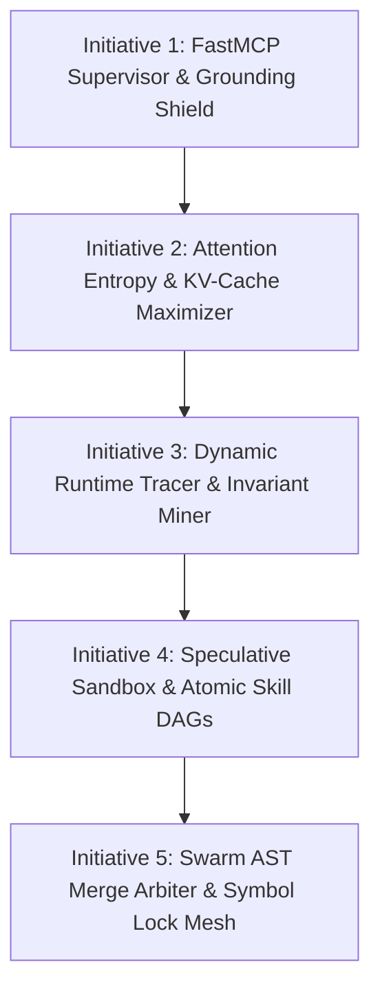

# Rush: The Unclaimed Opportunities & Frontier Innovations Report
**Document ID:** `rush-frontier-unclaimed-opportunities-report`  
**Target Platform:** Rush CLI & FastMCP Substrate (`rush-cli`)  
**Mission:** An Ambitious, First-Principles Exploration of Unclaimed Opportunities for Coding Agents and the Humans Who Steer Them  
**Author:** Principal AI Systems & Runtime Architect  

---

## 1. Grounding & First-Principles Philosophy

### The Mismatch at the Heart of AI Coding
Today's coding assistants (Cursor, Claude Code, Cline, Windsurf, Copilot, Antigravity, OpenCode) suffer from a foundational limitation: **they treat software engineering as a static text-prediction problem over isolated files, rather than an interactive, stateful, dynamic, and socio-technical discipline.**

Whether the user is a **first-time vibecoder** who knows what product they want but cannot read a TypeScript stack trace, a **senior systems engineer** tired of re-briefing every new model session, or a **team** running concurrent agent swarms, the unaddressed pain points are human, operational, and architectural:

1. **The Dynamic Reality Blindspot:** Coding agents look only at static code and ASTs. They have zero visibility into dynamic runtime execution—they cannot see which branches actually execute in production, what data shapes flow through memory, how database queries perform under load, or how asynchronous events race.
2. **The Intent & "Why" Vacuum:** Repositories contain code whose original intent, business constraints, and past trade-offs have vanished from human memory. When an agent touches this code, it refactors away subtle edge-case protections because it cannot distinguish deliberate domain constraints from accidental complexity.
3. **The Human-Agent Intent Gap:** Vibecoders express goals in terms of *user experience* ("Make checkout feel snappier and don't double-charge users on double-click"), while agents execute in terms of *low-level file modifications*. There is no middle substrate that translates user intent into verified invariants, presents transparent trade-offs, and explains risks in plain language before code is touched.
4. **The Ephemeral Model Trap:** Every time a user switches between Claude 3.7, GPT-4o, DeepSeek-R1, or future models, all accumulated working intelligence is lost. Knowledge is locked in proprietary, expiring vendor chat silos.
5. **The Fragile Verification Illusion:** Mocked unit tests pass green, but real applications crash on missing database migrations, unhandled network timeouts, environment mismatches, and race conditions.

### Rush’s Expanded Frontier
Rush must not merely be a static analysis wrapper or a set of basic tool bindings. Rush has the unclaimed opportunity to become the **Autonomous Operating System and Epistemic Substrate for Software Evolution**—the local, deterministic layer that connects static code, dynamic runtime execution, human intent, repository memory, and multi-agent coordination into a unified, cumulative asset owned permanently by the user.

---

## 2. 32 Unclaimed Breakthrough Opportunities

---

### DOMAIN I: Dynamic Runtime Reality & Execution Grounding (Beyond Static AST)

#### [OPP-001] Lightweight Bytecode & Execution Heatmap Tracer (`runtime_tracer.py`)
* **The User Problem & Agent Limitation:** Agents refactor code blindly based on static ASTs, frequently optimizing cold, rarely executed helper functions while introducing performance regressions or unhandled edge-case bugs in hot execution paths.
* **Who Benefits Most:** Experienced developers and performance-sensitive vibecoder apps.
* **What Rush Makes Possible:** Rush runs lightweight, deterministic execution tracing during test execution, recording exact branch execution frequencies, runtime type/value envelopes, and memory allocations, feeding a "Dynamic Reality Map" to the agent.
* **Why Current Tools Fall Short:** Static analyzers and language servers only see syntax; profilers produce human-facing flamegraphs that flood LLM context with noise.
* **Core Mechanism:** Local Python `sys.settrace` / bytecode instrumentation producing a compact, symbol-indexed execution density graph.
* **User Experience & Agent Behavior:** The agent sees: *"Function `process_payment` executed 450 times across 12 test scenarios; branch on line 42 was never taken."* The agent prioritizes hot paths and writes tests for dead branches.
* **Smallest Useful Version (MVP):** Track line-execution counts during `pytest` runs and attach execution density tags to `rush_token_outline`.
* **Verification Proof:** Run test suite with tracing enabled; assert that execution counts match real call invocations.
* **Differentiation:** Dynamic runtime execution reality fed directly into agent context budgets.

#### [OPP-002] Dynamic Invariant Discovery Engine (`invariant_miner.py`)
* **The User Problem & Agent Limitation:** Codebases are filled with unwritten business invariants (e.g., `user.age is always > 0`, `currency is always 3-letter ISO`, `transaction_id is never None`). Agents refactor code and accidentally violate these implicit rules.
* **Who Benefits Most:** Vibecoders working on legacy code and developers inheriting unfamiliar projects.
* **What Rush Makes Possible:** Observes runtime data shapes across test runs and static call sites, automatically inferring operational invariants (Daikon-style dynamic invariant detection adapted for LLM consumption) and enforcing them during refactors.
* **Why Current Tools Fall Short:** Static type checkers only verify types (`int`), not domain constraints (`int > 0 and int < 1000`).
* **Core Mechanism:** Statistical range and nullability analyzer over runtime test execution traces.
* **User Experience & Agent Behavior:** Agent receives pre-refactor briefing: *"Discovered invariant: `order.total` is strictly positive in 100% of observations. Preserving this invariant is mandatory."*
* **Smallest Useful Version (MVP):** Mine non-null and value-range invariants for top 10 function arguments during test runs.
* **Verification Proof:** Feed execution traces where parameter `x` is always between 1 and 10; assert discovered invariant `1 <= x <= 10`.
* **Differentiation:** Automatic operational invariant discovery from runtime behavior.

#### [OPP-003] Differential Property-Based Fuzz Synthesizer (`fuzz_synthesizer.py`)
* **The User Problem & Agent Limitation:** Agents write superficial unit tests with 2–3 happy-path examples. When edge cases hit production (Unicode emojis, null bytes, leap years, timezone transitions), the app crashes.
* **Who Benefits Most:** Vibecoders shipping user-facing products.
* **What Rush Makes Possible:** For any function an agent creates or modifies, Rush automatically synthesizes parameterized Hypothesis / property-based fuzz tests, running 500 edge-case mutations in milliseconds before approving the change.
* **Why Current Tools Fall Short:** Developers rarely have the time to write property tests manually; LLM-written tests replicate the same blind spots as LLM-written code.
* **Core Mechanism:** AST signature inspector synthesizing Hypothesis strategy decorators with edge-case generator distributions.
* **User Experience & Agent Behavior:** Agent writes string parser -> Rush runs 500 fuzz inputs -> Rush returns: *"Failed on input `'\x00\U0001f4a9'` with `UnicodeDecodeError`"* -> Agent fixes bug before human review.
* **Smallest Useful Version (MVP):** Automatically generate fuzz tests for pure functions taking primitive types (`str`, `int`, `dict`).
* **Verification Proof:** Run synthesizer against an unhandled divide-by-zero function; assert fuzzer discovers the failing input `0`.
* **Differentiation:** Automated property fuzzing as a mandatory agent verification gate.

#### [OPP-004] Behavior-Snapshot Invariance Prover (`behavior_snapshot.py`)
* **The User Problem & Agent Limitation:** Developers want to refactor ugly code or upgrade dependencies, but fear that the refactor will subtly change behavior in ways existing tests don't cover.
* **Who Benefits Most:** Teams undertaking major architectural refactors.
* **What Rush Makes Possible:** Before an agent touches a module, Rush captures a comprehensive "Behavior Snapshot" (a matrix of inputs, outputs, side-effects, and database states across test suites). After the agent refactors the code, Rush replays the snapshot and proves 100% behavioral equivalence.
* **Why Current Tools Fall Short:** Unit tests only test what developers thought to assert; snapshots capture complete input-output tensors.
* **Core Mechanism:** Serialized input/output recording wrapper capturing arguments and return values across test suite executions.
* **User Experience & Agent Behavior:** Developer asks: *"Refactor `pricing.py` to be 2x faster"*. Rush proves: *"Refactor is 2.4x faster and matches 1,420 historical input/output snapshots with zero drift."*
* **Smallest Useful Version (MVP):** Record and verify input/output JSON fixtures for deterministic public functions.
* **Verification Proof:** Refactor function internals; assert snapshot verifier detects unintended return value mutation.
* **Differentiation:** Mathematical behavioral invariance proof for refactoring agents.

#### [OPP-005] Ephemeral Twin-Environment Prover (`twin_environment.py`)
* **The User Problem & Agent Limitation:** Unit tests pass because they use mocks, but the actual app crashes on missing environment variables, real database dialect quirks, or network timeouts.
* **Who Benefits Most:** Vibecoders deploying full-stack web applications.
* **What Rush Makes Possible:** Spins up an ephemeral, lightweight local "digital twin" (in-memory SQLite/DuckDB configured with Postgres syntax compatibility, mock HTTP servers recording wire contracts) to test end-to-end execution without external cloud infrastructure.
* **Why Current Tools Fall Short:** Full Docker/Kubernetes dev environments are heavy and slow; simple mocks lie.
* **Core Mechanism:** Fast, sub-second local mock-service orchestrator running in-process or via ephemeral subprocesses.
* **User Experience & Agent Behavior:** Agent writes an API endpoint -> Rush executes live HTTP request against the local twin environment -> Catches real serialization failure before user opens browser.
* **Smallest Useful Version (MVP):** In-process SQLite database seeded with schema to test real SQL queries against ORM code.
* **Verification Proof:** Run an endpoint with an invalid SQL query; assert twin environment catches the database syntax error.
* **Differentiation:** Sub-second, mock-free real environment proving for coding agents.

---

### DOMAIN II: Cognitive Archaeology, Intent & Human-Agent Alignment

#### [OPP-006] Cognitive Archaeology & "Why This Exists" Engine (`archaeology.py`)
* **The User Problem & Agent Limitation:** Codebases are filled with weird, hacky-looking workarounds that were added to fix critical production edge cases. When an AI agent sees them, it "cleans them up", re-introducing the original catastrophic bug.
* **Who Benefits Most:** Developers maintaining long-lived or enterprise codebases.
* **What Rush Makes Possible:** When an agent inspects a function, Rush analyzes git commit histories, past pull request descriptions, linked issue IDs, and test commit associations to synthesize a crisp *"Why this code exists and what disasters it prevents"* summary.
* **Why Current Tools Fall Short:** Git blame shows commit messages, but agents cannot synthesize 5 years of git history across multiple files into actionable constraints.
* **Core Mechanism:** Local git log parsing and semantic commit-diff correlation linked to AST symbol ranges.
* **User Experience & Agent Behavior:** Agent reads code -> Rush attaches warning: *"Line 84 looks redundant, but was added in Commit `a4f12` to prevent deadlocks under high concurrency. Do not simplify."*
* **Smallest Useful Version (MVP):** Extract commit messages and PR references for lines modified within target function over past 2 years.
* **Verification Proof:** Target a function with a historical bugfix commit; assert archaeology tool extracts the original bug explanation.
* **Differentiation:** Historical rationale preservation preventing regression of intentional workarounds.

#### [OPP-007] The Uncertainty Matrix & Strategic Choice Presenter (`uncertainty_matrix.py`)
* **The User Problem & Agent Limitation:** When a task has ambiguous requirements, agents either guess (often incorrectly) or ask vague, open-ended questions that frustrate the user.
* **Who Benefits Most:** Vibecoders needing guidance and busy developers who want fast decision-making.
* **What Rush Makes Possible:** Rush analyzes architectural trade-offs and generates a structured, plain-English "Uncertainty Matrix" with 2–3 concrete options, detailing pros, cons, complexity, and backward-compatibility impact for 1-click user selection.
* **Why Current Tools Fall Short:** Agents write unstructured essays or make ungrounded assumptions without laying out architectural trade-offs.
* **Core Mechanism:** AST impact evaluator synthesizing trade-off vectors (breaking changes vs maintenance cost vs performance).
* **User Experience & Agent Behavior:** Vibecoder sees:  
  * *Option A (Recommended)*: Store user avatars locally. (Fast, free, zero setup).  
  * *Option B*: Connect AWS S3. (Scalable, requires API keys and monthly billing).  
  User clicks Option A -> Agent proceeds with zero confusion.
* **Smallest Useful Version (MVP):** Generate structured choice JSON with risk/reward scoring for schema modification decisions.
* **Verification Proof:** Trigger ambiguous refactor prompt; assert uncertainty matrix returns structured options with distinct trade-offs.
* **Differentiation:** Structured, low-friction decision negotiation between human and agent.

#### [OPP-008] Plain-English "What Will Change in Your App" Impact Translator (`impact_translator.py`)
* **The User Problem & Agent Limitation:** Non-technical vibecoders cannot understand raw git diffs (e.g., `+50 -20 in auth_middleware.py`), making it impossible for them to review or trust agent work.
* **Who Benefits Most:** Vibecoders and non-technical product builders.
* **What Rush Makes Possible:** Translates technical AST diffs into plain-English user-experience changes (e.g., *"Users will now see a loading spinner while checkout processes; password reset links will now expire after 15 minutes"*).
* **Why Current Tools Fall Short:** Git diffs and code review tools are built for experienced software engineers.
* **Core Mechanism:** AST change classifier mapping function mutations to user-facing domain capability descriptions.
* **User Experience & Agent Behavior:** Before applying a patch, Rush shows the vibecoder a 3-bullet summary of real product behavior changes, building trust and catching unintended side effects early.
* **Smallest Useful Version (MVP):** Map route/controller and model changes to plain-language endpoint and data impact summaries.
* **Verification Proof:** Feed a diff modifying a login route; assert plain-English translation states user login behavior changed.
* **Differentiation:** Demystifying code diffs into human product language.

#### [OPP-009] The "Regret Ledger" & Post-Mortem Immune Booster (`regret_ledger.py`)
* **The User Problem & Agent Limitation:** When an agent introduces a bug that gets caught in production or code review, the developer fixes it, but future agent sessions have no memory of the incident and make the same mistake again next week.
* **Who Benefits Most:** Teams and solo developers building production apps over time.
* **What Rush Makes Possible:** Developers run `rush regret ingest <commit/PR>`, which analyzes the bug, extracts the root cause, and permanently updates the repository's local immune system (generating an active AST invariant or negative knowledge entry).
* **Why Current Tools Fall Short:** Post-mortems are written in Google Docs or Notion where coding agents cannot access or enforce them.
* **Core Mechanism:** Diff post-mortem analyzer that generates deterministic AST lint rules and test invariants from bugfix diffs.
* **User Experience & Agent Behavior:** A past production incident becomes an active local invariant that prevents all future agents from ever repeating the same flaw.
* **Smallest Useful Version (MVP):** Convert a reverted commit into a permanent AST regex check in `.rush/regrets.json`.
* **Verification Scenario:** Ingest a bugfix commit; propose a new diff re-introducing the bug; assert immediate rejection.
* **Differentiation:** Permanent repository-level immune memory derived from real developer regrets.

#### [OPP-010] User Preference & Coding Style DNA Synthesizer (`style_dna.py`)
* **The User Problem & Agent Limitation:** Every developer has strong stylistic preferences (e.g., "prefer early returns", "use composition over inheritance", "use explicit type annotations"), but static linters only enforce formatting, leading to endless manual cleanup after agents.
* **Who Benefits Most:** Experienced developers who take pride in codebase cleanliness.
* **What Rush Makes Possible:** Automatically analyzes the developer's accepted git commits to synthesize a "Codebase Style DNA" (measuring nesting depth, variable naming idioms, error-handling conventions), ensuring agent-generated code matches the author's exact personal coding fingerprint.
* **Why Current Tools Fall Short:** Formatting tools like Prettier/Ruff only handle syntax layout, not structural coding idioms.
* **Core Mechanism:** Statistical AST pattern miner calculating idiomatic distributions across recent git commits.
* **User Experience & Agent Behavior:** Agent-generated code looks and feels indistinguishable from code written by the repository's human lead.
* **Smallest Useful Version (MVP):** Detect early-return vs nested-if preference and prompt agents with the preferred structural pattern.
* **Verification Proof:** Mine a repo with 90% early returns; assert style DNA outputs an explicit "prefer early return" constraint.
* **Differentiation:** Idiomatic structural style extraction beyond cosmetic formatters.

---

### DOMAIN III: Sovereign Knowledge Fabric & Cross-Model Interoperability

#### [OPP-011] The Universal "Rosetta Stone" Context Transpiler (`rosetta_context.py`)
* **The User Problem & Agent Limitation:** Different LLM models have completely different context sensitivities (Claude excels with hierarchical XML; OpenAI models prefer structured JSON; DeepSeek-R1 thrives with step-by-step chain-of-thought scaffolds). Developers cannot carry forward optimized context when switching models.
* **Who Benefits Most:** Developers who use multiple models (e.g. Claude Code for architecture, Codex for boilerplate, DeepSeek for debugging).
* **What Rush Makes Possible:** Rush maintains repository state in a model-neutral semantic format, dynamically compiling it into provider-optimized dialect representations on the fly.
* **Why Current Tools Fall Short:** Prompts and context frameworks are hardcoded for one specific vendor's format.
* **Core Mechanism:** Semantic AST/state intermediate representation with pluggable dialect emitters (XML, Markdown, JSON-RPC, S-expressions).
* **User Experience & Agent Behavior:** Seamless model switching: Claude Code receives clean XML tags; GPT-4o receives typed JSON schema context; both achieve maximum reasoning accuracy.
* **Smallest Useful Version (MVP):** Emit context as XML when `provider=anthropic` and structured Markdown when `provider=openai`.
* **Verification Proof:** Request context for Anthropic vs OpenAI; assert dialect syntax formatting conforms to vendor best practices.
* **Differentiation:** Model-neutral repository intelligence transpilation.

#### [OPP-012] Cross-Session Task Capsule & State Resumption Pod (`task_capsule.py`)
* **The User Problem & Agent Limitation:** A developer stops working on Friday afternoon. On Monday morning, starting a new agent session requires 20 minutes of re-explaining where work left off, what was tried, and what remains broken.
* **Who Benefits Most:** Everyone working on multi-day coding tasks.
* **What Rush Makes Possible:** Packages active task state, uncommitted AST diffs, failing test vectors, active hypotheses, and next step obligations into a compact `.rush/capsule.json` file that any agent can boot into in 2 seconds.
* **Why Current Tools Fall Short:** Chat transcripts are linear and messy; git branches don't record agent hypotheses or unwritten next steps.
* **Core Mechanism:** Structured serialization of epistemic graph state, active worktrees, and outstanding verification tasks.
* **User Experience & Agent Behavior:** Developer opens terminal on Monday, types `rush resume`, and the agent immediately greets them with: *"Resuming auth migration: 4/6 tests passing, remaining task is fixing token expiration in `session.py`."*
* **Smallest Useful Version (MVP):** Save and restore active modified file list and latest error trace to a local JSON file.
* **Verification Proof:** Create capsule, reset agent context, load capsule, and verify agent resumes exact task state.
* **Differentiation:** Grounded state resumption without re-reading chat history.

#### [OPP-013] Differential Knowledge Sync & Merkle State Tree (`knowledge_merkle.py`)
* **The User Problem & Agent Limitation:** In teams or multi-device setups, developers and agents learn things about the repository in isolation, resulting in fragmented, out-of-sync local knowledge.
* **Who Benefits Most:** Teams and developers working across multiple machines (laptop, desktop, remote dev container).
* **What Rush Makes Possible:** Manages repository knowledge (invariants, mistake fingerprints, symbol provenance) as a Git-like Merkle DAG, allowing developers to push, pull, and merge repository intelligence via `.rush/` alongside code.
* **Why Current Tools Fall Short:** Team knowledge tools (Wikis, Notion) are detached from the codebase; agent memory files are un-mergeable JSON blobs.
* **Core Mechanism:** Content-addressable Merkle tree storing verified facts and invariant hashes with deterministic 3-way merge rules.
* **User Experience & Agent Behavior:** When a teammate fixes a tricky bug and commits `.rush/invariants`, your local agent immediately gains immunity against that bug.
* **Smallest Useful Version (MVP):** Commit-friendly, append-only JSONL files with deterministic deduplication for mistake patterns.
* **Verification Proof:** Merge two independent `.rush/` knowledge trees and assert all unique verified facts are preserved without conflicts.
* **Differentiation:** Git-native, team-shared repository intelligence.

#### [OPP-014] Offline Local Embedding & Semantic Index Engine (`local_semantic_index.py`)
* **The User Problem & Agent Limitation:** Semantic code search tools require sending code to third-party cloud vector databases (OpenAI, Pinecone), violating privacy and incurring monthly costs.
* **Who Benefits Most:** Enterprise developers, privacy-conscious vibecoders, and offline developers.
* **What Rush Makes Possible:** 100% local, zero-network semantic code search using quantized local embeddings (e.g. ONNX-runtime MiniLM) running on the local CPU/GPU with sub-50ms query times.
* **Why Current Tools Fall Short:** Cloud-hosted vector databases require API keys and leak proprietary code.
* **Core Mechanism:** Local ONNX runtime executing compact code embedding models over AST chunk boundaries, stored in a local SQLite vector table.
* **User Experience & Agent Behavior:** Agents execute semantic natural language queries (`rush_semantic_search("Where do we handle Stripe webhooks?")`) with zero cloud dependencies.
* **Smallest Useful Version (MVP):** SQLite FTS5 BM25 search combined with local ONNX embeddings for symbol search.
* **Verification Proof:** Query a codebase for "payment processing" and assert `billing/stripe.py` is returned in the top 3 results.
* **Differentiation:** Zero-network, privacy-first local semantic search.

---

### DOMAIN IV: Multi-Agent Swarms, Lock Meshes & Collaborative Arbitration

#### [OPP-015] Symbol-Level Distributed Lock Mesh with Deadlock Prevention (`symbol_lock_mesh.py`)
* **The User Problem & Agent Limitation:** When running 3+ agents in parallel, they frequently edit the same file simultaneously, causing race conditions, corrupted syntax, and lost progress.
* **Who Benefits Most:** Power users running multi-agent swarms.
* **What Rush Makes Possible:** Fine-grained distributed locking at the function/class symbol level (rather than whole files), with automatic wait-for graph cycle detection and lease timeouts to prevent deadlocks.
* **Why Current Tools Fall Short:** File-level locking prevents parallel edits to independent functions in the same file; no locking causes silent overwrites.
* **Core Mechanism:** Local IPC daemon tracking active AST symbol leases with Tarjan cycle detection for deadlock prevention.
* **User Experience & Agent Behavior:** Agent 1 edits `AuthService.login()` while Agent 2 simultaneously edits `AuthService.logout()` in the same file without conflict or delay.
* **Smallest Useful Version (MVP):** File-backed symbol lockfile with 30-second TTL and automatic lease expiration.
* **Verification Proof:** Have Agent 1 acquire lock on `foo()`; assert Agent 2 gets wait status for `foo()` but acquires lock for `bar()` in same file.
* **Differentiation:** AST symbol-level concurrency mesh for coding agents.

#### [OPP-016] 3-Way AST Semantic Merge Arbiter (`ast_merge_arbiter.py`)
* **The User Problem & Agent Limitation:** Parallel agents working on the same file generate standard git line conflicts (`<<<<<<< HEAD`), which agents struggle to resolve without corrupting code.
* **Who Benefits Most:** Multi-agent development pipelines.
* **What Rush Makes Possible:** Merges concurrent agent branches by operating on AST nodes rather than text lines. If changes do not overlap in the syntax tree, Rush weaves them together cleanly with zero git conflict markers.
* **Why Current Tools Fall Short:** Git merge is dumb text diffing; it cannot recognize that two independent function insertions are non-conflicting.
* **Core Mechanism:** 3-way AST structural merge algorithm based on common ancestor AST trees.
* **User Experience & Agent Behavior:** 4 agents complete parallel tasks -> Rush automatically merges all 4 branches into a single clean syntax tree in milliseconds.
* **Smallest Useful Version (MVP):** Merge non-overlapping function additions and deletions in Python files.
* **Verification Proof:** Take base file, apply Function A in Branch 1 and Function B in Branch 2; assert merge produces valid AST with both functions.
* **Differentiation:** Language-aware structural AST merge resolution.

#### [OPP-017] Asynchronous Agent Task Auction & Specialization Mesh (`task_auction.py`)
* **The User Problem & Agent Limitation:** Monolithic agents try to do everything (architecture, coding, unit testing, documentation, security review), leading to degraded performance on specialized sub-tasks.
* **Who Benefits Most:** Autonomous development workflows.
* **What Rush Makes Possible:** Decomposes complex user goals into atomic sub-tasks and "auctions" them to specialized agent personas (e.g., Fuzzer Agent, Type Strictness Agent, Security Auditor) with explicit input/output contracts.
* **Why Current Tools Fall Short:** Multi-agent frameworks create chaotic chat chatter without structured contract handoffs.
* **Core Mechanism:** Contract-driven task queue with dependency DAG scheduling and verification gating.
* **User Experience & Agent Behavior:** User says *"Build user management"*; Rush orchestrates: Model Architect creates models -> Coder implements endpoints -> Fuzzer stress-tests -> Reviewer approves -> Finished feature delivered.
* **Smallest Useful Version (MVP):** Split task into `code` and `test` phases executed by sequential specialized prompt personas.
* **Verification Proof:** Dispatch task; verify coder persona generates code and tester persona generates passing test suite.
* **Differentiation:** Contract-driven task auction vs chaotic multi-agent chat rooms.

#### [OPP-018] Cross-Agent Knowledge Pub/Sub Blackboard (`knowledge_blackboard.py`)
* **The User Problem & Agent Limitation:** In multi-agent swarms, Agent A spends 10 minutes discovering that a library has a rate limit, but Agent B is unaware and makes the same discovery 5 minutes later, doubling token costs.
* **Who Benefits Most:** Multi-agent parallel systems.
* **What Rush Makes Possible:** A local real-time pub/sub blackboard where agents broadcast discovered facts, verified benchmarks, and dead ends, immediately synchronizing the collective intelligence of the swarm.
* **Why Current Tools Fall Short:** Agent conversations are completely isolated silos.
* **Core Mechanism:** In-process SQLite / JSONL event bus with topic-filtered subscriptions.
* **User Experience & Agent Behavior:** Agent A discovers an API quirk -> Publishes to `#dependencies` -> Agent B's next prompt automatically includes the finding -> Zero duplicate effort.
* **Smallest Useful Version (MVP):** Shared JSONL event stream that agents query before exploring external APIs.
* **Verification Proof:** Agent 1 logs fact to blackboard; Agent 2 queries topic and verifies fact is returned.
* **Differentiation:** Real-time collective epistemic synchronization.

---

### DOMAIN V: Dynamic Execution Guardrails & FastMCP Middleware

#### [OPP-019] Bidirectional FastMCP Supervisor Middleware (`mcp_supervisor.py`)
* **The User Problem & Agent Limitation:** Current MCP servers are passive request/response pipes. If an agent calls a tool with dangerous arguments or hallucinated data, the server executes it blindly.
* **Who Benefits Most:** All developers and agents.
* **What Rush Makes Possible:** Active middleware wrapped around FastMCP stdio handlers:
  * **Pre-Execution Gate:** Validates token budgets, checks file locks, and checks safety policies before execution.
  * **Post-Execution Gate:** Validates that output findings are grounded in disk reality and redacts accidental secrets before returning to the model.
* **Why Current Tools Fall Short:** Standard MCP provides no middleware or interceptor hooks.
* **Core Mechanism:** Python async decorator middleware chain wrapping FastMCP tool handlers.
* **User Experience & Agent Behavior:** Prevents rogue agent actions and guarantees all returned tool results are verified against disk reality.
* **Smallest Useful Version (MVP):** Pre-execution check verifying target file is within repository root; post-execution secret redaction.
* **Verification Proof:** Invoke tool with out-of-bounds path; verify interceptor blocks call with structured permission error.
* **Differentiation:** Active bidirectional supervisor middleware for FastMCP.

#### [OPP-020] Zero-Hallucination Import & Symbol Shield (`grounding_shield.py`)
* **The User Problem & Agent Limitation:** Agents frequently invent non-existent package dependencies or hallucinate methods on real objects, causing runtime crashes.
* **Who Benefits Most:** Vibecoders and developers working with fast-evolving libraries.
* **What Rush Makes Possible:** Parses the AST of all agent-proposed code *before* writing to disk, checking every `import` against the local environment and every method call against the local symbol graph, blocking hallucinations with installed alternatives.
* **Why Current Tools Fall Short:** Linters only run after files are already written to disk.
* **Core Mechanism:** Static AST import and call-site extractor validated against `pkg_resources` / `sys.modules` and CodeGraph symbol index.
* **User Experience & Agent Behavior:** Agent attempts to import `super_jwt_tool` -> Rush blocks write and suggests: *"Package not found. Did you mean `pyjwt` (installed v2.8)?"*
* **Smallest Useful Version (MVP):** Validate Python imports against installed packages in `.venv`.
* **Verification Proof:** Submit snippet importing `non_existent_fake_pkg`; assert shield blocks write and returns warning.
* **Differentiation:** Pre-write AST hallucination interception.

#### [OPP-021] Declarative Architecture & Layer Boundary Guard (`arch_guard.py`)
* **The User Problem & Agent Limitation:** Agents take lazy shortcuts, importing database models into UI components or bypassing service layers, degrading codebase architecture over time.
* **Who Benefits Most:** Engineering leads and maintainers of modular codebases.
* **What Rush Makes Possible:** Enforces declarative layer dependency rules defined in `rush.toml` (e.g. `transport` -> `service` -> `repository`), blocking any agent patch that introduces illegal cross-layer coupling.
* **Why Current Tools Fall Short:** Architecture reviews are manual and happen long after code is written.
* **Core Mechanism:** AST import path matching against declarative layer dependency matrices.
* **User Experience & Agent Behavior:** Agent tries to import DB query in CLI file -> Rush rejects patch and provides the proper service layer interface to call instead.
* **Smallest Useful Version (MVP):** Enforce that `src/rush/cli.py` cannot directly import internal engine modules.
* **Verification Proof:** Add an illegal import to `cli.py`; assert arch guard fails with explicit layer violation trace.
* **Differentiation:** Real-time AST architectural governance for coding agents.

#### [OPP-022] Database Schema Drift & Migration Auto-Drafter (`db_drift_drafter.py`)
* **The User Problem & Agent Limitation:** Agents change database models (SQLAlchemy, Prisma, Django) and update test mocks, but forget to create migration files, causing production deployment failures.
* **Who Benefits Most:** Full-stack developers shipping web apps.
* **What Rush Makes Possible:** Compares modified ORM models against migration history, spots schema drift, and automatically drafts the corresponding Alembic / Prisma migration file.
* **Why Current Tools Fall Short:** Mocked unit tests pass green even when database migrations are completely missing.
* **Core Mechanism:** AST model attribute extractor diffed against local migration revision histories.
* **User Experience & Agent Behavior:** Agent adds `phone_number` to `User` model -> Rush flags unmigrated column and generates `alembic/versions/2026_add_phone_number.py` automatically.
* **Smallest Useful Version (MVP):** Detect modified columns in SQLAlchemy models not present in migration files.
* **Verification Proof:** Add column to model fixture; assert drift drafter detects change and synthesizes migration script.
* **Differentiation:** AST-to-migration schema drift detection and auto-drafting.

#### [OPP-023] Public API Contract Compatibility Sentinel (`api_sentinel.py`)
* **The User Problem & Agent Limitation:** Refactoring agents accidentally rename public methods, remove keyword arguments, or narrow return types, breaking external downstream consumers.
* **Who Benefits Most:** Open-source maintainers and shared-service teams.
* **What Rush Makes Possible:** Compares the public export signatures of modified modules against the `main` git branch, detecting breaking API changes before commits land.
* **Why Current Tools Fall Short:** Internal unit tests pass if both the caller and callee were updated together inside the repository.
* **Core Mechanism:** AST signature and export map diffing against git base branch revisions.
* **User Experience & Agent Behavior:** Agent renames public method -> Sentinel warns: *"Breaking change: `client.get_user(id)` was renamed to `client.fetch_user(id)`. Maintain backward compatibility."*
* **Smallest Useful Version (MVP):** Check if any public function has removed parameters compared to git `HEAD`.
* **Verification Proof:** Delete parameter from public function fixture; assert sentinel flags breaking contract change.
* **Differentiation:** AST public API backward compatibility enforcement.

---

### DOMAIN VI: Token Economics, Context Packing & Dynamic Pipelines

#### [OPP-024] Atomic Multi-Step Skill DAG Pipeline (`skill_dag.py`)
* **The User Problem & Agent Limitation:** Standard agent workflows require 6–8 slow back-and-forth LLM network round-trips to complete a single task (read file -> propose diff -> check lint -> run test -> fix lint -> re-test).
* **Who Benefits Most:** Developers who want fast, responsive coding agents.
* **What Rush Makes Possible:** Agents submit a multi-step Skill Directed Acyclic Graph (DAG) that executes locally within Rush's runtime in a single round-trip, returning an atomic, verified outcome.
* **Why Current Tools Fall Short:** Standard MCP only executes 1 tool per network round-trip.
* **Core Mechanism:** In-process DAG execution engine with conditional execution and automatic rollback on failure.
* **User Experience & Agent Behavior:** Turns a 45-second multi-turn debugging ordeal into a 3-second single-turn atomic operation.
* **Smallest Useful Version (MVP):** Execute a 3-tool pipeline (`slice` -> `patch` -> `test`) with auto-rollback.
* **Verification Proof:** Dispatch DAG with a failing test step; verify sandbox rolls back and returns aggregate error trace.
* **Differentiation:** In-process multi-tool DAG orchestration for MCP.

#### [OPP-025] Attention Entropy Context Budgeter (`entropy_budgeter.py`)
* **The User Problem & Agent Limitation:** Passing large files wastes tokens and dilutes the model's attention, causing it to miss critical logic buried in boilerplate.
* **Who Benefits Most:** Developers on token budgets and long-context models.
* **What Rush Makes Possible:** Scores every AST node in a file by mathematical information entropy (cyclomatic complexity, recent churn, untested branches) and dynamically packs only the highest-entropy code within the token budget.
* **Why Current Tools Fall Short:** Naive tools either dump whole files or perform dumb top-N line slicing.
* **Core Mechanism:** AST node scoring using Shannon entropy of code complexity + call-graph topological distance.
* **User Experience & Agent Behavior:** A 1,500-line file is packed into 250 high-density tokens containing only critical logic and contracts, cutting token costs by 85%.
* **Smallest Useful Version (MVP):** Collapse low-complexity getters/setters/boilerplate into single-line signatures when over budget.
* **Verification Proof:** Pack a 1000-line file into a 300-token budget; verify complex functions retain bodies while simple helpers are skeletonized.
* **Differentiation:** Entropy-weighted AST context packing.

#### [OPP-026] KV-Cache Prefix Alignment Optimizer (`kv_aligner.py`)
* **The User Problem & Agent Limitation:** Shifting timestamps, fluctuating tool schemas, and dynamic headers invalidate LLM prompt caches (Anthropic/OpenAI KV caches), multiplying latency and cost by 10x.
* **Who Benefits Most:** Everyone running multi-turn agent sessions.
* **What Rush Makes Possible:** Enforces immutable, deterministic static-prefix blocks for all tool outputs, memory frames, and AST headers, locking in 95%+ prompt-cache hit rates across continuous sessions.
* **Why Current Tools Fall Short:** Standard MCP servers inject dynamic timestamps at the beginning of tool outputs.
* **Core Mechanism:** Output template engine separating static prefix blocks from dynamic postfix payloads.
* **User Experience & Agent Behavior:** Multi-turn sessions feel instantaneous and cost 80% less because the model reuses cached KV-cache states.
* **Smallest Useful Version (MVP):** Move all timestamps and session IDs to the trailing end of tool response payloads.
* **Verification Proof:** Generate 10 consecutive tool outputs and verify character-exact byte prefix parity across all outputs.
* **Differentiation:** Dedicated KV-cache prefix engineering for developer tooling.

#### [OPP-027] Lossless Error & Stack Trace Compactor (`trace_compactor.py`)
* **The User Problem & Agent Limitation:** 400-line framework stack traces overflow agent context and obscure the actual root cause of failures.
* **Who Benefits Most:** Full-stack developers debugging heavy frameworks (React, Django, FastAPI, Next.js).
* **What Rush Makes Possible:** Compresses repetitive runtime frames, framework internals, and vendor traceback noise into concise glyph tokens with deterministic offset lookups, cutting token size by 85% while preserving exact error line/column pointers.
* **Why Current Tools Fall Short:** Truncating stack traces often removes the critical originating frame.
* **Core Mechanism:** Frame deduplication and framework-pattern elimination with reversible hash anchors.
* **User Experience & Agent Behavior:** Agent sees a 15-line high-signal trace pointing directly to the application bug, rather than 400 lines of internal framework boilerplate.
* **Smallest Useful Version (MVP):** Collapse contiguous third-party `site-packages` / `node_modules` frames into single summary lines.
* **Verification Proof:** Feed 200-line traceback and verify output is < 30 lines with the root application frame intact.
* **Differentiation:** Reversible, AST-linked trace compaction.

#### [OPP-028] Semantic Context Differential Streamer (`diff_streamer.py`)
* **The User Problem & Agent Limitation:** Agents reload entire files after making small changes, wasting tokens and losing track of what changed.
* **Who Benefits Most:** Fast vibecoding iteration loops.
* **What Rush Makes Possible:** Computes call-graph topological distances from active edit sites and streams minimal AST delta trees containing only modified interfaces and immediate caller/callee contracts.
* **Why Current Tools Fall Short:** Standard file read tools return entire files or raw line chunks without call-site awareness.
* **Core Mechanism:** Tree-sitter AST diffing linked to local CodeGraph call-graph reachability.
* **User Experience & Agent Behavior:** Agent receives only the modified function AST and direct caller contracts (<50 lines) instead of re-reading a 600-line file.
* **Smallest Useful Version (MVP):** Return only the modified function AST and the signatures of its direct callers.
* **Verification Proof:** Modify 1 method in a 500-line class and assert returned context is < 50 lines.
* **Differentiation:** AST-aware neighborhood delta streaming.

---

### DOMAIN VII: Safety, Provenance & Verification

#### [OPP-029] Ephemeral Copy-on-Write Speculative Sandbox (`cow_sandbox.py`)
* **The User Problem & Agent Limitation:** Failed agent refactors leave broken, uncommitted code all over the user's working directory, forcing manual git cleanups.
* **Who Benefits Most:** Vibecoders terrified of AI breaking their working projects.
* **What Rush Makes Possible:** Sub-second ephemeral git worktrees with copy-on-write isolation. High-risk multi-step refactors execute completely isolated; only when all tests pass is the patch atomically promoted to the working directory.
* **Why Current Tools Fall Short:** Direct filesystem edits risk permanent user data loss.
* **Core Mechanism:** Fast `git worktree add --detach` combined with atomic patch promotion.
* **User Experience & Agent Behavior:** The user's working directory is 100% protected against half-baked or broken agent attempts.
* **Smallest Useful Version (MVP):** Execute a command in a detached temporary worktree and auto-cleanup.
* **Verification Proof:** Run failing test in sandbox, verify main repo working tree remains 100% clean.
* **Differentiation:** Zero-risk speculative agent execution.

#### [OPP-030] Deterministic Binary Flight Recorder (`flight_recorder.py`)
* **The User Problem & Agent Limitation:** When an agent makes a catastrophic mistake, developers cannot reconstruct what tools it called, what output it saw, or why it made that choice.
* **Who Benefits Most:** Developers needing auditability and debugging for agent actions.
* **What Rush Makes Possible:** Ultra-compact local trace logging every MCP message, AST diff, and validation verdict into an inspectable binary trace that can be replayed turn-by-turn.
* **Why Current Tools Fall Short:** Raw text logs are bloated and don't capture structured AST diffs.
* **Core Mechanism:** Structured JSONL / binary event recorder with millisecond-precision timestamps.
* **User Experience & Agent Behavior:** Run `rush flight-replay` to step backward and forward through every decision, tool call, and diff the agent executed.
* **Smallest Useful Version (MVP):** Log all tool calls and returns into `.rush/traces/<session_id>.jsonl`.
* **Verification Proof:** Execute 5 tool calls, query flight recorder, assert 5 sequential events logged.
* **Differentiation:** Deterministic time-travel replay for AI agent sessions.

#### [OPP-031] SLSA Build & Modification Attestation Generator (`attestation_generator.py`)
* **The User Problem & Agent Limitation:** Enterprise teams cannot verify if code was written by a human, an audited agent, or an unvetted script.
* **Who Benefits Most:** Enterprise compliance and security teams.
* **What Rush Makes Possible:** Generates cryptographic SLSA Level 3 provenance metadata certifying which agent executed which verified tools in which isolated worktree.
* **Why Current Tools Fall Short:** Git commits do not cryptographically attest to agent tool execution provenance.
* **Core Mechanism:** SHA-256 hash chains over tool execution records signed with local ephemeral keys.
* **User Experience & Agent Behavior:** Enterprise CI/CD automatically verifies that agent-generated PRs passed all local sandbox gates.
* **Smallest Useful Version (MVP):** Hash all modified files and tool execution logs into a verifiable manifest.
* **Verification Proof:** Generate attestation, modify a file manually, verify hash verification fails.
* **Differentiation:** Cryptographic provenance for AI-generated code.

#### [OPP-032] Dynamic Persona & Verbosity Governor (`persona_governor.py`)
* **The User Problem & Agent Limitation:** Agents produce pages of conversational chatter, pleasantries, and unsolicited advice, slowing down workflows and wasting context.
* **Who Benefits Most:** Vibecoders and developers who value concise, high-speed execution.
* **What Rush Makes Possible:** Injects dynamic output contracts into tool responses that force the agent into ultra-terse, action-only responses (e.g. 1-sentence explanations + code diffs), saving 40% of conversational output tokens.
* **Why Current Tools Fall Short:** System prompts decay in effectiveness over long conversations.
* **Core Mechanism:** Dynamic suffix injection into FastMCP tool result payloads reinforcing concise output formatting.
* **User Experience & Agent Behavior:** Fast, punchy agent interactions with zero wasted filler text.
* **Smallest Useful Version (MVP):** Inject a fixed concise-format instruction into every MCP tool summary.
* **Verification Proof:** Verify all MCP tool outputs include the concise response framing tag.
* **Differentiation:** Real-time verbosity governance via tool return framing.

---

## 3. Synthesis and Strategic Recommendation

### 1. What is Rush’s most compelling long-term role?
Rush is the **Deterministic Ground Truth and Epistemic Substrate for Software Evolution**. While frontier LLMs serve as probabilistic reasoning engines, Rush is the local operating system that owns repository intelligence, runtime verification, structural merge arbitration, and safety governance.

### 2. What durable assets should Rush own on behalf of the user?
* **The Epistemic Belief & Invariant Graph:** The proof-backed map of what is true and what constraints must be preserved.
* **The Cognitive Archaeology Ledger:** The historical rationale behind why complex code exists.
* **The Mistake & Regret Fingerprints:** The repository's permanent immune system against past bugs.
* **The AST Merge Arbiter & Lock Mesh:** The local concurrency substrate enabling multi-agent collaboration.

### 3. Partitioning: What belongs where?
* **Repository-Specific (Owned in `.rush/`):** Invariant rules, architecture boundaries, belief graphs, mistake fingerprints, and symbol provenance.
* **Provider-Specific:** Model weights, raw prompt tokens, temperature, and provider billing.
* **Session-Specific:** Ephemeral copy-on-write worktree sandboxes and active token budgets.
* **User-Specific:** Personal Style DNA and global verbosity preferences.

### 4. Foundational primitives that unlock multiple opportunities
1. **Tree-sitter AST Graph Engine:** Unlocks context packing, semantic diffs, architectural enforcement, mutation fuzzing, and 3-way semantic merging.
2. **Causal Invalidation DAG:** Unlocks epistemic memory, anti-thrashing circuit breakers, and task handoff capsules.
3. **FastMCP Bidirectional Middleware:** Unlocks live guardrails, zero-hallucination shields, verbosity governance, and flight recording.

### 5. Handling knowledge without creating a stale dumping ground
Rush enforces **Execution-Proof Grounding**. No statement or chat summary enters durable memory without being anchored to an AST symbol and backed by an execution proof (passing test, linter run, or explicit user confirmation). If the underlying AST changes, the memory transitions to `STALE` until re-proven.

### 6. What good multi-agent work in one repository actually requires
It requires **symbol-level locking** (preventing simultaneous edits to the same function) and **3-way AST semantic merging** (cleanly combining non-overlapping AST changes). Text-based git merge conflict resolution is fundamentally inadequate for autonomous swarms.

### 7. Form Factor: Portable Core with Standardized Adapters
Rush should remain a **portable, high-performance Python 3.12 core exposed via stdio FastMCP and CLI**, ensuring universal compatibility across Cursor, Claude Code, Cline, Windsurf, Copilot, and custom autonomous swarms without platform lock-in.

### 8. What Rush should deliberately NOT become
* Rush must NOT become a generic web UI / consumer mockup builder.
* Rush must NOT become an unprompted Git hook vandal.
* Rush must NOT become a hosted cloud dependency or closed SaaS.
* Rush must NOT become a passive chat-log aggregator.

---

## 4. Recommended High-Leverage Implementation Sequence

1. **Initiative 1: Live Guardrails & Hallucination Defense (`mcp_supervisor.py`, `grounding_shield.py`)**
   * *Value*: Immediate protection against phantom imports and ungrounded file modifications.
2. **Initiative 2: Attention Entropy & KV-Cache Maximizer (`entropy_budgeter.py`, `kv_aligner.py`)**
   * *Value*: 70–90% reduction in developer token costs and sub-second response latencies.
3. **Initiative 3: Dynamic Runtime Tracer & Invariant Miner (`runtime_tracer.py`, `invariant_miner.py`)**
   * *Value*: Bridges static AST to live execution reality, preventing subtle runtime bugs.
4. **Initiative 4: Safe Speculation & Atomic Skill DAGs (`cow_sandbox.py`, `skill_dag.py`)**
   * *Value*: Zero-risk multi-step refactoring in ephemeral copy-on-write worktree sandboxes.
5. **Initiative 5: Multi-Agent Swarm Harmony (`ast_merge_arbiter.py`, `symbol_lock_mesh.py`)**
   * *Value*: Conflict-free parallel agent collaboration in shared repositories.

---
*Report completed and committed to repository documentation.*
