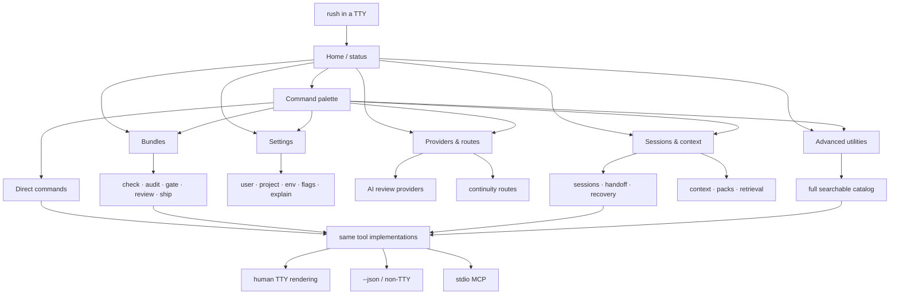
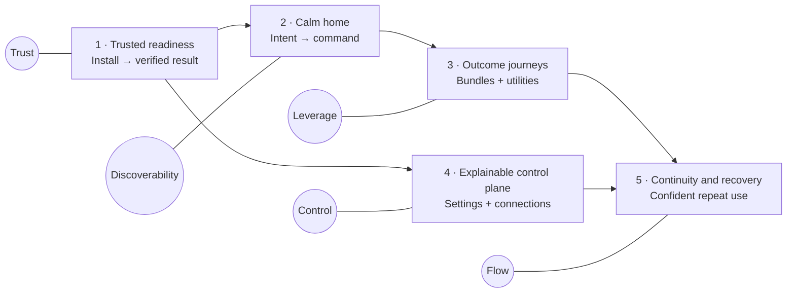
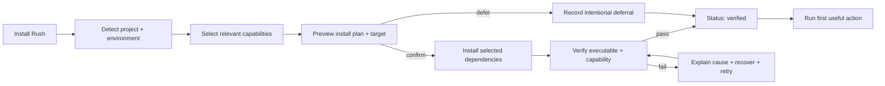
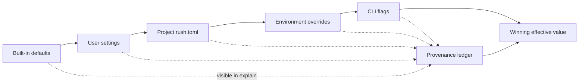
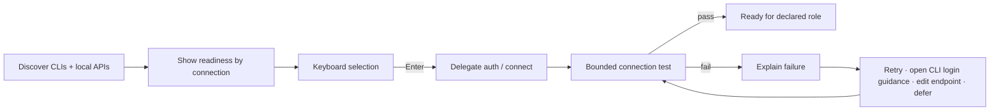

# Rush Terminal Control Plane: Product and Experience Roadmap

**Product direction:** Transform Rush from a broad command catalog into a calm, self-contained terminal control plane without weakening its direct CLI, JSON, permissions, stdout, or stdio MCP contracts.

**Roadmap horizon:** Five experience phases. This is a product roadmap, not an implementation plan.

## 1. Product objective, target users, and design principles

### Product objective

Rush should make a local development environment legible and operable from one place. A user should be able to arrive with an intent — “is this project ready?”, “what should I run?”, “prepare this for review”, “connect my provider”, “resume this session” — and reach a safe, explainable action without memorizing Rush’s command topology or reverse-engineering their environment.

The north-star experience is a verified path from **unknown state** to **understood state** to **useful action**. Rush should not merely launch tools. It should explain what is available, why an action is recommended, what it will do, which permissions it needs, and how to recover when a prerequisite is missing.

### Target users

- **New adopters** who want a trustworthy first result before learning Rush’s command language.
- **Working developers** who need fast, repeatable paths through checks, audits, reviews, context, sessions, and shipping readiness.
- **Power users and automation authors** who expect stable direct commands, predictable exit behavior, `--json`, and composability.
- **AI coding agents and MCP clients** that need the same underlying tool implementations and structured results without terminal decoration or interactive prompts.
- **Teams with constrained environments** that need explicit permissions, local-first behavior, credential hygiene, and clear explanations of unavailable capabilities.

### Core design principles

1. **Intent before inventory.** Lead with jobs such as Check, Audit, Review, Resume, and Ship; reveal the complete utility catalog only when asked.
2. **Verified truth, not optimistic setup.** “Ready” means detected and successfully verified. “Installed” alone is not success.
3. **One product, two interaction modes.** The TTY experience is polished and keyboard-driven; scripts and MCP receive the same deterministic operations without prompts, animation, or decorative output.
4. **Preview before consequence.** Show the exact command, scope, permissions, network use, and writes before a consequential action.
5. **Explain every active choice.** Settings, providers, routes, and models must expose provenance and overridden values.
6. **Progressive disclosure over reorganization churn.** Preserve direct commands; place a task-oriented discovery layer above them rather than renaming the world.
7. **Local and permissioned by default.** No implied network access, credential capture, background mutation, or silent package installation.
8. **Status is semantic, not cosmetic.** Every state must pair a label and cue with color: Ready, Needs action, Failed, Unavailable, Skipped, or Deferred.
9. **Calm density.** Show the smallest amount of information needed to make the next decision, with details available on demand.
10. **Transport discipline is inviolable.** While `rush mcp serve` is active, stdout remains JSON-RPC only; diagnostics stay on stderr. Interactive rendering never leaks into MCP or JSON output.

## 2. Underlying opportunities identified from the report

The report’s feature requests point to deeper product opportunities:

### Replace translation work with intent routing

Users currently perform two jobs before Rush performs one: they decide what kind of outcome they need, then search a large command surface for the command that might produce it. Rush can own the first translation step through a contextual home, searchable launcher, and task-oriented bundles while leaving direct commands intact.

### Turn environment ambiguity into a trustworthy readiness model

The important onboarding problem is not installing more software. It is knowing which layer is missing and whether the selected capability actually works. A shared readiness vocabulary can unify setup, doctor, capabilities, status, providers, and recovery.

| State | Meaning | Allowed next action |
|---|---|---|
| **Detected** | Rush found a relevant stack, executable, local API, or configuration source. | Inspect or select it. |
| **Ready** | The capability is configured and its required checks pass. | Run it. |
| **Installed** | An artifact or executable was added, but validation is not yet complete. | Verify it. |
| **Verified** | Rush executed an authoritative readiness check successfully. | Mark setup step complete. |
| **Unavailable** | The capability is relevant but a current prerequisite is missing or failing. | Follow a specific recovery path. |
| **Skipped** | Rush intentionally did not run a capability in this invocation. | Explain the permission or condition. |
| **Deferred** | Rush intentionally does not support this capability in the current product horizon. | Do not present a false connection path. |

### Make explainability a control-plane feature

Configuration provenance, provider readiness, permissions, and command previews are versions of the same need: users want to know **why Rush will behave a certain way before it acts**. Treat explanation as a first-class interface, not scattered help text.

### Convert failure into guided continuation

An unavailable engine, unauthenticated CLI, unhealthy API, narrow terminal, or denied permission should not be a dead end. Each result should preserve context, state the reason, offer the safest next action, and make retry obvious.

### Treat continuity as a lifecycle, not another provider menu

Session save, context packing, handoff, route selection, resume, and recovery form a coherent continuity journey. Review-model configuration is separate: it controls how Rush enriches a review, whereas continuity routes control where a saved working state is resumed.

## 3. Current-state consistency to resolve

| Area | Current inconsistency | Product correction |
|---|---|---|
| Setup and installation | Installation guidance says Rush never installs optional engines; first-run guidance says setup may install them; the setup implementation can install in interactive mode but non-interactive behavior mainly reports skipped items. “Setup succeeded” therefore has no stable user meaning. | Define setup as an explicit detect → select → install → verify transaction. Installation is opt-in and visible. Success means every selected item is verified or intentionally deferred, with a durable receipt. |
| “Interactive” terminal UI | `rush ui` is described as an interactive finding explorer, while the current path renders a Rich dashboard without a true keyboard event loop or navigation model. | Stop using “interactive” for a static result view. Introduce a real focus model, keyboard map, search, selection, back navigation, and safe execution contract. Keep the static renderer as a non-interactive result view if useful. |
| Command discovery | The CLI exposes fast-path suites alongside many groups and advanced utilities, leaving users to browse references or remember taxonomy. | Make `rush` in a TTY an intent-led home and make the palette search tasks, synonyms, capabilities, and exact commands. Advanced utilities remain reachable but do not dominate the first screen. |
| Configuration provenance | Current behavior is built-in defaults → nearest `rush.toml` → explicit CLI arguments, with a special environment-backed log-level default. There is no general user-settings layer or way to explain the winner; some parsed fields are not consumed. | Adopt a consistent five-layer model and expose winning source, overridden sources, and consumer status. Do not claim a setting is active merely because it parses. |
| Review models vs continuity routes | Anthropic/OpenAI review configuration and continuity handoff routes can look like one “provider/model” problem even though they govern different operations and permissions. | Present one Connections area with two explicit lanes: **AI review providers** and **continuity routes**. Never mix their model controls or readiness claims. |

## 4. North-star terminal architecture



The launcher is not a second command system. Every selectable action resolves to an existing or deliberately introduced direct command, shows that command before execution, and invokes the same implementation used by CLI automation and MCP registration.

## 5. Cinematic terminal interaction system

Rush should be recognizably kinetic. Motion is a primary product material: text can assemble, decrypt, pulse, travel, scatter, reform, and resolve as Rush moves from uncertainty to verified evidence. The interface should feel authored rather than like a conventional dashboard with colored borders.

### Reference stack and intended use

Rush will deliberately draw from four MIT-licensed terminal-animation projects:

| Reference | Role in Rush | Product boundary |
|---|---|---|
| [TerminalTextEffects](https://github.com/ChrisBuilds/terminaltexteffects) | Primary Python-native motion engine: paths, waypoints, scenes, easing, gradients, layers, effect events, inline rendering, and terminal restoration. | The main in-process renderer for composed Rush scenes. Rush supplies its own text, timing, state, and color tokens rather than exposing the library’s effect catalog raw. |
| [GhostPrint](https://github.com/MRThugh/ghostprint) | Cinematic punctuation: typewriter entrances, controlled glitch, gradients, loading moments, boxes, and banners. | Short identity and transition moments only. Effects must never corrupt durable output or continue after the state they represent has resolved. |
| [Flossum](https://github.com/pushkarscripts/flossum) | Compact motion vocabulary: progress bars, color pulses, scramble/decode, dots, frame playback, type/delete, and wave motion. | Flossum is Node-native; Rush adopts or ports selected effect behavior under the MIT license instead of requiring a Node runtime for the Python CLI. |
| [termflix](https://github.com/paulrobello/termflix) | Procedural visual language: particles, Braille and half-block canvases, true color, ANSI-256 dithering, palettes, recordings, and runtime modes. | Use as the model for bounded procedural micro-canvases and optional recorded showcases, not as a permanent full-screen background that competes with results. |

This is a reference stack, not four unrelated animation systems competing for attention. Rush owns one motion director, one frame clock, one live region, and one token adapter. Each borrowed effect becomes a named Rush transition with a semantic purpose.

### Rush motion grammar

- **Arrival — decrypt and assemble.** A new surface resolves from scrambled characters using TerminalTextEffects-style `decrypt` or `errorcorrect`. The project name and requested outcome become readable first; secondary metadata resolves afterward.
- **Discovery — radar and beams.** Setup, capabilities, and provider scanning use a bounded termflix-inspired radar or particle micro-canvas while a TerminalTextEffects beam reveals each confirmed capability.
- **Agent activity — procedural signatures.** Active agents receive small, continuously changing Braille or half-block signatures derived from the termflix particle model. Different agent roles have distinct motion profiles, not merely different spinner characters.
- **Progress — animated evidence.** Determinate work uses a Flossum-inspired progress line with a truthful percentage, item count, and moving color pulse. Indeterminate work uses a traveling segment and stage name, never a fabricated percentage.
- **Handoff — characters travel.** Context and session handoff use a short TerminalTextEffects `binarypath`-style scene in which a compact representation of the payload travels from Rush to the selected route, followed by the actual connection result.
- **Success — highlight and lock.** A TerminalTextEffects `highlight` or `beams` pass crosses the completed result once, then the line locks into its stable verified state.
- **Failure — glitch at the fault.** GhostPrint-style glitch is applied once to the precise failed label or stage; it then resolves into stable error copy and recovery choices. The rest of the screen remains coherent.
- **Recovery — error correction.** Retrying or repairing a failed prerequisite visually reconstitutes the affected text using `errorcorrect`, making recovery feel like continuation rather than a new command.
- **Completion — procedural release.** High-value milestones may trigger a brief, bounded termflix-inspired particle release in the header or status gutter. The result remains readable throughout.

### Token and color contract

- The animation libraries do not choose Rush’s palette. Every gradient stop, particle, pulse, highlight, and status transition receives colors from the canonical Rush application token map.
- Consolidate the currently divergent terminal, dashboard, embedded-dashboard, and HTML-export palettes before visual implementation. Until that decision is made, roadmap artifacts should name semantic roles rather than invent or repeat hex values.
- Required roles include `accent.primary`, `accent.energy`, `status.success`, `status.warning`, `status.failure`, `status.deferred`, `text.primary`, `text.muted`, `surface.base`, `surface.raised`, `border.quiet`, and `focus`.
- Color may become expressive and saturated during active motion, but settled screens return to a lower-energy state so the next animation has somewhere to go.

### Hierarchy, density, and live regions

- A Rush screen is a sequence of scenes, not a grid of permanently boxed widgets. Identity arrives, work begins, evidence accumulates, and the screen resolves around the outcome.
- Reserve one stable command/help line and one bounded animation region. Animation never pushes normal shell history down the terminal every frame.
- Use full-width cinematic moments for first run, mode changes, handoff, and final verification. Use small inline or side-gutter motion for ongoing work so users can continue navigating.
- Details open without stopping the active scene. Progress, logs, and findings share one frame clock and redraw policy.
- `TERM=dumb`, CI, non-TTY, `--json`, pipes, and stdio MCP remain static because they are transport modes, not interactive canvases.

### Compact home/status wireframe — frozen animation frame

```text
╭─ R U S H ─ payments-api / main ────────────────────────────╮
│ CHECK                                                       │  title resolving via decrypt
│ verified 7  ·  attention 2  ·  deferred 1                  │  highlight travels once
├─────────────────────────────────────────────────────────────┤
│                                                             │
│  › check changed code                         READY          │
│    rush check . --changed                                    │
│                                                             │
│    setup environment                          2 TO VERIFY    │  pulsing progress line
│    ━━━━━━━━━━━━━━━━╺━━━━╸────────────  62%                  │
│                                                             │
│    resume payment-retries                     CODEX CLI      │
│                                                             │
│                                          ⡀⢀⠠⡐⢄⠢⡑  │  procedural activity gutter
│                                          ⠈⠢⡑⢌⠢⡑⠔  │
├─────────────────────────────────────────────────────────────┤
│ / explore   ↑↓ select   enter run   space preview   ? help  │
╰─────────────────────────────────────────────────────────────╯
```

**Empty state:** the Rush title assembles, a short radar sweep finds no project, and the screen resolves to Select path, Initialize project, or Browse capabilities. **Loading state:** the layout appears immediately while a bounded procedural signature and truthful stage label animate. **Error state:** the failed label glitches once, stabilizes, and `errorcorrect` is reserved for the recovery attempt. **Narrow-terminal fallback:** procedural canvases collapse into single-line signatures and the scene becomes a vertical sequence without losing animation or keyboard control.

## 6. Phase roadmap



Phases are dependency-ordered product bets, not release trains. Small vertical slices may ship within a phase, but the experience should not advance until its phase-exit outcome is true.

## Phase 1 — Trusted Readiness

### User-centered goal

Take a user from installation to one verified, useful Rush result without tool archaeology or ambiguous “success.”

### User outcome and experience shift

Before: the user runs setup, receives recommendations or skipped tools, consults documentation, and guesses whether Rush is ready. After: the user sees what Rush detected, intentionally chooses a plan, watches selected dependencies install, sees each verification result, and immediately runs the best first action.

### Main interface concepts and journeys

- **`rush status` as the shared truth surface.** It summarizes project detection, configuration validity, engine readiness, review-provider readiness, continuity-route readiness, permissions relevant to the next action, and the most useful next step. It reads state; it does not silently mutate it.
- **Setup as a transaction.** `rush setup` detects the project and proposes an install/verification plan. The user can accept all, select items, defer items, or quit. Nothing installs before the plan and target environment are visible.
- **Doctor as diagnosis.** `rush doctor` focuses on Rush runtime health, PATH precedence, package managers, authentication delegation prerequisites, writable locations, and executable shadowing. It explains causes and recovery, not product capability inventory.
- **Capabilities as the catalog of possible and current.** `rush capabilities` answers what Rush knows how to do and why each capability is ready, unavailable, skipped, or deferred in this project.
- **Initialization as project policy.** `rush init` writes a reviewed project configuration; it is not required merely to inspect or run safe defaults.
- **Setup receipt.** A durable, secret-free receipt records detected stack, selected items, installer/environment target, install result, verification method/result, intentional deferrals, and timestamp. It is evidence for status and recovery, not a lockfile or credential store.



The automation-safe equivalent uses explicit flags and structured output. It never prompts, animates, or infers permission to install. A non-interactive setup without installation authority returns the proposed plan and accurate skipped/deferred states rather than claiming success.

### Product decisions to settle

- Which checks qualify an engine as **verified** rather than merely present: executable resolution, version probe, minimal invocation, or engine-specific health check.
- Where secret-free setup receipts live, how long they remain authoritative, and when status refreshes them.
- Whether interactive setup defaults to a minimal recommended set or no preselection. Recommendation: preselect the smallest useful set, but require explicit confirmation.
- Which package managers Rush may delegate to on each platform and how prominently the target environment is shown.
- Whether `status` becomes a new top-level command or the shared read model behind home, doctor summaries, and provider screens. Recommendation: make it a first-class command and shared model.

### Dependencies

A canonical capability/readiness model; authoritative engine probes; consistent permission semantics; cross-platform package-manager detection; a secret-redacted receipt format; agreement between installation, first-run, CLI reference, and setup copy.

### Risks and open questions

- Installation can target the wrong global, project, or isolated environment. The chosen environment must be explicit before confirmation.
- Some engines cannot be safely verified without network, a project build, or expensive work. Verification levels may need “basic” and “full,” but the default state must remain honest.
- Stale receipts can create false confidence. Live probes should override receipts when facts disagree.
- Corporate mirrors and offline environments need recovery that delegates to the user’s package-manager policy rather than inventing Rush-specific networking.

### Phase-exit outcome

A first-time user can install Rush, run setup, understand every selected or deferred dependency, reach a verified status, and complete `rush check` or another recommended first action without opening the cookbook. No setup path reports success solely because it emitted recommendations.

## Phase 2 — A Calm Home and Command Launcher

### User-centered goal

Let users begin with intent and project context while preserving exact commands for experts and automation.

### User outcome and experience shift

Before: help output and documentation expose the command taxonomy. After: `rush` in a capable TTY opens a compact home that answers “what is this project’s state?” and “what should I do next?”, while `/` opens a searchable keyboard-driven launcher that always reveals the underlying command.

### Main interface concepts and journeys

- **TTY home.** Show project identity, a readiness summary, at most three ranked next actions, compact connection health, and recent Rush activity. It performs cheap local detection and uses cached results for expensive checks.
- **Command palette.** Search by outcome, synonym, tool, error, language, or exact command. “Prepare PR,” “security,” “resume,” and “why skipped?” should find useful actions even if those phrases are not command names.
- **Two-layer results.** The first layer contains Recommended and Common actions. Advanced utilities appear under a clearly labeled expandable group or when search matches them.
- **Command preview.** The focused action shows the exact command, target path, anticipated duration class, required permissions, network behavior, and write effects.
- **Contextual help.** `?` explains the current screen and keys; a focused row can show “Why recommended?” without opening general documentation.
- **Recent activity.** Show a small local history of Rush operations and outcomes, never shell history or secret-bearing arguments. Selecting an item can inspect the result or rerun its sanitized command.

### Product decisions to settle

- Bare `rush` behavior. Recommendation: open home only when stdin/stdout are interactive and the terminal meets capability requirements; otherwise return stable concise help with no side effects.
- Canonical launcher name. Recommendation: `rush explore` as the descriptive direct command, with `rush menu` retained only as an optional alias if needed.
- Recommendation policy. Recommendation: deterministic and local, based on project type, readiness, changed files, recent Rush outcomes, and explicit user intent — not opaque model ranking.
- Activity retention and privacy boundaries. Store only sanitized Rush metadata, locally, with a visible clear-history action.
- Whether `rush ui` is repurposed or deprecated. Recommendation: reserve `rush ui` for the true interactive explorer and keep static rendering under the normal result path.

### Dependencies

Phase 1’s status/readiness model; a metadata-rich command registry; terminal capability and size detection; a reusable keyboard/focus model; a sanitized activity record; stable command previews generated from the same CLI schema.

### Risks and open questions

- The launcher could drift into a second product surface. Prevent this by resolving every action to a canonical direct command and implementation.
- Too much live probing can make home feel slow. Render immediately, stage bounded probes, and never block navigation on nonessential checks.
- Recommendations can feel judgmental or noisy. Cap them, explain them, and let users pin or dismiss recurring actions.
- Key collisions and screen-reader behavior require early accessibility evaluation.

### Phase-exit outcome

Users unfamiliar with the command catalog can reach check, audit, gate, review, setup, settings, context, session resume, provider status, and ship readiness from the keyboard without documentation, and can state exactly what command Rush will execute before they run it.

## Phase 3 — Outcome Journeys, Bundles, and Progressive Utility Access

### User-centered goal

Make Rush’s breadth feel like a small set of coherent developer journeys rather than dozens of unrelated utilities.

### User outcome and experience shift

Before: users select individual commands and manually sequence recovery. After: they choose an outcome lane, inspect its plan, execute existing tools as a bundle, and receive a single prioritized result with direct paths into detail and recovery.

### Main interface concepts and user journeys

- **Fast paths stay first-class:** Check for the inner loop, Audit for breadth, Gate for policy, Review for human/AI interpretation, Setup for readiness, Context for grounded material, Session for continuity, Provider for connections, and Ship for release confidence.
- **Bundle plan view.** Before execution, show included capabilities, parallel/sequential shape, skipped/unavailable items, permissions, expected artifacts, and the exact direct command.
- **Progressive result.** Start with outcome, blockers, and next action. Let users expand a bundle, tool, or finding without flooding the initial screen.
- **Context-aware recommendations.** Recommend a bundle based on the user’s stated outcome and project facts. For example, a changed-files check can precede a gate; an unavailable security engine should not disappear from an audit.
- **Safe mutation boundary.** Read-only bundles can run immediately. Any write, build, download, network call, artifact creation, or browser use is visibly marked and governed by existing permissions. Destructive or publishing-adjacent operations require a distinct confirmation and remain explicit direct commands.
- **Unavailable-tool recovery.** Every unavailable row states why it matters, whether the bundle can continue, and offers Explain, Setup, Copy recovery command, or Defer. A failed install or denied permission returns to the same plan with preserved selections.
- **Advanced utility access.** The full catalog remains searchable by capability, input type, maturity, permission, and outcome. Rare utilities never compete with fast paths on home.

### Product decisions to settle

- The stable outcome taxonomy and which direct commands are promoted as fast paths.
- Whether unavailable tools reduce a bundle to partial success, failure, or skipped status. Recommendation: make policy explicit per bundle and report partial execution without hiding missing coverage.
- How recommendations communicate confidence and evidence without implying autonomous judgment.
- Which actions are safe enough for one-key execution and which always require preview/confirmation.
- How bundle results map back to canonical `ToolResult` without inventing a parallel result contract.

### Dependencies

A canonical command/capability registry; consistent permissions and mutation metadata; suite composition that calls shared tool implementations; Phase 1 readiness states; Phase 2 preview and navigation components.

### Risks and open questions

- Bundles can become opaque macros. The plan and exact underlying commands must remain inspectable.
- “Intelligent” recommendations can become commodity labeling. Their value comes from grounded project state and useful recovery, not branding.
- A partial bundle may create false confidence. Coverage gaps must be prominent in the outcome, not buried in details.
- The catalog’s maturity states need honest presentation so placeholders or guarded capabilities do not look production-ready.

### Phase-exit outcome

Users can complete the common inner-loop, audit, review, continuity, and ship-readiness journeys from a handful of outcome lanes; advanced utilities remain discoverable; and every execution remains previewable, permissioned, and reproducible as a direct command or structured MCP call.

## Phase 4 — Explainable Settings, Providers, Routes, and Models

### User-centered goal

Give users one safe place to understand and control Rush behavior, while keeping project policy, personal preferences, secrets, review models, and continuity routes conceptually separate.

### User outcome and experience shift

Before: users infer precedence from documentation and environment behavior, while provider readiness is distributed across CLI authentication, environment variables, and route-specific logic. After: every active setting and connection can answer “what is Rush using, why, and how do I change or test it?”

### Configuration mental model



- **Defaults** are safe product behavior.
- **User settings** hold personal, non-secret preferences such as theme, animation intensity, default home behavior, and preferred review provider.
- **Project configuration** holds shareable repository policy and tool behavior.
- **Environment overrides** support ephemeral machine/CI choices and secret references.
- **CLI flags** are explicit invocation-scoped overrides.

For every value, Settings shows the winner, source, overridden values, validity, and whether a current Rush consumer actually uses it. Credentials are represented only as “available/missing/invalid” and source type; their values never appear.

### Connections mental model

**AI review providers** enrich Rush review results. They may expose provider-specific model selection where Rush owns that choice. Their status should distinguish configured, authenticated/delegated, reachable, and permitted for the current invocation.

**Continuity routes** resume a saved Rush handoff in another agent or service. Supported route concepts are:

- **Claude Code CLI** — discovered executable; authentication delegated to the existing CLI session.
- **Codex CLI** — discovered executable; authentication delegated to the existing CLI session.
- **Antigravity CLI** — discovered executable; authentication delegated to the existing CLI session.
- **9router CLI** — discovered executable and route readiness only. **9router owns route and model selection. Rush must never show a model picker, persist a model, or add a model argument for 9router.** The UI states “Model managed by 9router.”
- **OmniRoute API** — discovered through explicit endpoint configuration and secret availability, then verified with bounded endpoint health and connection tests. Spell **OmniRoute** exactly in every user-facing surface.
- **Z.AI** — explicitly **Deferred**. It is neither connectable nor shown as a broken provider.



Discovery should auto-scan PATH for supported CLIs and probe explicitly configured local APIs. It must not crawl arbitrary ports, read provider credential files, or imply that finding an executable means it is authenticated.

### Provider/settings connection wireframe

```text
┌─ Connections ──────────────────────────────────────────────┐ [border.quiet]
│ AI REVIEW                      CONTINUITY ROUTES            │
│ ✓ OpenAI     Ready             ✓ Claude Code CLI  Ready    │ [status.ok]
│ ! Anthropic  Key unavailable  ›✓ Codex CLI        Ready    │ [focus]
│                                ! Antigravity CLI   Login    │ [status.warn]
│                                ✓ 9router CLI       Ready    │
│                                  Model: managed by 9router  │ [text.muted]
│                                × OmniRoute         Failed   │ [status.fail]
│                                ◌ Z.AI              Deferred │ [status.skipped]
├────────────────────────────────────────────────────────────┤
│ Codex CLI                                                   │
│ Detected: C:\…\codex.exe     Auth: delegated to Codex CLI  │
│ Role: continuity route       Last test: 2 minutes ago ✓    │
│ Command preview: rush provider test codex                   │
├────────────────────────────────────────────────────────────┤
│ ↑↓ Select   Enter Connect/Test   e Explain   s Settings    │
│ Tab Switch lane   / Search   Esc Back                       │
└────────────────────────────────────────────────────────────┘
```

**Empty state:** “No supported connections detected” with Rescan, Add explicit OmniRoute endpoint, and View requirements. **Loading state:** each connection row reports its named probe without blocking selection. **Error state:** keep discovery evidence and show the failed layer — executable, authentication delegation, endpoint, permission, or response validation. **Narrow-terminal fallback:** lanes become stacked sections; the focused connection opens a full-width detail screen; key affordances remain in a two-line footer.

### Main interface concepts and user journeys

- **Settings status, get, set, and explain.** Interactive screens are backed by direct, scriptable configuration commands and deterministic structured results.
- **Scoped editing.** Every write explicitly targets user or project scope and previews the destination and effective change.
- **Connection discovery.** Rescan supported CLIs/local APIs, show Detected versus Ready, select with arrows, and press Enter to connect or test.
- **Authentication delegation.** For CLI-backed routes, Rush launches or instructs the provider’s own authentication flow. It never captures the credential.
- **Model management only where owned.** Review providers can expose available/configured models when the provider contract supports it. Continuity route screens do not inherit these controls.
- **Safe secret posture.** Credentials never appear in `rush.toml`, user-visible logs, terminal output, setup receipts, activity history, context packs, session checkpoints, handoff payloads, or continuity records. Use existing CLI authentication, environment-based secrets, or secure user-owned credential storage concepts.

### Product decisions to settle

- The user-settings location and cross-platform ownership/permission model.
- The exact set of environment overrides and which settings are intentionally not environment-configurable.
- Whether “connect” for a delegated CLI means launch login, verify existing login, or both. Recommendation: label the actual action; use Test when no login delegation is available.
- Review-provider model discovery and validation rules, including offline behavior and stale catalogs.
- OmniRoute endpoint and secret-reference ownership, plus the minimum safe health test.
- Which configuration fields without verified consumers are hidden, labeled inactive, or removed from user-facing settings.

### Dependencies

A typed setting registry with source metadata; user/project scopes; redaction guarantees; provider and route descriptors with separate roles; bounded CLI/API probes; permission-aware connection tests; shared status rendering from Phase 1.

### Risks and open questions

- A unified Connections area can still blur roles. Preserve explicit lane labels and role-specific details everywhere.
- Provider tests can trigger network or provider-side effects. Tests must be bounded, permissioned, and described before execution.
- Environment variable provenance can leak sensitive names or values. Show approved variable names only when safe and never their contents.
- Model lists change over time. Treat discovery as provider-owned, cache carefully, and show when a value is stale or unverified.

### Phase-exit outcome

For any active setting or connection, a user can see the effective value/state, its origin, overridden layers, actual consumer, permissions, and a safe way to change or test it. Users can connect or verify Claude Code CLI, Codex CLI, Antigravity CLI, 9router CLI, and OmniRoute without Rush persisting credentials or misrepresenting route/model ownership.

## Phase 5 — Continuity, Recovery, and Terminal Craft

### User-centered goal

Make Rush feel dependable across repeated work: users can leave, resume, diagnose failures, and complete a journey without losing context or fighting the interface.

### User outcome and experience shift

Before: session, context, provider resume, and recovery are separate command concepts, and failures return results that users must interpret. After: Rush preserves a clear continuity thread — what was saved, what is safe to hand off, which route is ready, what failed, and the shortest verified path forward.

### Main interface concepts and user journeys

- **Continuity timeline.** Sessions show goal, open work, relevant files, dependencies, failure fingerprint, context handle, route history, and freshness — all secret-free and locally owned.
- **Resume preview.** Before handing off, show which session/context is included, which route will receive it, required permissions, sanitized payload size, and exact direct command.
- **Role-aware route handoff.** The connection screen supplies route readiness; the continuity screen owns session selection and resume. It never asks 9router for a Rush-side model choice.
- **Failure recovery drawer.** A failed action preserves the plan and selections, identifies the failed layer, and offers one primary recovery plus Explain, Retry, Change permission, Change connection, or Defer where applicable.
- **Live readiness.** Returning from provider login or dependency installation updates only the affected state and lets the user continue from the prior decision point.
- **Terminal craft pass.** Apply the shared cinematic scene grammar, focus, status, narrow-screen, accessibility, and animation system across home, setup, launcher, bundles, settings, connections, sessions, and results.
- **Automation parity audit.** Every interactive journey documents its direct command and structured equivalent; non-TTY behavior remains stable and prompt-free.

### Product decisions to settle

- Session retention, naming, freshness, deletion, and privacy defaults.
- What continuity records may contain by default and which fields require explicit inclusion.
- Recovery priority rules: when Rush should recommend retry, setup, permission change, route change, or deferral.
- Whether interactive state survives terminal interruption and, if so, what minimal secret-free resume state is safe to keep.
- The supported terminal capability baseline and the exact static fallback contract.

### Dependencies

Phases 1–4; sanitized local activity and session records; shared redaction; provider/route readiness; context packing and retrieval; deterministic command reconstruction; mature terminal accessibility behavior.

### Risks and open questions

- Continuity records can accidentally become a secret or prompt-injection channel. Apply the same redaction, provenance, and trust boundaries as tool output and provider handoff.
- Too much retained state can feel invasive. Make retention visible, local, inspectable, and clearable.
- Recovery suggestions can loop. Track the attempted remedy and escalate to a different safe path rather than repeating the same advice.
- Terminal polish can regress stdout behavior. Treat TTY detection, `--json`, non-TTY, and stdio MCP as hard mode boundaries, not styling preferences.

### Phase-exit outcome

A user can save work, inspect exactly what will be handed off, resume through a ready route, recover from common setup/provider/permission failures without restarting the journey, and use the same Rush commands in scripts or MCP with no interactive leakage.

## 7. Recommended first product slice

Build one narrow vertical journey: **`rush status` → guided setup plan → install selected dependency → verify → run first check**.

The visible TTY slice should include a compact status summary, one ranked next action, an explicit setup plan with environment target and permission/write indicators, staged install/verify feedback, a secret-free receipt, and a final command preview for the first useful action. Its non-interactive counterpart should expose the same state and transitions through explicit flags and `--json`.

This slice delivers immediate trust and creates the shared readiness model needed by home, bundles, settings, providers, and recovery. It does not require the full command palette, all connection types, session redesign, or a broad TUI rewrite.

## 8. Product decisions required before detailed implementation planning

1. **The canonical readiness state machine:** exact meanings and transitions for Detected, Installed, Verified, Ready, Unavailable, Skipped, Failed, and Deferred.
2. **Setup authority and environment targeting:** what may be installed, where, through which delegated package managers, and which confirmations/flags authorize it.
3. **The no-argument and `rush ui` contract:** when home launches, what static fallback does, and how the current “interactive” claim is corrected.
4. **The outcome taxonomy:** the small set of fast paths that owns the top-level experience and the rules for progressively disclosing advanced utilities.
5. **Configuration scope and precedence:** user-settings location, project ownership, environment override policy, CLI precedence, and how inactive/unconsumed settings are represented.
6. **Provider-role boundaries:** the contract separating AI review providers from continuity routes, including model ownership and explicit 9router behavior.
7. **Credential and local-record policy:** what receipts, activity, sessions, context, and handoffs may store; how redaction and user-owned secure storage are enforced.
8. **Terminal interaction baseline:** supported terminals, accessibility/focus semantics, animation intensity, narrow-mode threshold, and deterministic non-TTY/MCP fallbacks.

## 9. What “amazing, clear, and uncluttered” means for Rush

**Amazing** means Rush appears to understand the user’s project because it turns grounded local state into the right next action, previews consequences, updates live, and helps the user recover without losing their place. It does not mean spectacle, a browser shell, or an opaque AI layer.

**Clear** means every screen answers one primary question; every status has a reason; every setting has provenance; every connection has a declared role; every mutation has a preview and permission; and every interactive action maps to an exact direct command.

**Uncluttered** means the first view contains project identity, readiness, up to three useful actions, and compact help. Details, advanced utilities, verbose findings, and secondary metadata remain one keystroke away. Color supports meaning but never carries it alone; motion communicates real state change and is suppressed only when Rush is operating through a non-interactive transport.

The result is not “a nicer command line.” It is a coherent local control plane whose depth is available without being imposed.
