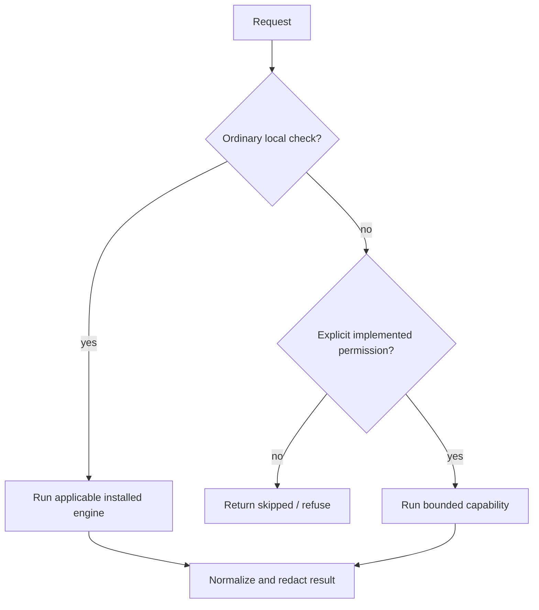

# Safety overview

Rush is designed to make the safe action the default.

- **No implicit installs.** Missing optional engines return `skipped`.
- **No silent source rewrite.** Review/check commands are read-only; formatter mutation is an explicit path and `--check` is available.
- **No hidden publication.** Release is dry-run; publication execution is intentionally unavailable.
- **No history rewrite.** Commit-message checking never changes Git.
- **Explicit execution permissions.** Browser, slow, network, download, build, and artifact-write operations require explicit permission flags (`--allow-*`) and report structured `metadata.execution`.
- **No model marketing beyond implementation.** Review is deterministic; Graft is explicit; `--llm` makes no provider call.
- **No secrets in normalized logs/results.** Obvious secret assignments are redacted, but raw external tool behavior still deserves care.
- **Continuity is receipt-based.** Save requires explicit cache-write permission; restore marks changed declared dependencies `stale`, keeps legacy checkpoints `unknown`, and never promotes historic instructions to authority.

Read [Permissions](permissions.md), [Privacy](privacy-and-data-handling.md), and [Security model](security-model.md).
