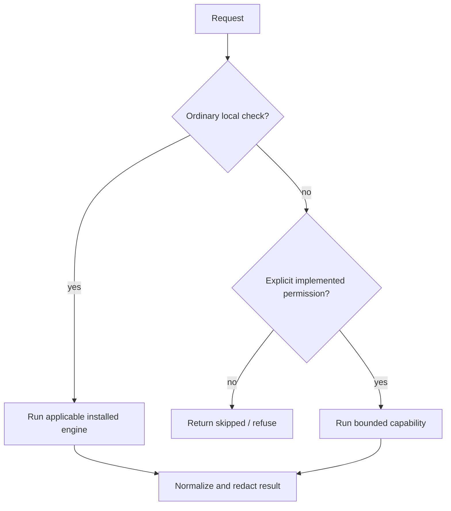

# Safety overview

## Historical recovery evidence

Mined mistake records are redacted and labelled historical evidence in coordination recovery. They remain non-authoritative: no command, patch, merge, or retry follows automatically from them.

Safe defaults remain the design requirement. P64-01 makes `fix --dry-run` bounded Ruff preview; P64-02 makes `ship clean` preview registered artifacts and require explicit apply plus artifact-write. Checkpoint/governance symlinks, patch cleanup, and token-outline retain open Phase 64 defects.

- **No implicit installs.** Missing optional engines return `skipped`.
- **No silent source rewrite.** Review/check commands are read-only; formatter mutation is an explicit path and `--check` is available.
- **No hidden publication.** Current CLI exposes `release check` for version parity; publication execution is unavailable.
- **No history rewrite.** Commit-message checking never changes Git.
- **Explicit execution permissions.** Browser, slow, network, download, build, and artifact-write operations require explicit permission flags (`--allow-*`) and report structured `metadata.execution`.
- **No model marketing beyond implementation.** Review is deterministic; Graft is explicit; `--llm` can send findings to a configured provider.
- **No secrets in normalized logs/results.** Obvious secret assignments are redacted, but raw external tool behavior still deserves care.
- **Continuity is receipt-based.** Save requires explicit cache-write permission; restore marks changed declared dependencies `stale`, keeps legacy checkpoints `unknown`, and never promotes historic instructions to authority.
- **Coordination is evidence-only.** Held/stale locks, merge conflicts, and replay/failure receipts never authorize an unlock, merge, replay, or retry.

Read [Permissions](permissions.md), [Privacy](privacy-and-data-handling.md), and [Security model](security-model.md).

### Plugin Safety Guarantees (Phase 56)
- Fail-closed execution: unauthorized or tampered plugins spawn 0 child processes.
- Process observation immunity: process tables cannot inspect secrets passed to plugins.

## Invocation & Parity Safety Summary (Phase 57)

CLI/MCP share invocation components, but value coercion and custom-output bypass defects remain open (F06/F07). Shared code is not proof of identical behavior.

## Phase 58 Architecture: Capability Locks, CAS Memory, and Fail-Closed Patch Verification

The following component contracts are not whole-application guarantees. Checkpoint/governance symlink escapes, sandbox fallback, destructive cleanup and custom-output redaction defects remain open; see [Known issues](../KNOWN_ISSUES.md).

1. **Capability Locks & Verifier Custody (`rush.mcp_mesh`)**:
   - Callers retain high-entropy capability tokens (`LockCapabilityInput`) delivered exclusively via protected channels (`stdin`, `descriptor`, or sensitive MCP parameters); argv and environment leakage are rejected fail-closed.
   - `MeshLockManager` stores verifier-only records (`LockLeaseRecord`) generated via `rush.io.VerifierRecord` (PBKDF2-HMAC-SHA256, 100k rounds) with monotonic generation counters and `rush.io.PhysicalRoot` containment under `.rush/locks`.
   - Renewal and release verify caller capability in constant time (`hmac.compare_digest`); wrong, low-entropy, or stale tokens fail closed.

2. **CAS Map Transactions & Persistent Memory (`rush.memory`)**:
   - `CASMapTransaction` enforces optimistic concurrency with monotonic version numbers and atomic file replacement (`rush.io.AtomicFile`) using sanitized JSON payloads (`SanitizedJsonValue`).
   - Store states are truthfully separated into distinct typed exceptions: `StoreNotFoundError`, `StoreCorruptionError` (retaining raw bytes and SHA-256 digest), `StoreValidationError`, `StoreIOError`, and `CASConflictError` (exhausted retries fail closed).
   - `PreferenceStore`, `InvariantGraph`, and `MerkleInvalidator` eliminate silent empty dict fallbacks.

3. **Atomic Checkpoint Journals & Unified Store Persistence (`rush.memory.checkpoint_journal`)**:
   - `checkpoint_journal.py` is a thin compatibility view over `TypedArtifactStore` (`rush.memory.store`, Phase 61): `save_checkpoint()`/`restore_checkpoint()` write/read each checkpoint as one `MemoryArtifact` row (`family="handoff"`, `subject="active_context"`); canonical data lives in `.rush/memory.db`, not a per-checkpoint JSON file.
   - `save_checkpoint()` still writes a physical `.json` artifact via `rush.io.AtomicFile` and returns its `Path` (`dest.exists()` holds), preserving the pre-Phase-61 contract for existing callers; explicit schema version `1.0.0` is unchanged.
   - Corrupted or unparseable checkpoint files are preserved on disk, cryptographically digested with SHA-256, and surfaced in `list_checkpoints()` with status `corrupt` — unchanged by the Phase 61 migration.

4. **Contained Patch Verification & Atomic Rollback (`rush.patch`)**:
   - `PatchContract` cryptographically binds base commit, tree digest, patch content hash, sandbox directory under `rush.io.PhysicalRoot`, command plans, and policy review classes (`standard`, `policy-changing`, `privileged`).
   - Workspaces must be clean before sandboxing or patch application; dirty checkouts fail closed with `DirtyWorkspaceError`.
   - `PatchVerifier` requires at least one passing executed test command; zero executed commands return `outcome='unavailable'` and `False` (zero commands never verify).
   - Patch-sandbox rollback still uses broad reset/clean and can discard unrelated work. Patch-sandbox restoration remains planned in [P64-04](../phase-plans/phase-64-runtime-correctness-and-safe-execution-plan.md); [F43](../reports/phase-64-66-application-review.md) remains open.

5. **Runtime Output Boundary Adapter Enforcement (`rush.contracts.operations`)**:
   - 100% of public operations declared in `governance/public-operations.toml` enforce their target adapters (`ToolOperationAdapter`, `AdminOperationAdapter`, `ServiceOperationAdapter`) at runtime boundaries while preserving native JSON-RPC service protocol messages.
