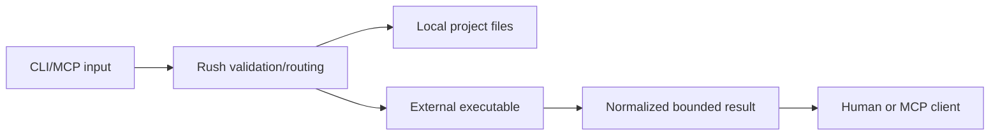

# Security model

## Protected assets

Rush protects source files, Git history, credentials, MCP protocol integrity, local machine resources, network targets, release artifacts, and report paths.

## Trust boundaries

Project files and engine output are untrusted input. Engine binaries are environment-discovered dependencies, not bundled trust anchors.

## Controls

- existing path validation;
- Git-root-bounded configuration discovery;
- known tool-name validation;
- subprocess timeout/capture and MCP stdin detachment;
- structured parser fixtures and malformed-report handling;
- stable result normalization, finding bounds, and redaction;
- owned config/environment for promoted high-risk adapters;
- safe artifact path/overwrite checks;
- explicit permission gates and dry-run defaults.

## Non-goals

Rush is not a sandbox, antivirus, complete SAST platform, credential vault, or release authority. Running an untrusted third-party executable remains a local security decision. Report vulnerabilities through [Incident and security](../maintainers/incident-and-security.md).
