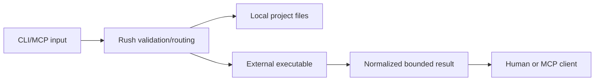

# Security model

## Provider process boundary

Supported continuation CLIs use typed argv, a timeout, and discarded stdout/stderr. For Windows `.cmd`/`.bat` launchers, Rush uses one fixed `cmd.exe` profile and carries checkpoint-controlled text only in a per-process delayed-expansion environment variable, never in CMD syntax. OmniRoute uses one fixed localhost HTTP request, a timeout, semantic response validation, and no credential/header handling. `9router_cli` invokes Codex with a fixed local 9Router base URL and a child-process-only `OPENAI_API_KEY` sourced from `RUSH_9ROUTER_API_KEY`; it passes no model argument. Rush does not request OAuth, inspect keychains, retain process output, or call the 9Router server launcher.

## Protected assets

Rush protects source files, Git history, credentials, MCP protocol integrity, local machine resources, network targets, release artifacts, and report paths.

The continuity trust boundary accepts explicit CLI/MCP handoff fields only at `SessionContinuityTool`; save needs cache-write permission. Historic instructions are reduced to quarantined evidence, and failed attempts are surfaced only as redacted receipts/tombstones so a resumed agent cannot treat retained text as authority.

Coordination inputs are bounded to repository-local targets and single session identifiers. Lock/replay inspection is read-only; stale ownership, merge conflicts, and malformed evidence resolve to structured non-authoritative states rather than a mutation or retry.

## Trust boundaries

Project files and engine output are untrusted input. Engine binaries are environment-discovered dependencies, not bundled trust anchors.

## The 7 Defensive Controls

Rush enforces seven architectural defensive controls across all operations:

1. **Control 1 (Flag-Salted Cryptographic Caching)**: Caches results using SHA-256 digests salted with all active tool flags, engine parameters, and path hashes (`src/rush/cache.py`).
2. **Control 2 (Path Boundary Confinement & Monorepo Isolation)**: Rejects directory traversal escapes (`..`) across workspace packages and target paths (`assert_safe_workspace_path`, `src/rush/discovery/workspace.py`).
3. **Control 3 (Shell Injection Prevention & Typed Package Installer)**: Restricts package names via regex `^[a-zA-Z0-9@_./-]+$` and executes installations using typed argv arrays (`src/rush/tools/setup_wizard.py`).
4. **Control 4 (Binary Integrity & Anti-Shadowing)**: Environment doctor audits PATH precedence and alerts on binary shadowing vulnerabilities in current working directories (`src/rush/tools/doctor.py`).
5. **Control 5 (Dashboard Auth, Loopback Binding, DNS Rebinding & CSRF Protection)**: The local web dashboard binds strictly to `127.0.0.1`, enforces ephemeral 64-hex token auth (`X-Rush-Auth`), validates `Host` headers to defeat DNS rebinding, and rejects cross-origin requests (`src/rush/dashboard.py`).
6. **Control 6 (Repository Trust Gating)**: Custom script plugins and hooks are blocked in untrusted repository directories by default until explicitly authorized via `rush trust` (`src/rush/plugins/trust.py`).
7. **Control 7 (Patch Confinement & XML Session Memory Framing)**: Automated patches shield sensitive paths (`.git/`, `.env`, `.rush/cache.db`), and multi-turn session history is framed in strict XML boundary tags (`<rush_session_memory>`) with XML escaping (`src/rush/session_memory.py`).

## Core Invariants

- Existing path validation and target containment;
- Git-root-bounded configuration discovery;
- Known tool-name validation;
- Subprocess timeout/capture and MCP stdin detachment;
- Structured parser fixtures and malformed-report handling;
- Stable result normalization, finding bounds, and redaction;
- Owned config/environment for promoted high-risk adapters;
- Safe artifact path/overwrite checks;
- Explicit permission gates and dry-run defaults;
- Recursive deep sanitization of all emitted JSON and persistent disk writes (Phase 53);
- Strict stdout purity and fail-safe stderr NDJSON logging with credential redaction (Phase 53).
- Physical path boundary containment defeating symlinks and Windows reparse points (`src/rush/io/physical_paths.py`, Phase 55);
- Durable atomic file replacement accepting only sanitized contracts with manager-owned temp cleanup (`src/rush/io/atomic_file.py`, Phase 55);
- One-way non-recoverable capability verification records defeating token leakage in state files (`src/rush/io/verifier_record.py`, Phase 55).

## Non-goals

Rush is not a sandbox, antivirus, complete SAST platform, credential vault, or release authority. Running an untrusted third-party executable remains a local security decision. Report vulnerabilities through [Incident and security](../maintainers/incident-and-security.md).

### Plugin Security Model (Phase 56)
Plugins execute with ambient user permissions. Rush provides cryptographic content authorization, transitive closure verification, and protected secret channels, but does not provide kernel-level sandboxing.

## Provider Egress Threat Model & Containment (Phase 57)

Remote AI provider calls enforce strict outbound network containment:
- Requests must use `https://`.
- Host must exist in `APPROVED_PROVIDER_ORIGINS`.
- Redirects (3xx) to foreign hosts abort immediately, preventing token leakage.

## Phase 58 Architecture: Capability Locks, CAS Memory, and Fail-Closed Patch Verification

Rush implements closed-loop resilience, fail-closed security, and physical containment across multi-agent concurrency, persistent memory, and AI-driven patch remediation (Findings R-009, R-010, R-011, R-016):

1. **Capability Locks & Verifier Custody (`rush.mcp_mesh`)**:
   - Callers retain high-entropy capability tokens (`LockCapabilityInput`) delivered exclusively via protected channels (`stdin`, `descriptor`, or sensitive MCP parameters); argv and environment leakage are rejected fail-closed.
   - `MeshLockManager` stores verifier-only records (`LockLeaseRecord`) generated via `rush.io.VerifierRecord` (PBKDF2-HMAC-SHA256, 100k rounds) with monotonic generation counters and `rush.io.PhysicalRoot` containment under `.rush/locks`.
   - Renewal and release verify caller capability in constant time (`hmac.compare_digest`); wrong, low-entropy, or stale tokens fail closed.

2. **CAS Map Transactions & Persistent Memory (`rush.memory`)**:
   - `CASMapTransaction` enforces optimistic concurrency with monotonic version numbers and atomic file replacement (`rush.io.AtomicFile`) using sanitized JSON payloads (`SanitizedJsonValue`).
   - Store states are truthfully separated into distinct typed exceptions: `StoreNotFoundError`, `StoreCorruptionError` (retaining raw bytes and SHA-256 digest), `StoreValidationError`, `StoreIOError`, and `CASConflictError` (exhausted retries fail closed).
   - `PreferenceStore`, `InvariantGraph`, and `MerkleInvalidator` eliminate silent empty dict fallbacks.

3. **Atomic Checkpoint Journals & Corrupt Evidence (`rush.memory.checkpoint_journal`)**:
   - Session checkpoints are written via `rush.io.AtomicFile` using explicit schema version `1.0.0`.
   - Corrupted or unparseable checkpoint files are preserved on disk, cryptographically digested with SHA-256, and surfaced in `list_checkpoints()` with status `corrupt`.

4. **Contained Patch Verification & Atomic Rollback (`rush.patch`)**:
   - `PatchContract` cryptographically binds base commit, tree digest, patch content hash, sandbox directory under `rush.io.PhysicalRoot`, command plans, and policy review classes (`standard`, `policy-changing`, `privileged`).
   - Workspaces must be clean before sandboxing or patch application; dirty checkouts fail closed with `DirtyWorkspaceError`.
   - `PatchVerifier` requires at least one passing executed test command; zero executed commands return `outcome='unavailable'` and `False` (zero commands never verify).
   - Failed promotion or verification triggers automatic atomic rollback (`git reset --hard`, `git clean -fd`) restoring the working directory to its exact pre-patch commit and state.

5. **Runtime Output Boundary Adapter Enforcement (`rush.contracts.operations`)**:
   - 100% of public operations declared in `governance/public-operations.toml` enforce their target adapters (`ToolOperationAdapter`, `AdminOperationAdapter`, `ServiceOperationAdapter`) at runtime boundaries while preserving native JSON-RPC service protocol messages.
