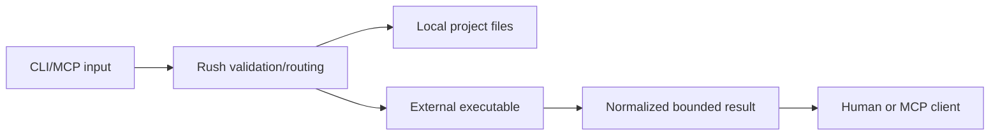

# Security model

## Protected assets

Rush protects source files, Git history, credentials, MCP protocol integrity, local machine resources, network targets, release artifacts, and report paths.

## Trust boundaries

Project files and engine output are untrusted input. Engine binaries are environment-discovered dependencies, not bundled trust anchors.

## The 7 Defensive Controls

Rush enforces seven architectural defensive controls across all operations:

1. **Control 1 (Flag-Salted Cryptographic Caching)**: Caches results using SHA-256 digests salted with all active tool flags, engine parameters, and path hashes (`src/rush/cache.py`).
2. **Control 2 (Path Boundary Confinement & Monorepo Isolation)**: Rejects directory traversal escapes (`..`) across workspace packages and target paths (`assert_safe_workspace_path`, `src/rush/discovery/workspace.py`).
3. **Control 3 (Shell Injection Prevention & Typed Package Installer)**: Restricts package names via regex `^[a-zA-Z0-9@_./-]+$` and executes installations using typed argv arrays (`src/rush/tools/setup_wizard.py`).
4. **Control 4 (Binary Integrity & Anti-Shadowing)**: Environment doctor audits PATH precedence and alerts on binary shadowing vulnerabilities in current working directories (`src/rush/tools/doctor.py`).
5. **Control 5 (Dashboard Auth, Loopback Binding, DNS Rebinding & CSRF Protection)**: The local web dashboard binds strictly to `127.0.0.1`, enforces ephemeral 64-hex token auth (`X-Rush-Auth`), validates `Host` headers to defeat DNS rebinding, and rejects cross-origin requests (`src/rush/dashboard.py`).
6. **Control 6 (Repository Trust Gating)**: Custom script plugins and hooks are blocked in untrusted repository directories by default until explicitly authorized via `rush trust` (`src/rush/plugins/trust.py`).
7. **Control 7 (Patch Confinement & XML Session Memory Framing)**: Automated patches shield sensitive paths (`.git/`, `.env`, `.rush/cache.db`), and multi-turn session history is framed in strict XML boundary tags (`<rush_session_memory>`) with XML escaping (`src/rush/session_memory.py`).

## Core Invariants

- Existing path validation and target containment;
- Git-root-bounded configuration discovery;
- Known tool-name validation;
- Subprocess timeout/capture and MCP stdin detachment;
- Structured parser fixtures and malformed-report handling;
- Stable result normalization, finding bounds, and redaction;
- Owned config/environment for promoted high-risk adapters;
- Safe artifact path/overwrite checks;
- Explicit permission gates and dry-run defaults.

## Non-goals

Rush is not a sandbox, antivirus, complete SAST platform, credential vault, or release authority. Running an untrusted third-party executable remains a local security decision. Report vulnerabilities through [Incident and security](../maintainers/incident-and-security.md).
