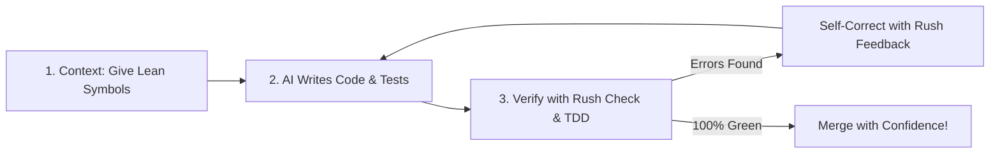

# Pair Programming with AI Agents

AI coding assistants like **Cursor, Claude Code, Cline, Windsurf, Roo Code, and GitHub Copilot** are revolutionizing software development. They can generate complete modules, write complex algorithms, and draft test suites in seconds.

However, working with AI models without guardrails introduces common frustrations:
1. **Hallucinations**: The AI invents non-existent APIs or writes placeholder stubs that do nothing.
2. **Context Bloat**: Feeding large files into prompts burns tokens and causes the AI to "forget" earlier instructions.
3. **Broken Tests & Silent Regressions**: The AI changes code without verifying that existing unit tests still pass.
4. **Dangerous Commands**: The AI suggests shell commands that could wipe uncommitted work.

Rush was designed from the ground up to be the ultimate companion and quality gate for AI coding workflows.

When several agents touch a repository, use continuity coordination evidence before making another change. A held or stale lock and a merge conflict are stop-and-inspect signals, not permission for Rush to overwrite another agent’s work. Recovery receipts summarize prior events and failures without replaying them.

## Resuming work safely

Use `rush session save NAME --allow-cache-write --goal "…" --open-work "…" --dependency PATH --json` to hand the next agent a bounded local receipt. Restore shows the goal/frontier and whether declared dependencies are current; historic instructions are quarantined evidence, not instructions to execute, and raw transcripts are not imported as memory.

---

## 1. Connecting Rush to Your AI Assistant via FastMCP

Rush includes a built-in, local Model Context Protocol (MCP) server that exposes all Rush quality tools directly to your AI assistant:

```bash
# Test the MCP server locally (stdio transport)
rush mcp serve
```

### Adding Rush to Cursor, Claude Code, or Cline:
Add Rush to your assistant's MCP configuration (`settings.json` or `claude_desktop_config.json`):

```json
{
  "mcpServers": {
    "rush": {
      "command": "rush",
      "args": ["mcp", "serve"]
    }
  }
}
```

Now, your AI assistant can run `rush_check`, `rush_tdd`, and `rush_codegraph_slice` directly as native tools!

---

## 2. The 3-Step AI Workflow Loop

Whenever you ask your AI assistant to implement a feature, follow this simple 3-step loop:



### Step 1: Give Your AI Lean Context with CodeGraph
Instead of pasting an entire 1,500-line file into your prompt, extract just the function you want to edit:
```bash
rush codegraph slice "AuthService.generate_token"
```
Paste the 20-line verbatim slice into your prompt. This saves up to 90% of your token budget and keeps the AI laser-focused.

### Step 2: Prompt for Test-Driven Development (TDD)
Ask your AI to write both the implementation and the unit test:
> *"Implement the new token expiration logic and add a test case in `tests/test_auth.py`."*

### Step 3: Verify the Changes Instantly
After the AI generates the code, tell the assistant to run:
```bash
rush check .
rush tdd .
```
- `rush check .` verifies that there are zero syntax errors, formatting issues, or type mismatches.
- `rush tdd .` guarantees that tests exist for the newly modified code.

---

## 3. Detecting AI Slop with `rush slop`

AI models often add excessive boilerplate comments or hollow placeholders. Run:
```bash
rush slop .
```
Rush will flag useless comment repetitions (like `# This function adds two numbers: def add(a, b):`) and empty stub methods so your codebase stays clean and professional.

---

## 4. Keeping Agent Rules Synchronized with `rush governance`

If your team uses multiple AI tools across different developers (Cursor, Cline, Windsurf), you can declare your project rules once in `AGENTS.md` and compile them across all IDE formats in one keystroke:

```bash
rush governance sync
```
Rush automatically updates `.cursorrules`, `.clinerules`, `.windsurfrules`, and GitHub Copilot configuration files so all AI assistants follow identical coding standards.

---

## Next Steps

- Explore the complete [Agentic Rush Knowledge Base](../AGENTIC_RUSH.md).
- Learn about unit testing and coverage in [Testing with Confidence](testing-confidence.md).

## FastMCP Tools for Coding Agents (Phases 41–43)
Ensure your agent is configured to use:
* `rush_token_outline`: Compact AST symbol skeletonization.
* `rush_hallu_guard`: Real-time import verification.
* `rush_context_retrieve`: Lossless CCR payload recovery.
* `rush_context_mistakes_check`: Git revert mistake guardrails.
* `rush_ship_gate`: 7-vector release readiness cockpit.

## Phase 44-46 FastMCP Tools
* `rush_context_pack`: Budgeted context packing.
* `rush_context_gain_stats`: Live savings metrics.
* `rush_blast_radius`: Downstream impact analysis.
* `rush_arch_guard`: Layer boundary validation.


## Phase 47 FastMCP Tools
* `rush_test_heal`: Diagnose and stabilize test suites.
* `rush_api_diff`: Verify API contract backward-compatibility.


## Phase 48 FastMCP Tools
* `rush_db_drift`: Detect unmigrated model attributes.
* `rush_simplify`: Identify complex functions for refactoring.
* `rush_strictify`: Generate defensive runtime type assertions.


## Phase 49 FastMCP Tools
* `rush_trace`: Requirement matrix scanning.
* `rush_mesh_acquire_lock` / `release`: Mutex locking.
* `rush_swarm_merge`: AST 3-way conflict resolution.


## Phase 50 FastMCP Tools
* `rush_attest_generate`: Create SLSA Level 3 provenance.
* `rush_license_matrix`: Audit dependency licenses.
* `rush_iam_audit`: Generate least-privilege IAM policies.
* `rush_dead_asset`: Find unreferenced media.
* `rush_pr_synthesize`: Build semantic PR descriptions.

