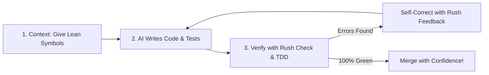

# Pair Programming with AI Agents

## Recover context deliberately

If `rush context pack` reports `recovery.state: "available"`, use its CCR handle with `rush context retrieve`. The retrieved content was redacted before storage. Coordination recovery may show prior mistake guardrails as historical evidence; inspect current repository state rather than replaying a previous patch or instruction.

## Continue work with another agent CLI

Save a local checkpoint and resume it through an already configured Claude Code, Codex, or Antigravity CLI, through `9router_cli`, or through OmniRoute's fixed local API, with explicit `--allow-network`. `9router_cli` uses the installed Codex CLI and fixed local 9Router; set `RUSH_9ROUTER_API_KEY` in the invoking process and do not provide a model. The receiving provider gets a short work frontier, not the original transcript or hidden instructions. Z.AI is deferred.

AI coding assistants like **Claude Code, Cline, Windsurf, Roo Code, and GitHub Copilot** are revolutionizing software development. They can generate complete modules, write complex algorithms, and draft test suites in seconds.

However, working with AI models without guardrails introduces common frustrations:
1. **Hallucinations**: The AI invents non-existent APIs or writes placeholder stubs that do nothing.
2. **Context Bloat**: Feeding large files into prompts burns tokens and causes the AI to "forget" earlier instructions.
3. **Broken Tests & Silent Regressions**: The AI changes code without verifying that existing unit tests still pass.
4. **Dangerous Commands**: The AI suggests shell commands that could wipe uncommitted work.

Rush provides local quality commands and a stdio MCP server for AI coding workflows.

When several agents touch a repository, use continuity coordination evidence before making another change. A held or stale lock and a merge conflict are stop-and-inspect signals, not permission for Rush to overwrite another agent’s work. Recovery receipts summarize prior events and failures without replaying them.

## Resuming work safely

Use `rush session save NAME --allow-cache-write --goal "…" --open-work "…" --dependency PATH --json` to hand the next agent a bounded local receipt. Restore shows the goal/frontier and whether declared dependencies are current; historic instructions carry a `trust_tier` (`EXTERNAL_WRITE`/`DERIVED`/`IMPORTED` — never `STATED` on entry, Phase 61's unified typed-artifact schema) and are evidence, not instructions to execute, and raw transcripts are not imported as memory.

---

## 1. Connecting Rush to Your AI Assistant via FastMCP

Rush includes a built-in local Model Context Protocol (MCP) server. Current source installation requires `uv` plus an absolute Rush checkout path in client configuration:

```bash
# Test the MCP server locally (stdio transport)
uv run --directory /absolute/path/to/rush-cli rush mcp serve
```

### Adding Rush to Claude Code or Cline:
Add Rush to your assistant's MCP configuration (`settings.json` or `claude_desktop_config.json`):

```json
{
  "mcpServers": {
    "rush": {
      "command": "uv",
      "args": ["run", "--directory", "/absolute/path/to/rush-cli", "rush", "mcp", "serve"]
    }
  }
}
```

Restart the client, inspect its discovered Rush tools, then invoke one read-only tool with an absolute project path. Automatic client connection is **planned — implementation [Phase 65, P65-10](../phase-plans/phase-65-project-provisioning-scan-and-agent-workflow-plan.md#p65-10--one-command-installation-and-readiness-integration-f35-f42).**

Add `--profile core|full` to `mcp serve` to pick the registered tool set (Phase 70 T4): `core` registers exactly `rush_status`, `rush_check`, `rush_lint`, `rush_review`, `rush_security`, `rush_test`, and `rush_memory`; `full` (the default) registers every tool, and a call outside the running profile's set returns "Unknown tool". `rush agent connect AGENT_ID --session ID --profile core|full --yes` migrates an existing agent's Rush MCP entry between profiles, always previewing the change first; a new registration always launches `mcp serve --profile core`.

### Installing the native Claude Code or Codex CLI plugin

Instead of a manual MCP entry, Claude Code and Codex CLI can install Rush through their own plugin CLI:

```bash
rush install --agent-plugin claude
rush install --agent-plugin codex
# both, and remove an existing manual "rush" MCP entry Rush did not record:
rush install --agent-plugin claude --agent-plugin codex --convert-manual-entry
```

`--agent-plugin` is repeatable. Without `--convert-manual-entry`, a host with an existing unrecorded `rush` MCP entry is left unchanged and reported, so Rush never runs two servers for the same host at once; the flag consents to removing that entry (shown as a diff) before the plugin installs, and Rush restores the manual entry if the install fails. Each host's own CLI performs the install under native approval — `claude plugin marketplace add`/`claude plugin install` for Claude Code, `codex plugin marketplace add`/`codex plugin add` for Codex — so a policy denial or a missing host CLI is reported, not faked.

Upgrading to a new Rush version needs more than the host's own `update` command, because it re-reads the marketplace's already-registered source and reports "already at the latest version" otherwise. Re-run the same `rush install --agent-plugin <host>` command after upgrading Rush: it re-points the marketplace at the new version directory first (`claude plugin marketplace add` again to replace the source, or `codex plugin marketplace remove` then re-`add` since Codex refuses a second source under one name) before running the host's update/add step.

`rush agent hook claude|codex` is the post-edit hook entrypoint the installed plugin's `hooks.json` invokes; it reads the host's JSON event on stdin and always exits 0, so a hook never changes the edit's result.

### What the installed skill teaches (Phase 70 T1)

`rush install --agent-plugin claude` and `rush install --agent-plugin codex` each bundle an
identical copy of the canonical guidance (`src/rush/integrations/agent_assets/claude/skills/rush/SKILL.md`
and `.../codex/skills/rush/SKILL.md`, both copies of `agent_assets/skills/rush/SKILL.md`) as the
host's `rush:rush` skill. It teaches, in the model's own context: when to call Rush (before every
commit; after every code change; whenever the user asks about quality, lint, formatting, types,
tests, security, secrets or dead code); the `core`/`full` profile tool lists and that a tool outside
the connected profile fails as an unknown tool; path resolution against the declared project root;
the five result statuses (`ok`, `warn`, `fail`, `error`, `skipped`) and that `skipped` never means
the code passed; the seven permission grants and that a grant is never implied by a profile or a
previous call; compact-result recovery (`result_view="compact"`, `rush_status(operation="result",
result_handle=...)`); memory scope (`rush_memory` reads only sessions named in a non-empty
`session_allowlist`); and verification limits (a registered server is not proof it ran; a result
covers only the files and engines it lists). A manual `rush agent connect` without the native plugin
gets the same contract a different way: the MCP server's own `instructions` field (Phase 70 T5,
`build_server_instructions`) carries the identical triggers, statuses, grants, compact recovery,
memory scope and verification-limit text, generated from the same source as the skill.

### Truthful tool descriptions and guarantees (Phase 70 T5)

Every core tool's MCP description and the server's `instructions` state only what that tool
actually verifies, current source:
- `rush_check`: "Before commit/after edits: format-check, lint, typecheck, dead, slop, test at
  `<path>`. Test step runs only with `allow_build`; else it is skipped and the result is never `ok`
  (`warn` if all else passes)."
- `rush_status`: "Call first each session. Read-only, no grant: `<path>` project setup, engines,
  scans, results, agents, memory. Agent registration is not verified activity. `operation=result`
  reads a stored result."
- `rush_review`: "Before commit: heuristic review of `<path>`; engines are deterministic. ...
  `use_llm=true` sends findings to a configured external LLM; no Rush grant gates it." Turning on
  `use_llm` is a data-egress decision the caller makes explicitly, not a permission Rush enforces.
- `rush_memory`: reads need a non-empty `session_allowlist`; writes and other mutations need
  `allow_cache_write`.
- `rush_test`: runs only with `allow_build`; without it, nothing runs.

### Opt-in post-edit checks (Phase 70 T7)

Post-edit checks are off until you opt in per host and per project:

```bash
rush agent connect claude-code --session ID --project /absolute/path/to/project \
  --allow-cache-write --allow-artifact-write --enable-agent-hooks
```

The native plugin's own hook approval still applies -- `rush agent connect --enable-agent-hooks`
records project-level consent, but the check only actually runs through the plugin installed by
`rush install --agent-plugin claude` (or `codex`) and that host's own hook acceptance. Once both are
in place, every `Write`/`Edit`/`MultiEdit` in Claude Code (or `apply_patch`/`Edit`/`Write` in Codex)
runs the plugin's `PostToolUse` hook, which calls `rush agent hook claude` (or `rush agent hook
codex`) with the host's event on stdin. The hook only checks an edit inside the activated,
registered project; an edited path outside that project, or reached through a symlink, is excluded
and named as such, and Rush's own tool calls are never rechecked (no recursion). The host wraps the
hook in a 30-second timeout; Rush's own check stops around 25 seconds and reports the steps that did
not run rather than hang. The model sees a bounded plain-text report (at most 8,192 bytes) in its
context: an invocation ID, the checked scope, the overall status (with an incomplete-step count when
the deadline or a cancellation cut steps short), each of the six check steps (`format`, `lint`,
`typecheck`, `dead`, `slop`, `test`) with its own status, and findings (or `findings: none`). Add
`--hook-result-cache` to also let the check store its full result, so the report includes a
`result_handle` you can pass to `rush_status(operation="result", result_handle=...)` or `rush status
PATH --result HANDLE --json`. `--disable-agent-hooks`, or `rush agent disconnect claude-code
--project /absolute/path/to/project`, removes the activation; loading or installing the plugin alone
never runs a check.

---

## 2. The 3-Step AI Workflow Loop

Whenever you ask your AI assistant to implement a feature, follow this simple 3-step loop:


```mermaid
flowchart LR
    A["1. Context: Give Lean Symbols"] --> B["2. AI Writes Code & Tests"]
    B --> C["3. Verify with Rush Check & TDD"]
    C -- Errors Found --> D["Self-Correct with Rush Feedback"]
    D --> B
    C -- 100% Green --> E["Merge with Confidence!"]
```

### Step 1: Give Your AI Lean Context with CodeGraph
Instead of pasting an entire 1,500-line file into your prompt, extract just the function you want to edit:
```bash
uv run rush codegraph slice "AuthService.generate_token"
```
Paste the 20-line verbatim slice into your prompt. This saves up to 90% of your token budget and keeps the AI laser-focused.

### Step 2: Prompt for Test-Driven Development (TDD)
Ask your AI to write both the implementation and the unit test:
> *"Implement the new token expiration logic and add a test case in `tests/test_auth.py`."*

### Step 3: Verify the Changes Instantly
After the AI generates the code, tell the assistant to run:
```bash
uv run rush check .
uv run rush tdd .
```
- `rush check .` verifies that there are zero syntax errors, formatting issues, or type mismatches.
- `rush tdd .` guarantees that tests exist for the newly modified code.

---

## 3. Detecting AI Slop with `rush slop`

AI models often add excessive boilerplate comments or hollow placeholders. Run:
```bash
uv run rush slop .
```
Rush will flag useless comment repetitions (like `# This function adds two numbers: def add(a, b):`) and empty stub methods so your codebase stays clean and professional.

---

## 4. Keeping Agent Rules Synchronized with `rush governance`

If your team uses multiple AI tools across different developers (Cline, Windsurf), you can declare your project rules once in `AGENTS.md` and compile them across all IDE formats in one keystroke:

```bash
uv run rush governance sync
```
Rush automatically updates `.clinerules`, `.windsurfrules`, and GitHub Copilot configuration files so all AI assistants follow identical coding standards.

---

## Next Steps

- Explore the complete [Agentic Rush Knowledge Base](../AGENTIC_RUSH.md).
- Learn about unit testing and coverage in [Testing with Confidence](testing-confidence.md).

## FastMCP Tools for Coding Agents (Phases 41–43)
Ensure your agent is configured to use:
* `rush_token_outline`: Compact AST symbol skeletonization.
* `rush_hallu_guard`: Real-time import verification.
* `rush_context_retrieve`: Lossless CCR payload recovery.
* `rush_context_mistakes_check`: Git revert mistake guardrails.
* `rush_ship_gate`: 7-vector release readiness cockpit.

## Phase 44-46 FastMCP Tools
* `rush_context_pack`: Budgeted context packing.
* `rush_context_gain_stats`: Live savings metrics.
* `rush_blast_radius`: Downstream impact analysis.
* `rush_arch_guard`: Layer boundary validation.


## Phase 47 FastMCP Tools
* `rush_test_heal`: Diagnose and stabilize test suites.
* `rush_api_diff`: Verify API contract backward-compatibility.


## Phase 48 FastMCP Tools
* `rush_db_drift`: Detect unmigrated model attributes.
* `rush_simplify`: Identify complex functions for refactoring.
* `rush_strictify`: Generate defensive runtime type assertions.


## Phase 49 FastMCP Tools
* `rush_trace`: Requirement matrix scanning.
* `rush_mesh_acquire_lock` / `release`: Mutex locking.
* `rush_swarm_merge`: AST 3-way conflict resolution.


## Phase 50 FastMCP Tools
* `rush_attest_generate`: Create SLSA Level 3 provenance.
* `rush_license_matrix`: Audit dependency licenses.
* `rush_iam_audit`: Generate least-privilege IAM policies.
* `rush_dead_asset`: Find unreferenced media.
* `rush_pr_synthesize`: Build semantic PR descriptions.
