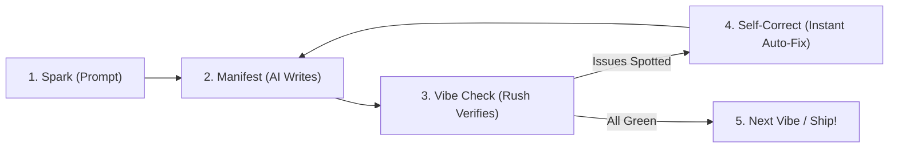

# The Vibecoder Workflow: The Frictionless Build Loop

What does an actual vibecoding session with Rush look like in practice?

Here is the exact, step-by-step loop that turns high-level product ideas into verified, production-ready software without friction.

---

## The 4-Phase Loop



---

## Phase 1: The Spark (Give Lean Context)

Before you prompt your AI model to modify a complex feature, don't dump the whole 3,000-line repository into the chat. Instead, use Rush's CodeGraph to slice out just the target function:

```bash
rush codegraph slice "PaymentService.process_checkout"
```

Rush returns a clean, 25-line verbatim snippet with line numbers. 

### Your Prompt:
> *"Here is `PaymentService.process_checkout`. Add support for Apple Pay and generate a unit test in `tests/test_payments.py`."*

---

## Phase 2: Manifest (The AI Generates Code)

Your AI coding assistant (Cursor, Claude Code, Cline, etc.) generates the new code and test cases in seconds.

---

## Phase 3: The Vibe Check (Rush Silently Audits)

If you have `rush watch .` running in the background, Rush automatically re-evaluates the touched files the instant your editor saves them:

```text
[OK] lint [ruff]: all clean (45ms)
[OK] format [prettier]: all formatted (30ms)
[OK] typecheck [mypy]: 0 errors (110ms)
[OK] tdd: test contract verified (tests/test_payments.py) (80ms)
[OK] slop: 0 issues detected (25ms)
```

In less than **300 milliseconds**, Rush verified that:
1. The AI wrote valid syntax with zero linter errors.
2. The AI didn't introduce type mismatches.
3. The AI didn't hallucinate empty placeholder stubs (`rush slop`).
4. The AI actually created the requested unit test (`rush tdd`).

---

## Phase 4: Instant Self-Correction (When Things Go Wrong)

What if the AI made a mistake—like forgetting to import `UUID` or introducing a type mismatch?

Instead of you having to debug the stack trace manually, Rush feeds the structured finding directly back to your AI assistant:
```text
[FAIL] typecheck [mypy]: 1 error
  src/services/payments.py:42: error: Incompatible types: expected 'str', got 'UUID'
```

Your AI sees the exact file, line number, and compiler message, immediately apologizes, and fixes the issue on the very next turn.

---

## Phase 5: Ship with Confidence

When you finish your session:
```bash
# Verify the entire gate suite before committing
rush gate .

# Generate a PR quality scorecard
rush score pr-card
```

You just built and tested a complete, production-ready feature in 10 minutes flat!

---

## Next Steps

- Set up your AI IDE in 2 minutes with [Setting Up Your AI Agent](setting-up-your-agent.md).
- Learn how to banish AI hallucinations forever in [Slop-Busting & Hallucination Defense](slop-busting-and-hallucination-defense.md).

## Pre-Flight Ship Cockpit in Your Workflow (Phase 42)

Before opening a PR or tagging a release:
```bash
# 1. Purge scratch debris
rush ship clean

# 2. Check environment variable parity
rush ship env

# 3. Verify documentation links
rush ship docs

# 4. Run the full 7-vector Ship Gate Cockpit
rush ship gate
```

## Blast Radius in Vibecoding Workflow (Phase 46)
Before refactoring a core function, run `rush blast-radius --path <file>` to verify all affected tests and routes.


## Flaky Test Self-Healing
Run `rush test-heal` whenever async tests fail intermittently.


## Database Drift Verification
Run `rush db-drift` before deploying any database schema change.


## Local CI Simulation
Run `rush simulate-ci` before pushing to verify all GitHub Actions steps pass on your local machine.


## Semantic PR Generation
Use `rush pr-synthesize` to generate perfect, professional PR descriptions in 1 second.

