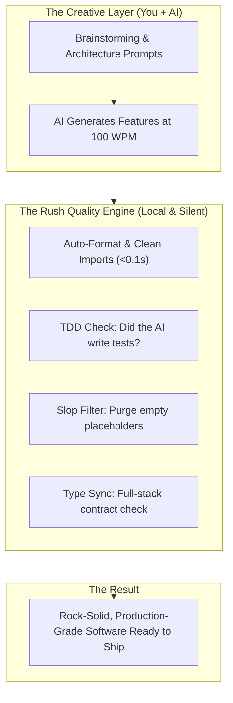

# What is Vibecoding with Rush?

In early 2025, Andrej Karpathy famously coined the term **"Vibecoding"** to describe a dramatic paradigm shift in software development:

> *"There's a new kind of coding I call 'vibecoding', where you entirely give into the vibes, embrace every whim, talk to AI in natural language, and let the LLM do all the typing."*

Vibecoding unlocked software creation for millions of people. Builders who had great product ideas no longer needed to spend 10 years mastering compiler flags or memorizing CSS flexbox edge cases. You talk, the AI types, the software appears.

---

## The "Vibecoding Hangover"

As anyone who has vibecoded a complex project knows, pure unstructured vibes eventually run into a brick wall:

1. **The Ghost Bug**: The AI modifies 8 files to add a dark mode toggle, but silently breaks your database migrations. You only notice three days later when your app crashes in production.
2. **The "Fix My Fix" Loop**: You ask the AI to fix a type error. It fixes that error, but introduces two new syntax errors. You spend 45 minutes stuck in a frustrating prompt loop asking the model to fix its own hallucinations.
3. **The AI Slop Avalanche**: Your code fills up with 400 lines of redundant comments (`# In this step we return true`), duplicate object keys, and empty placeholder functions (`# TODO: implement later`) that make the code impossible to maintain.
4. **The Token Tax**: As your codebase grows, pasting huge files into prompts costs serious money, slows down response times, and causes the AI to forget the very rules you gave it.

---

## The Rush Philosophy: Flow State + Quality Safety Net

Rush was built so that you **never have to choose between speed and quality**.

### With Rush:
- **You stay in the flow**: You think, prompt, and iterate without stopping to manually reformat code or hunt for missing semicolons.
- **Rush acts as the invisible co-pilot**: It runs locally on your machine in under 200 milliseconds, silently auto-cleaning formatting, checking types, verifying test contracts, and intercepting dangerous commands.
- **Your AI becomes 10x smarter**: Instead of giving your AI vague error messages, Rush hands the model exact line numbers, compiler AST rules, and lean code slices, enabling the model to write clean code on the very first try.

---

## Next Steps

- Learn the rhythm of a high-velocity session in [The Vibecoder Workflow](the-vibecoder-workflow.md).
- Connect Rush to Cursor, Claude, or Cline in [Setting Up Your AI Agent](setting-up-your-agent.md).
