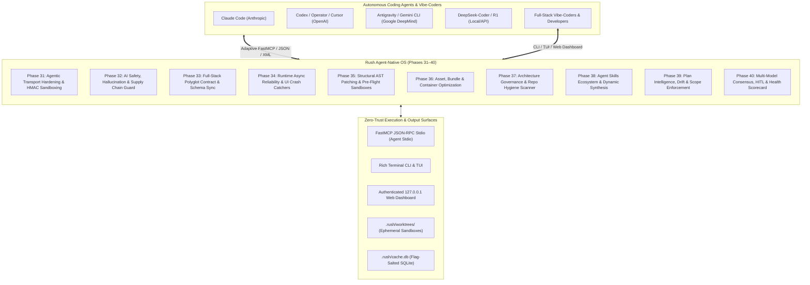
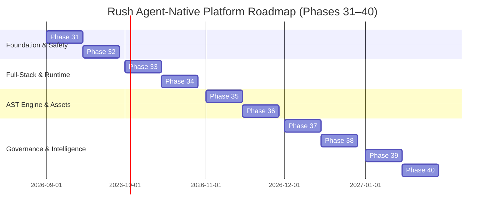

# Master Innovation & Architecture Build Plan: Rush Agent-Native Platform (Phases 31–40)

> **Document Version:** 1.1.0  
> **Status:** Approved Master Architecture & Engineering Blueprint  
> **Target App Versioning:** Rush v0.3.0 → v1.0.0  
> **Repository:** `jamesdsizemore/rush-cli`  
> **Python Baseline:** Python 3.12 (managed via `uv`)  
> **Target Ecosystem:** Autonomous Coding Agents (Claude Code, OpenAI Codex/Operator, Antigravity CLI, DeepSeek-Coder/R1, Hermes, Aider, Devin) and Full-Stack Developers & Vibe-Coders  
> **Core Contract:** Stdio JSON-RPC FastMCP transport, stderr NDJSON diagnostics, deterministic offline execution, zero docs drift, zero-trust repository safety.

---

## 1. Executive Summary & Architectural Synthesis

This Master Innovation Plan synthesizes all previous research, custom tool brainstorms, and agentic support specifications into a unified, 10-phase engineering roadmap (Phases 31–40).

Rush is evolving into the definitive **Agent-Native Quality Operating System**—bridging the rapid velocity of vibe-coding with the deterministic rigor, AST-level precision, and closed-loop self-healing required by enterprise software engineering.



---

## 2. Mandatory Token-Conservation Development Workflow

To maximize developer velocity and minimize LLM token consumption across multi-turn implementation sessions, all agents and contributors MUST adhere to the following token-conservation toolchain:

### 2.1 Rust Token Killer (`rtk`) & Compact Command Invocations
- Run all shell operations through `rtk` (or equivalent proxy) where available to strip superfluous terminal escape codes and compress verbose outputs.
- Filter test runs with `-q` and specific file/node targets (e.g. `pytest tests/test_schema_sync.py -q -k test_pydantic_ts`).

### 2.2 Context-Mode (`context-mode`)
- Before inspecting complex multi-file subsystems, use `context-mode` / `ctx_compose` / `ctx_search` to query exact symbol definitions rather than reading whole source files.
- Restrict file views to precise line ranges (`view_file` with `StartLine` and `EndLine`) under 100 lines.

### 2.3 Graft Dependency Pruning (`graft`)
- When analyzing dependencies, AST structures, or cross-language models, use `graft` to extract isolated subtrees rather than ingesting entire directory hierarchies into agent context.

---

## 3. Pinned Dependencies Baseline & Architectural Decision Records (ADRs)

To guarantee 100% offline reproducibility, supply chain security, and zero runtime drift, all new packages are pinned with formal ADRs:

```toml
# pyproject.toml additions (Phases 31–40)
dependencies = [
    "mcp==1.28.1",        # Official Python MCP SDK; stdio FastMCP server
    "click==8.4.2",       # CLI framework
    "rich==13.9.4",       # Terminal pretty-printing & TUI
    "pytest==9.0.3",      # Test runner
    "tree-sitter==0.24.0",# High-performance incremental AST parsing & structural patching (ADR-008)
    "tree-sitter-python==0.23.6",     # Python grammar for Tree-Sitter
    "tree-sitter-typescript==0.23.2", # TypeScript/TSX grammar for Tree-Sitter
    "tree-sitter-javascript==0.23.1", # JavaScript grammar for Tree-Sitter
]
```

### ADR-008: Native Graft Semantic Slicing & Tree-Sitter AST Engine
- **Context:** Standalone `ast-grep` operates primarily as a single-file pattern search tool and requires spawning external platform-specific binaries. Coding agents require multi-file call-graph traversal, symbol dependency extraction, and context-window token pruning.
- **Decision:** Adopt **`graft`** powered by native embedded `tree-sitter` (`tree-sitter==0.24.0`) as Rush's unified AST engine for symbol slicing, dependency tree extraction, and structural patching.
- **Consequences:** Enables instantaneous in-process semantic symbol slicing (`rush_graft_slice`), structural code rewrites (`rush_apply_ast_patch`), and cross-language type mapping (`rush schema-sync`) with zero external binary dependencies and up to 90% reduction in agent context token consumption.

### ADR-009: Cryptographic HMAC Context Boundary Framing for Prompt Injection Shielding
- **Context:** Indirect prompt injections in repository comments or test fixtures can hijack coding agent reasoning loops.
- **Decision:** Wrap all MCP tool outputs and diagnostic strings in cryptographically HMAC-SHA256 signed XML boundary tags (`<rush_agent_sandbox hmac="...">`).
- **Consequences:** Zero-overhead client-side and agent-side verification that diagnostic content cannot be interpreted as instructions.

### ADR-010: Ephemeral Git Worktree Sandboxing for Pre-Flight Evaluation
- **Context:** Agents applying speculative fixes risk dirtying the developer's working tree or introducing uncommitted broken syntax.
- **Decision:** Execute speculative remediation and test execution inside detached ephemeral git worktrees under `.rush/worktrees/`.
- **Consequences:** Completely isolates agent experiments from the active workspace until verification gates pass 100%.

---

## 4. Phase-by-Phase Comprehensive Build Plan (Phases 31–40)

---

### Phase 31: Agentic Transport Hardening, HMAC Sandboxing & Token-Adaptive Compactor

#### Objective & Scope
Equip Rush's FastMCP stdio server with model-adaptive output serializers (tailored for Claude Code, OpenAI Codex, Antigravity, and DeepSeek-R1), cryptographic HMAC context boundary framing (Control 7 extension), stateful cursor pagination, real-time turn token accounting, and lock-free WAL SQLite concurrency for multi-agent workflows.

#### File Roster
- **Allowed & Target Files:**
  - `src/rush/agent_transport.py` (New: Model-adaptive serialization, HMAC envelope framing)
  - `src/rush/mcp.py` (Register `rush_format_agent`, `rush_paginate_findings`, `rush_turn_cost`, `rush mcp tunnel`)
  - `src/rush/cache.py` (Enable SQLite WAL mode and busy timeout handlers)
  - `tests/test_agent_transport.py` (New: Unit and contract tests for adaptive formats & HMAC)
  - `tests/test_mcp_pagination.py` (New: Tests for cursor pagination and token estimation)
  - `docs/developer/phase-31-agentic-transport.md` (Ledger documentation)
- **Forbidden Files:**
  - `src/rush/tools/*` (Tool implementations must remain isolated from transport layers)

#### Step-by-Step Task Specifications
1. **Task 31.1: Cryptographic HMAC Context Boundary Envelope (`<rush_agent_sandbox>`)**
   - Implement `AgentSandboxEnvelope` in `src/rush/agent_transport.py`.
   - Generates an ephemeral session secret in-memory upon MCP startup.
   - Computes `HMAC-SHA256(payload, session_secret)` and wraps MCP string outputs in `<rush_agent_sandbox hmac="...">...</rush_agent_sandbox>`.
   - Strips or escapes any nested `<rush_agent_sandbox>` tags in untrusted repo text to prevent breakout attacks.
2. **Task 31.2: Model-Adaptive Output Serializer (`rush_format_agent`)**
   - Implement `format_findings_for_agent(findings, agent_type)`:
     - `AgentType.CLAUDE`: Semantic XML `<findings><finding id="..." rule="..." file="...">...</finding></findings>`.
     - `AgentType.DEEPSEEK`: Dense structural pseudo-diff format optimized for R1 reasoning tokens.
     - `AgentType.CODEX` / `AgentType.CURSOR`: Compact unified diff patches with concise file-line anchors.
     - `AgentType.AGY` / `AgentType.GEMINI`: High-density structured JSON with explicit AST node addresses.
3. **Task 31.3: Stateful Cursor Pagination (`rush_paginate_findings`)**
   - Implement `PaginatedFindingManager` storing in-memory query snapshots keyed by UUID.
   - Computes BPE token estimation per chunk and enforces `limit` and `min_severity` parameters.
4. **Task 31.4: Real-Time Turn Token & Latency Meter (`_rush_telemetry`)**
   - Attach token count estimates and execution timing metadata to every FastMCP response.
5. **Task 31.5: Lock-Free SQLite WAL Concurrency (`rush mcp tunnel`)**
   - Configure SQLite connection in `src/rush/cache.py` with `PRAGMA journal_mode=WAL;`, `PRAGMA busy_timeout=5000;`, and `PRAGMA synchronous=NORMAL;`.

#### Verification & Exit Criteria
- `pytest tests/test_agent_transport.py tests/test_mcp_pagination.py -q` passes 100%.
- HMAC validation catches 100% of adversarial prompt injection breakout attempts.
- Doc parity passes with `python scripts/sync_docs.py --check`.

---

### Phase 32: AI Safety, Hallucination Prevention & Supply Chain Defense

#### Objective & Scope
Implement native offline scanners protecting developers and vibe-coders from AI hallucinations: hallucinated/typo-squatted dependencies, prompt injection vulnerabilities in application templates, low-density AI code boilerplate (slop), context window token bloat, and ambiguous system prompts.

#### File Roster
- **Allowed & Target Files:**
  - `src/rush/tools/typo_squat.py` (New: Offline top-50k package index & Levenshtein distance matcher)
  - `src/rush/tools/prompt_guard.py` (New: AST prompt template analyzer)
  - `src/rush/tools/slop_buster.py` (New: Tree-Sitter AST token density & tautological comment checker)
  - `src/rush/tools/context_diet.py` (New: Non-ignored token counter & scratch file trimmer)
  - `src/rush/tools/prompt_linter.py` (New: Markdown instruction quality analyzer)
  - `src/rush/data/pypi_top50k.bin` (New: Compact binary bloom filter / trie of verified packages)
  - `src/rush/data/npm_top50k.bin` (New: Compact binary bloom filter / trie of verified npm packages)
  - `src/rush/catalog.py` & `src/rush/cli.py` & `src/rush/mcp.py` (Register new tools)
  - `tests/test_ai_safety_tools.py` (New: Comprehensive tests for all 5 tools)
- **Forbidden Files:**
  - Remote network requests during scanning (must operate 100% offline).

#### Step-by-Step Task Specifications
1. **Task 32.1: Package Hallucination & Typo-Squatting Guard (`rush typo-squat`)**
   - Package a compressed binary trie/bloom filter of top 50,000 verified PyPI and npm package names directly in `src/rush/data/`.
   - AST parser extracts imported modules and declared dependencies (`pyproject.toml`, `package.json`, `Cargo.toml`).
   - Flags unverified packages with Levenshtein distance $\le 2$ from popular packages to catch typo-squatting.
2. **Task 32.2: Prompt Injection & Template Bleed Scanner (`rush prompt-guard`)**
   - AST visitor searching for template strings (`f"..."`, `` `...` ``) used in LLM client calls (`openai`, `anthropic`, `google.generativeai`).
   - Flags raw user inputs interpolated without XML/tag framing or sanitization.
3. **Task 32.3: AI Boilerplate & Slop Reducer (`rush slop-buster`)**
   - Calculates AST semantic density: ratio of executable statements to tautological comments (`# Returns the user`).
   - Flags empty `pass` / `TODO` stubs generated by AI agents during phased refactoring.
4. **Task 32.4: Agent Context Token Bloat Cleaner (`rush context-diet`)**
   - Scans repository for unignored files exceeding 20,000 tokens (e.g. debug JSON dumps, test artifacts).
   - Provides `--prune` flag to automatically append offenders to `.gitignore` or clean scratchpads.
5. **Task 32.5: System Prompt & Instruction Linter (`rush prompt-linter`)**
   - Lints `CLAUDE.md`, `.cursorrules`, `AGENTS.md` against Anthropic/OpenAI prompt engineering rubrics.
   - Detects conflicting rules, excessive token length, and non-deterministic directives.

#### Verification & Exit Criteria
- `pytest tests/test_ai_safety_tools.py -q` passes 100%.
- Typo-squatting scanner accurately detects simulated hallucinated packages with zero false negatives.

---

### Phase 33: Full-Stack Polyglot Contract & Cross-Language Synchronization

#### Objective & Scope
Eliminate silent full-stack runtime errors by bridging backend Python/Pydantic schemas with frontend TypeScript/Zod interfaces, mapping backend API routes against frontend client fetch calls, verifying environment variable parity across configurations, and auditing database migration safety.

#### File Roster
- **Allowed & Target Files:**
  - `src/rush/tools/schema_sync.py` (New: Cross-language Pydantic ↔ TS/Zod AST diff bridge)
  - `src/rush/tools/dead_routes.py` (New: API route extractor & frontend consumer mapper)
  - `src/rush/tools/env_sync.py` (New: AST environment variable extractor vs `.env.example`)
  - `src/rush/tools/migration_guard.py` (New: Alembic/Prisma DDL safety & lock linter)
  - `src/rush/tools/n_plus_one.py` (New: AST loop tracer detecting nested ORM/SQL queries)
  - `src/rush/catalog.py`, `src/rush/cli.py`, `src/rush/mcp.py`
  - `tests/test_fullstack_sync.py` (New: Full-stack contract and sync test suite)

#### Step-by-Step Task Specifications
1. **Task 33.1: Cross-Language Schema & Type Parity (`rush schema-sync`)**
   - Python AST extracts Pydantic `BaseModel` field names, types, and nullability.
   - TypeScript Tree-Sitter AST extracts `interface`, `type`, and `z.object({...})` definitions.
   - Matches schemas by naming convention (`User` ↔ `UserDTO`, `UserResponse`) and flags mismatched, missing, or renamed properties.
2. **Task 33.2: API Endpoint & Route Zombie Scanner (`rush dead-routes`)**
   - Backend route extractor identifies FastAPI/Express/Flask route endpoints (`@app.get("/api/v1/items")`).
   - Frontend AST extracts all `fetch(...)`, `axios.get(...)`, and React Query URLs.
   - Identifies orphaned backend routes (0 callers) and broken frontend routes (404 targets).
3. **Task 33.3: Environment Variable Parity Guard (`rush env-sync`)**
   - Extracts all `os.getenv(...)`, `os.environ[...]`, and `process.env.*` lookups across source code.
   - Cross-references against `.env.example`, `.env.template`, and `docker-compose.yml`.
   - Alerts on missing keys and flags hardcoded production secrets in example files.
4. **Task 33.4: Database Migration Safety Linter (`rush migration-guard`)**
   - Parses Alembic Python migrations and Prisma schema files.
   - Detects destructive operations: `drop_column`, adding `NOT NULL` without `server_default`, and long table-locking operations.
5. **Task 33.5: ORM & SQL N+1 Query Anti-Pattern Detector (`rush n-plus-one`)**
   - AST analysis on loop constructs (`For`, `While`) detecting embedded ORM attribute access (`user.posts`) or database calls (`db.query(...)`).
   - Recommends eager loading (`joinedload`, `selectinload`, `include`).

#### Verification & Exit Criteria
- `pytest tests/test_fullstack_sync.py -q` passes 100%.
- Schema sync identifies 100% of injected Pydantic/TypeScript field discrepancies.

---

### Phase 34: Runtime Async Reliability, Event Loop & UI Crash Catchers

#### Objective & Scope
Guarantee runtime resilience by detecting blocking synchronous I/O inside asynchronous event loops, verifying UI crash-prevention error boundaries, analyzing regular expressions for ReDoS vulnerabilities, and extracting hardcoded magic literals.

#### File Roster
- **Allowed & Target Files:**
  - `src/rush/tools/async_sanity.py` (New: Event loop starvation & unawaited coroutine linter)
  - `src/rush/tools/crash_catcher.py` (New: React ErrorBoundary & async fallback linter)
  - `src/rush/tools/regex_safe.py` (New: Deterministic NFA/DFA ReDoS vulnerability analyzer)
  - `src/rush/tools/magic_cleaner.py` (New: Magic literal & hardcoded URL extractor)
  - `src/rush/tools/state_thrash.py` (New: React re-render & hook dependency linter)
  - `src/rush/catalog.py`, `src/rush/cli.py`, `src/rush/mcp.py`
  - `tests/test_runtime_reliability.py` (New: Async, ReDoS, and UI crash tests)

#### Step-by-Step Task Specifications
1. **Task 34.1: Event Loop Starvation & Async Sanity (`rush async-sanity`)**
   - Python AST analyzes all `async def` function bodies for blocking calls: `time.sleep`, `requests.*`, `urllib.*`, blocking file I/O `open().read()`, `subprocess.run` (without async wrappers).
   - Detects coroutine calls missing `await` or `asyncio.create_task`.
2. **Task 34.2: Frontend UI Crash Catcher (`rush crash-catcher`)**
   - TSX/JSX AST parser verifies top-level and route-level components are wrapped in `<ErrorBoundary>` components.
   - Verifies `useEffect` asynchronous promises have `.catch()` handlers or `try/catch` blocks.
3. **Task 34.3: Deterministic ReDoS & Backtracking Analyzer (`rush regex-safe`)**
   - Pure Python AST regex parser that translates regex strings into NFA state graphs.
   - Detects nested quantifiers `(a+)+`, overlapping alternations `(a|a)+`, and polynomial/exponential backtracking hazards.
4. **Task 34.4: Magic Literal & URL Extractor (`rush magic-cleaner`)**
   - AST literal collector finds unnamed numeric constants (`86400`, `3600`) and hardcoded URLs (`http://localhost:8000`).
   - Suggests refactorings extracting values into typed module constants.
5. **Task 34.5: React State Thrashing & Re-Render Linter (`rush state-thrash`)**
   - Scans JSX props for inline object instantiation `style={{ padding: 8 }}` and anonymous inline closures inside hot render loops.
   - Verifies `useMemo` / `useEffect` dependency arrays contain all referenced scope symbols.

#### Verification & Exit Criteria
- `pytest tests/test_runtime_reliability.py -q` passes 100%.
- ReDoS detector correctly flags known vulnerable regexes without timing out or false positives.

---

### Phase 35: Structural AST Patching, Pre-Flight Ephemeral Sandboxes & TDD Driver

#### Objective & Scope
Replace fragile string diffs with AST-validated structural patching via Tree-Sitter, implement ephemeral git worktree sandboxes for pre-flight testing, build an agentic TDD state machine driver, and expose in-process Graft semantic symbol slicing over FastMCP.

#### File Roster
- **Allowed & Target Files:**
  - `src/rush/ast_patcher.py` (New: Tree-Sitter AST structural patch applier)
  - `src/rush/sandbox.py` (New: Ephemeral git worktree pre-flight executor)
  - `src/rush/tdd_driver.py` (New: FastMCP TDD state machine: RED → GREEN → REFACTOR)
  - `src/rush/tools/graft_slice.py` (New: Graft semantic symbol & dependency slicing tool)
  - `src/rush/tools/context_snippet.py` (New: Enclosing scope hydrator)
  - `src/rush/mcp.py` (Register `rush_apply_ast_patch`, `rush_sandbox_eval`, `rush_tdd_next_step`, `rush_graft_slice`, `rush_get_context_snippet`)
  - `tests/test_ast_patching.py` (New: Structural AST patching & sandbox tests)
  - `tests/test_tdd_driver.py` (New: TDD state machine contract tests)

#### Step-by-Step Task Specifications
1. **Task 35.1: Tree-Sitter AST Structural Patch Engine (`rush_apply_ast_patch`)**
   - Implement `ASTPatcher` in `src/rush/ast_patcher.py` using `tree-sitter`.
   - Modifies AST nodes directly by structural address rather than character offsets or regex.
   - Formats modified code with project formatters (`ruff`, `prettier`) and verifies syntax validity before file write.
2. **Task 35.2: Ephemeral Pre-Flight Worktree Sandbox (`rush_sandbox_eval`)**
   - Implement `WorktreeSandbox` in `src/rush/sandbox.py`.
   - Creates a temporary git worktree at `.rush/worktrees/eval_<id>`.
   - Applies candidate patch, executes `rush check` / `rush test`, captures structured results, and destroys worktree without touching user working tree.
3. **Task 35.3: Agentic TDD State Machine Driver (`rush_tdd_next_step`)**
   - FastMCP state machine enforcing strict TDD:
     - `STATE_RED`: Receives new test. Runs test; verifies it FAILS with expected assertion error.
     - `STATE_GREEN`: Receives implementation. Runs test; verifies it PASSES.
     - `STATE_REFACTOR`: Receives clean refactor. Runs full suite; verifies all tests remain green.
4. **Task 35.4: Graft Semantic Symbol & Dependency Slicing Tool (`rush_graft_slice`)**
   - Exposes in-process `graft` symbol slicing over MCP: `rush_graft_slice(symbol_name="UserResponse", file="src/schemas.py", depth=1)`.
   - Traverses call graphs and type hierarchies across files, extracting a minimal, self-contained token-pruned AST slice for the agent.
5. **Task 35.5: Smart Enclosing Scope Hydrator (`rush_get_context_snippet`)**
   - Given a file and line number, returns only the enclosing AST function or class declaration (typically 20–40 lines), saving 90% of prompt context tokens.

#### Verification & Exit Criteria
- `pytest tests/test_ast_patching.py tests/test_tdd_driver.py -q` passes 100%.
- Ephemeral sandbox leaves 0 uncommitted artifacts or dirty working tree state upon evaluation.

---

### Phase 36: Asset, Bundle & Container Optimization Watchdog

#### Objective & Scope
Protect vibe-coders and web applications from asset bloat, non-tree-shakeable barrel imports, inefficient container build caching, and memory/handle lifecycle leaks.

#### File Roster
- **Allowed & Target Files:**
  - `src/rush/tools/asset_diet.py` (New: Image, SVG, and binary asset inspector)
  - `src/rush/tools/bundle_watch.py` (New: JS/Wasm tree-shaking & barrel import linter)
  - `src/rush/tools/docker_lean.py` (New: Dockerfile layer ordering & multi-stage optimizer)
  - `src/rush/tools/memory_leak.py` (New: Event listener & unclosed handle lifecycle detector)
  - `src/rush/catalog.py`, `src/rush/cli.py`, `src/rush/mcp.py`
  - `tests/test_asset_and_bundle_tools.py` (New: Tests for asset and container checks)

#### Step-by-Step Task Specifications
1. **Task 36.1: Asset Bloat & Optimization Watchdog (`rush asset-diet`)**
   - Pure Python binary header parsers for PNG, JPEG, WebP, AVIF, and SVG.
   - Flags uncompressed raster images (>500KB) and SVGs containing bloated editor metadata.
   - Suggests conversion to modern formats with estimated bandwidth savings.
2. **Task 36.2: JS/Wasm Tree-Shaking & Barrel Import Linter (`rush bundle-watch`)**
   - Scans JavaScript/TypeScript import statements for monolithic package imports (`import _ from 'lodash'`, `import * as lucide from 'lucide-react'`).
   - Recommends path-specific imports (`import debounce from 'lodash/debounce'`).
3. **Task 36.3: Dockerfile Layer & Cache Optimizer (`rush docker-lean`)**
   - Deterministic parser for `Dockerfile` and `Containerfile`.
   - Verifies dependency manifests (`pyproject.toml`, `package.json`) are copied and installed BEFORE full source code `COPY . .`.
   - Enforces non-root container execution (`USER nonroot`).
4. **Task 36.4: Lifecycle Handle & Memory Leak Detector (`rush memory-leak`)**
   - Verifies that React `useEffect` / `addEventListener` / `setInterval` return explicit cleanup callbacks.
   - In Python, verifies network sessions, database cursors, and file descriptors use context managers (`with` statements).

#### Verification & Exit Criteria
- `pytest tests/test_asset_and_bundle_tools.py -q` passes 100%.

---

### Phase 37: Architecture Governance, License Compliance & Holistic Repo Scanner

#### Objective & Scope
Provide a unified repository-level hygiene and structure scanner (`rush repo`), audit viral copyleft license contamination in AI-generated code, detect cross-file dead export zombies, validate docstring-to-code parity, enforce secure CORS headers, and sanitize test mock fixtures.

#### File Roster
- **Allowed & Target Files:**
  - `src/rush/tools/repo.py` (New: Holistic repository hygiene, conflict marker & structure scanner)
  - `src/rush/tools/license_audit.py` (New: GPL/Copyleft & AI attribution scanner)
  - `src/rush/tools/zombie_code.py` (New: Cross-file symbol reference graph & dead export linter)
  - `src/rush/tools/doc_parity.py` (New: Docstring parameter & signature drift validator)
  - `src/rush/tools/cors_guard.py` (New: CORS wildcard & HTTP security header auditor)
  - `src/rush/tools/test_sanitizer.py` (New: Test mock PII & sensitive fixture data sanitizer)
  - `src/rush/catalog.py`, `src/rush/cli.py`, `src/rush/mcp.py`
  - `tests/test_repo_governance_tools.py` (New: Comprehensive governance tests)

#### Step-by-Step Task Specifications
1. **Task 37.1: Holistic Repository Hygiene & Structure Scanner (`rush repo`)**
   - Fast Boyer-Moore search for stray git merge conflict markers (`<<<<<<< HEAD`, `=======`, `>>>>>>>`).
   - Audits required repository scaffolding (`README.md`, `LICENSE`, `.gitignore`, `CONTRIBUTING.md`, `SECURITY.md`).
   - Detects conflicting package manager lockfiles (`package-lock.json` alongside `pnpm-lock.yaml`).
   - Flags Windows MAX_PATH length violations (>260 chars) and mixed CRLF/LF line endings.
2. **Task 37.2: Copyleft Contamination & License Auditor (`rush license-audit`)**
   - Compares declared project license with dependencies and source headers against SPDX database.
   - Flags GPL/AGPL viral copyleft contamination in commercial/permissive codebases.
3. **Task 37.3: Cross-File Dead Export & Zombie Code Linter (`rush zombie-code`)**
   - Constructs in-memory repository symbol reference graph using `graft`.
   - Flags exported functions, classes, and types that have 0 callers across the workspace.
4. **Task 37.4: Docstring-to-Code Signature Drift Validator (`rush doc-parity`)**
   - Compares AST function parameters and return types against `@param` / `:param` / `@returns` docstrings.
5. **Task 37.5: CORS & HTTP Security Headers Auditor (`rush cors-guard`)**
   - Scans FastAPI, Express, Django, Next.js middleware definitions.
   - Disallows wildcard origins `allow_origins=["*"]` when `allow_credentials=True` is enabled.
6. **Task 37.6: Test Mock PII & Fixture Sanitizer (`rush test-sanitizer`)**
   - Scans test fixtures for real credit card numbers, live API tokens, and non-RFC 2606 email domains.

#### Verification & Exit Criteria
- `pytest tests/test_repo_governance_tools.py -q` passes 100%.

---

### Phase 38: Agent Skills Ecosystem, Dynamic Synthesis & Security Fuzzing

#### Objective & Scope
Build an enterprise-grade agent skills runtime: auditing `SKILL.md` frontmatter and prompt injection security, synthesizing permanent AST plugins from natural language instructions, hot-reloading skills without server restarts, translating skills across agent formats, and fuzzing skill resilience.

#### File Roster
- **Allowed & Target Files:**
  - `src/rush/skills/auditor.py` (New: Agent skill YAML frontmatter, token & security auditor)
  - `src/rush/skills/synthesizer.py` (New: Natural language rule to AST plugin compiler using `graft`)
  - `src/rush/skills/watcher.py` (New: Zero-restart skill file watcher & MCP notification dispatcher)
  - `src/rush/skills/adapter.py` (New: Universal `CLAUDE.md` ↔ `SKILL.md` ↔ Cursor translator)
  - `src/rush/skills/fuzzer.py` (New: Skill boundary & malformed input fuzzer)
  - `src/rush/tools/skill_audit.py` (New: CLI/MCP tool entrypoint)
  - `src/rush/mcp.py` (Register `rush_skill_audit`, `rush_list_skills_compact`, dynamic skill handlers)
  - `tests/test_skills_ecosystem.py` (New: Skill validation, synthesis, and fuzzing tests)

#### Step-by-Step Task Specifications
1. **Task 38.1: Agent Skill Linter & Injection Scanner (`rush skill-audit`)**
   - Validates `SKILL.md` YAML frontmatter against canonical Agent Skill schema.
   - Scans markdown bodies and example files for hidden prompt injection overrides (`<system_override>`) and unauthorized shell commands.
   - Computes token weight and flags bloated prose (>3,000 tokens).
2. **Task 38.2: Natural Language Rule to AST Plugin Synthesizer (`rush skill-synthesize`)**
   - AI agent skill taking plain-English rules (e.g. *"Disallow direct calls to Stripe without idempotency key"*), compiling them into `graft` / Python plugin rules, generating test fixtures, and validating with `rush plugin validate`.
3. **Task 38.3: Zero-Restart Dynamic Skill Hot-Reloading (`rush skill-reload`)**
   - File system watcher on `~/.gemini/config/skills/`, `.claude/skills/`, and `.rush/skills/`.
   - Sends `notifications/tools/list_changed` JSON-RPC notifications to connected MCP clients on changes.
4. **Task 38.4: Zero-Token Compact Skill Catalog (`rush_list_skills_compact`)**
   - Emits a 50-token index of available skills, loading full detailed schemas only when explicitly invoked.
5. **Task 38.5: Skill Adversarial Fuzzer (`rush skill-fuzz`)**
   - Automated test harness passing boundary-breaking inputs (empty inputs, unicode traps, deep JSON) to skill entrypoints to verify crash immunity.

#### Verification & Exit Criteria
- `pytest tests/test_skills_ecosystem.py -q` passes 100%.

---

### Phase 39: Implementation Plan Intelligence, Drift Verification & Scope Enforcement

#### Objective & Scope
Transform software planning documents into enforceable quality contracts: linting implementation plans for atomic structure and defensive controls, enforcing strict zero-scope-creep file rosters during agent execution, auto-generating TDD build plans, and detecting plan-to-code drift.

#### File Roster
- **Allowed & Target Files:**
  - `src/rush/tools/plan_lint.py` (New: Plan structure, ambiguity & defensive control linter)
  - `src/rush/tools/plan_verify.py` (New: Git diff file roster scope creep guard & progress tracker)
  - `src/rush/tools/plan_gen.py` (New: Deterministic TDD phased plan generator)
  - `src/rush/tools/plan_diff.py` (New: Plan specification vs code AST structural drift detector)
  - `src/rush/catalog.py`, `src/rush/cli.py`, `src/rush/mcp.py`
  - `tests/test_plan_intelligence.py` (New: Plan linting, verification, and scope tests)

#### Step-by-Step Task Specifications
1. **Task 39.1: Implementation Plan & Spec Linter (`rush plan-lint`)**
   - Verifies markdown plans contain mandatory sections: Objectives, Allowed/Target File Rosters, Forbidden Files, TDD Red-Green-Refactor tasks, and Exit Criteria.
   - Flags vague prose (*"handle edge cases appropriately"*, *"update as necessary"*) and requires explicit symbol/file references.
   - Verifies plans incorporate relevant Rush Defensive Controls (Controls 1–7).
2. **Task 39.2: Plan Execution Scope Creep Guard & Progress Verifier (`rush plan-verify`)**
   - Compares `git diff` against the plan's `Allowed Files` roster. Fails immediately if an agent modifies unapproved files.
   - Computes mathematical execution progress by cross-referencing plan checkboxes with test execution results.
3. **Task 39.3: Deterministic TDD Phased Plan Generator (`rush plan-gen`)**
   - Takes a high-level feature prompt and generates a standardized, TDD-centered implementation plan markdown document.
4. **Task 39.4: Plan vs Code Structural Drift Detector (`rush plan-diff`)**
   - Compares planned classes, functions, and endpoints declared in `docs/developer/phase-*.md` with actual AST symbols in `src/`.

#### Verification & Exit Criteria
- `pytest tests/test_plan_intelligence.py -q` passes 100%.

---

### Phase 40: Multi-Model Reasoning Consensus, Human Symbiosis & Vibe-Coder Scorecard

#### Objective & Scope
Complete the Rush platform with advanced multi-model consensus review (Claude 3.7 + DeepSeek V3/R1), agent churn loop circuit breakers, cross-agent session handoffs, human-in-the-loop approval interception, time-travel agent action replays, a weighted 0–100 vibe-coder codebase health scorecard, and LLM token cost forecasting.

#### File Roster
- **Allowed & Target Files:**
  - `src/rush/consensus.py` (New: Multi-model consensus and DeepSeek-R1 CoT gate)
  - `src/rush/agent_churn.py` (New: Thrashing loop circuit breaker)
  - `src/rush/handoff.py` (New: Cross-agent session state serializer)
  - `src/rush/hitl.py` (New: Human-in-the-loop approval interceptor in CLI/TUI/Dashboard)
  - `src/rush/agent_telemetry.py` (New: Time-travel audit replay log & multi-agent benchmark)
  - `src/rush/tools/score.py` (New: Weighted 0–100 health index & SVG badge generator)
  - `src/rush/tools/token_cost.py` (New: Multi-model BPE token & cost forecaster)
  - `src/rush/tools/policy_compile.py` (New: Plain-English policy to AST rule compiler)
  - `src/rush/catalog.py`, `src/rush/cli.py`, `src/rush/mcp.py`, `src/rush/dashboard.py`
  - `tests/test_consensus_and_scorecard.py` (New: Multi-model, telemetry, and scorecard tests)

#### Step-by-Step Task Specifications
1. **Task 40.1: Multi-Model Consensus & CoT Reasoning Gate (`rush verify-cot`, `rush agent-consensus`)**
   - Dispatches complex findings to a 2-model ensemble (e.g. Claude 3.7 Sonnet + DeepSeek V3).
   - Only alerts when both models agree, eliminating false-positive hallucinations.
   - DeepSeek-R1 CoT gate generates formal step-by-step reasoning verification for structural AST diffs.
2. **Task 40.2: Agent Churn & Thrashing Circuit Breaker (`rush agent-stepback`)**
   - Tracks file modification frequency in `.rush/session_memory.db`.
   - When an agent edits the same file 3+ times without resolving test failures, trips a circuit breaker and injects an architectural root-cause diagnostic.
3. **Task 40.3: Cross-Agent Session Handoff Serializer (`rush handoff-export / import`)**
   - Bundles active diagnostics, passing/failing test rosters, active diffs, and session memory into `.rush/handoff.json` for seamless task handoffs between agents.
4. **Task 40.4: Human-in-the-Loop Approval Interceptor (`rush_request_human_approval`)**
   - Pauses FastMCP tool execution on destructive actions (file deletion, dependency changes, schema drops) and prompts the developer in CLI, TUI, or Dashboard.
5. **Task 40.5: Time-Travel Agent Action Replay & Telemetry (`rush agent-replay`, `rush agent-stats`)**
   - Records every agent action, tool invocation, token count, and duration to `.rush/agent_audit.jsonl`.
   - Provides an interactive step-by-step replay in TUI and Dashboard.
6. **Task 40.6: Vibe-Coder Codebase Health Scorecard & SVG Badge (`rush score`)**
   - Aggregates findings into a unified 0–100 index: Security (30%), Tests (25%), Cleanliness (20%), Architecture (15%), Docs (10%).
   - Generates standalone `rush-score.svg` for README badges.
7. **Task 40.7: Multi-Model LLM Token & Cost Forecaster (`rush token-cost`)**
   - BPE token counter paired with local model pricing tables (Claude 3.7, GPT-4o, Gemini 2.5, DeepSeek V3).
8. **Task 40.8: Plain-English Policy Compiler (`rush policy-compile`)**
   - Compiles markdown engineering standards in `CONTRIBUTING.md` into deterministic AST rules.

#### Verification & Exit Criteria
- `pytest tests/test_consensus_and_scorecard.py -q` passes 100%.
- Health scorecard calculates mathematical 0–100 score and produces valid SVG badge.

---

## 5. Master Roadmap Timeline (Phases 31–40)



---

## 6. Testing, Error Logging & Operational Invariants

### 6.1 Strict Diagnostic Logging Standard (NDJSON on Stderr)
- In accordance with the project contract, all diagnostic, progress, and error events MUST be emitted to `sys.stderr` formatted as structured NDJSON:
  ```json
  {"timestamp": "2026-09-01T12:00:00Z", "level": "INFO", "subsystem": "ast_patcher", "event": "patch_validated", "file": "src/api.py", "nodes_modified": 2}
  ```
- `stdout` remains strictly reserved for FastMCP JSON-RPC frames and CLI output streams.

### 6.2 Test-Driven Development (TDD) Gate Requirements
- Every new tool, transport serializer, and AST parser MUST begin with a failing unit test fixture.
- All 161+ documentation files in `/docs` must pass `scripts/sync_docs.py --check` with 0 drift on every commit.
- Code changes must pass `ruff check src tests scripts` and `ruff format --check src tests scripts` cleanly.
