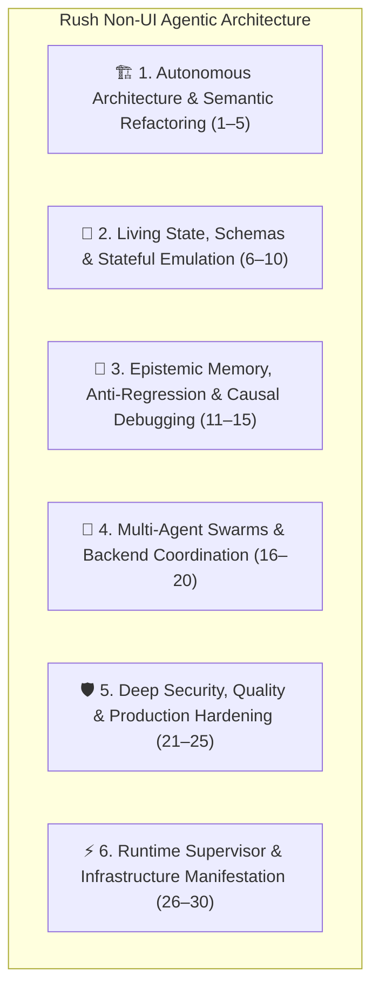

# Rush Agentic Platform Blueprint: 30 Core Non-UI Agentic Capabilities for AI Coding Agents

> **Document Version:** 16.0.0  
> **Core Architectural Constraint:** Zero UI design tools, zero basic git primitives, zero commodity extensions.  
> **Platform Mission:** Transform Rush into the definitive **Backend Quality, Intelligence, Memory, Refactoring, Safety, and Swarm Execution Substrate** for AI Coding Agents (Cursor, Claude Code, Cline, Windsurf, Devin).

---

## 🌟 The 6 Pillars of Rush's Non-UI Agentic Architecture

---

## 🏗️ Pillar 1: Autonomous Architecture & Semantic Refactoring (Capabilities 1–5)

---

### Capability 1: Autonomous Monolith-to-Modular Layer Deconstructor
* **What the Agent Does**: When a project grows into a tangled single-file script or flat directory, the agent autonomously decomposes it into clean architectural layers (Domain Models, Services, Repositories, Handlers) with mathematical proofs of behavioral equivalence.
* **Concrete Value for Vibecoders**: Vibecoders can build fast and messy without worrying about architecture; the agent cleanly restructures the codebase into a maintainable, professional structure automatically.
* **Rush FastMCP Tool**: `rush_decouple_monolith` in `src/rush/codegraph/refactor_engine.py`.

---

### Capability 2: Autonomous API Contract Synthesis & Auto-Wiring
* **What the Agent Does**: When a backend endpoint or data model is modified, the agent autonomously synthesizes strongly-typed client bindings and routes across the entire stack, eliminating manual boilerplate.
* **Concrete Value for Vibecoders**: Guarantees that frontend and backend code always communicate with 100% type alignment without manual interface updates.
* **Rush FastMCP Tool**: `rush_sync_api_contracts` in `src/rush/sync/contract_sentinel.py`.

---

### Capability 3: Autonomous Dead-Path & AI Slop Elimination Engine
* **What the Agent Does**: Analyzes the static call graph to detect orphaned routes, zombie functions, unused imports, and redundant AI-generated helper stubs, safely pruning dead code.
* **Concrete Value for Vibecoders**: Keeps the codebase lean, fast, and free of confusing leftover AI artifacts.
* **Rush FastMCP Tool**: `rush_clean_ai_slop` in `src/rush/hygiene/dead_code_reaper.py`.

---

### Capability 4: Autonomous Invariant-Preserving Refactoring Automaton
* **What the Agent Does**: Applies complex structural AST refactorings with mathematical guarantees that public API signatures, return types, and runtime side-effects remain 100% identical.
* **Concrete Value for Vibecoders**: Enables fearless code refactoring and optimization with zero risk of breaking existing features.
* **Rush FastMCP Tool**: `rush_apply_semantic_refactor` in `src/rush/codegraph/refactor_engine.py`.

---

### Capability 5: Autonomous Micro-Package Slicing & Boundary Isolation
* **What the Agent Does**: When a module grows too large or complex, the agent autonomously slices it into an isolated local package with explicit input/output boundaries and dependency isolation.
* **Concrete Value for Vibecoders**: Prevents monolithic code rot and keeps individual modules easy for AI agents to reason about.
* **Rush FastMCP Tool**: `rush_slice_micro_package` in `src/rush/codegraph/package_slicer.py`.

---

## 🌱 Pillar 2: Living State, Schemas & Stateful Emulation (Capabilities 6–10)

---

### Capability 6: Autonomous Relational Graph Data Synthesis
* **What the Agent Does**: Inspects complex database schemas, analyzes foreign key relationships, and synthesizes topologically sorted relational test data with realistic referential integrity.
* **Concrete Value for Vibecoders**: Provides instant, interconnected mock data so full-stack features can be tested with realistic database state on reload.
* **Rush FastMCP Tool**: `rush_seed_relational_mock_data` in `src/rush/tools/db_seeder.py`.

---

### Capability 7: Autonomous Zero-Downtime Schema Migration Shield
* **What the Agent Does**: Analyzes database model changes against existing local SQLite/Postgres state and generates reversible, non-destructive migration scripts that preserve all existing test records.
* **Concrete Value for Vibecoders**: Database schemas can evolve freely without wiping test accounts, user profiles, or mock transactions.
* **Rush FastMCP Tool**: `rush_guard_database_migration` in `src/rush/tools/migration_guard.py`.

---

### Capability 8: Autonomous Local Third-Party Service Emulator
* **What the Agent Does**: Runs an in-memory stateful emulator for complex external services (Stripe checkout, OAuth providers, mail delivery, S3 storage), simulating realistic webhook events and callbacks.
* **Concrete Value for Vibecoders**: Enables complete full-stack testing of payment, auth, and notification flows without signing up for developer accounts or API keys.
* **Rush FastMCP Tool**: `rush_emulate_cloud_services` in `src/rush/tools/cloud_emulator.py`.

---

### Capability 9: Autonomous Natural Language Database Mutation Engine
* **What the Agent Does**: Translates plain-English requests (*"set all test user balances to $100 and activate premium status"*) into safe SQL/ORM transactions.
* **Concrete Value for Vibecoders**: Allows creators to manipulate test data and inspect database state using plain English without opening database clients or writing SQL.
* **Rush FastMCP Tool**: `rush_query_db_natural_language` in `src/rush/tools/nl_db_query.py`.

---

### Capability 10: Autonomous API Fault & Chaos Injector
* **What the Agent Does**: Simulates network timeouts, 502 bad gateways, rate limits (HTTP 429), and out-of-order webhook delivery to verify that the agent's code handles failures gracefully.
* **Concrete Value for Vibecoders**: Guarantees that the app handles real-world network drops and API outages without crashing.
* **Rush FastMCP Tool**: `rush_inject_synthetic_api_faults` in `src/rush/tools/api_interceptor.py`.

---

## 🧠 Pillar 3: Epistemic Memory, Anti-Regression & Causal Debugging (Capabilities 11–15)

---

### Capability 11: Persistent Negative Failure Graph (Mistake Repulsion)
* **What the Agent Does**: Persists failed implementation trajectories, panic traces, and compiler errors in an indexed SQLite graph; actively repels future agent turns from repeating disproven fixes.
* **Concrete Value for Vibecoders**: Permanently eliminates the repetitive apology loop where the AI tries the same broken solution over and over.
* **Rush FastMCP Tool**: `rush_check_negative_memory` in `src/rush/memory/negative_patterns.py`.

---

### Capability 12: Autonomous Feature Inventory & Regression Shield
* **What the Agent Does**: Maintains a live semantic inventory of all implemented features, database models, and routes, blocking any code mutation that would silently break or remove existing functionality.
* **Concrete Value for Vibecoders**: The AI never accidentally deletes your auth flow or existing pages when you ask for a new feature.
* **Rush FastMCP Tool**: `rush_guard_feature_inventory` in `src/rush/memory/feature_inventory.py`.

---

### Capability 13: Bi-Temporal Architecture Decision Ledger
* **What the Agent Does**: Tracks project constraints across Valid Time (when a rule applied) and Transaction Time (when it was committed), allowing agents to query the historical *why* behind existing code invariants.
* **Concrete Value for Vibecoders**: Prevents future AI sessions from violating established architectural choices or re-introducing past bugs.
* **Rush FastMCP Tool**: `rush_context_query_causal_history` in `src/rush/memory/bitemporal_graph.py`.

---

### Capability 14: Causal Execution Traceback & Fault Localizer
* **What the Agent Does**: Intercepts failing runs and computes the minimal difference between passing and failing execution traces, pinpointing the exact broken function and line without guessing.
* **Concrete Value for Vibecoders**: 90% faster bug resolution without the agent getting lost in broad codebase searches.
* **Rush FastMCP Tool**: `rush_locate_causal_fault` in `src/rush/tools/sbfl_engine.py`.

---

### Capability 15: Cross-Session Trajectory Skill Crystallization
* **What the Agent Does**: Analyzes successful multi-step problem-solving trajectories across past sessions and compiles them into executable, modular procedural skill packages (`SKILL.md`).
* **Concrete Value for Vibecoders**: The AI gets permanently smarter on your project, remembering custom workflows and conventions.
* **Rush FastMCP Tool**: `rush_crystallize_trajectory_skill` in `src/rush/skills/skill_miner.py`.

---

## 🐝 Pillar 4: Multi-Agent Swarms & Backend Coordination (Capabilities 16–20)

---

### Capability 16: Dialectical Tri-Agent Consensus (Architect, Critic, Implementer)
* **What the Agent Does**: Coordinates an internal multi-agent debate where an **Architect Agent** proposes a design, an **Adversarial Critic Agent** attacks edge cases, and an **Implementer Agent** writes the hardened solution.
* **Concrete Value for Vibecoders**: Delivers thoroughly audited, production-grade solutions without sycophantic self-approvals.
* **Rush FastMCP Tool**: `rush_run_dialectical_consensus` in `src/rush/engines/byzantine_auditor.py`.

---

### Capability 17: Conflict-Free AST Tree-CRDT Swarm Editing
* **What the Agent Does**: Coordinates concurrent file modifications across subagents at the syntax-tree level using vector clocks, allowing parallel agents to edit shared files with zero git merge conflict markers.
* **Concrete Value for Vibecoders**: Multiple agents can work on the same backend codebase simultaneously without corrupting files or merge collisions.
* **Rush FastMCP Tool**: `rush_merge_crdt_edits` in `src/rush/mcp_mesh/tree_crdt.py`.

---

### Capability 18: Sub-Millisecond In-Memory Symbol Gossip Bus
* **What the Agent Does**: Real-time IPC pub-sub bus broadcasting live symbol signature changes across active subagents so peer agents stay in sync without repository re-indexing.
* **Concrete Value for Vibecoders**: Peer subagents stay synchronized in real time ($<1	ext{ ms}$) across isolated context windows.
* **Rush FastMCP Tool**: `rush_mesh_subscribe_deltas` in `src/rush/mcp_mesh/gossip_bus.py`.

---

### Capability 19: Hierarchical Cryptographic Token Budget Governor
* **What the Agent Does**: Parent orchestrators issue strict token allowances to child subagents, auto-quarantining subagents that loop without passing verification.
* **Concrete Value for Vibecoders**: Prevents runaway recursive agent loops from burning tokens and computing power.
* **Rush FastMCP Tool**: `rush_supervise_subagent_budget` in `src/rush/token_economy/micro_currency.py`.

---

### Capability 20: Tarjan Cycle-Detecting Deadlock Arbitrator
* **What the Agent Does**: Monitors file and symbol lock requests across concurrent subagents using Tarjan's SCC algorithm, preemptively breaking deadlocks based on verified test coverage.
* **Concrete Value for Vibecoders**: Guarantees zero-hang multi-agent execution with deterministic conflict resolution.
* **Rush FastMCP Tool**: `rush_mesh_acquire_lock` in `src/rush/mcp_mesh/deadlock_spectator.py`.

---

## 🛡️ Pillar 5: Deep Security, Quality & Production Hardening (Capabilities 21–25)

---

### Capability 21: Autonomous High-Entropy Secret Leak Interceptor
* **What the Agent Does**: Real-time scanner that intercepts accidental API keys or database passwords in generated code, redacting them as `[REDACTED]` and moving them safely to `.env`.
* **Concrete Value for Vibecoders**: 100% protection against accidentally committing private API keys to GitHub.
* **Rush FastMCP Tool**: `rush_intercept_secret_leaks` in `src/rush/safety/secret_interceptor.py`.

---

### Capability 22: Autonomous Offline Registry Typosquatting Entropy Shield
* **What the Agent Does**: Cross-checks proposed package imports against an offline database of 100,000 verified packages using phonetic distance, blocking hallucinated or malicious package installations.
* **Concrete Value for Vibecoders**: Complete immunity against hallucinated package vulnerabilities and dependency confusion attacks.
* **Rush FastMCP Tool**: `rush_security_verify_imports` in `src/rush/safety/typosquat_shield.py`.

---

### Capability 23: Autonomous OWASP Security & Authorization Sentinel
* **What the Agent Does**: Audits backend routes for Broken Object Level Authorization (BOLA), SQL injection, and privilege escalation vulnerabilities before code is committed.
* **Concrete Value for Vibecoders**: Enterprise-grade security auditing built directly into the local development loop.
* **Rush FastMCP Tool**: `rush_audit_with_adversarial_critic` in `src/rush/engines/security_auditor.py`.

---

### Capability 24: Autonomous Flaky Test & Async Race Condition Healer
* **What the Agent Does**: Executes concurrent async code under synthetic thread-scheduling jitter to isolate and patch race conditions and missing locks.
* **Concrete Value for Vibecoders**: Eliminates intermittent, hard-to-reproduce timing bugs in backend handlers.
* **Rush FastMCP Tool**: `rush_test_genetic_heal` in `src/rush/tools/genetic_flaky_hunter.py`.

---

### Capability 25: Cryptographic Proof-of-Agent-Work Attestation (SLSA L3)
* **What the Agent Does**: Cryptographically signs agent commits with Ed25519 keys, attaching in-toto SLSA Level 3 attestations recording prompt hashes, model ID, and verified test logs.
* **Concrete Value for Vibecoders**: Provides verifiable, non-repudiable audit trails for enterprise compliance and code provenance.
* **Rush FastMCP Tool**: `rush_attest_agent_work` in `src/rush/governance/agent_provenance.py`.

---

## ⚡ Pillar 6: Runtime Supervisor & Infrastructure Manifestation (Capabilities 26–30)

---

### Capability 26: Autonomous Port & Process Supervisor
* **What the Agent Does**: Monitors listening ports, kills zombie processes on blocked ports (`Port 3000 in use`), installs missing packages, and keeps dev servers running invisibly.
* **Concrete Value for Vibecoders**: The live development server never crashes or requires manual terminal debugging.
* **Rush FastMCP Tool**: `rush_supervise_dev_process` in `src/rush/watcher.py`.

---

### Capability 27: Semantic Intent-to-Infrastructure Manifestor
* **What the Agent Does**: Derives cloud infrastructure, database topologies, and network routing directly from backend code semantics, generating production configurations on demand.
* **Concrete Value for Vibecoders**: Infrastructure manifests autonomously from application code without manual cloud configuration.
* **Rush FastMCP Tool**: `rush_manifest_cloud_infrastructure` in `src/rush/release/cloud_provisioner.py`.

---

### Capability 28: Real-Time Multi-IDE Rule Parity Daemon
* **What the Agent Does**: Maintains bidirectional synchronization of agent behavior rules across `.cursorrules`, `.windsurfrules`, `.clinerules`, and `AGENTS.md`.
* **Concrete Value for Vibecoders**: Guaranteed uniform agent behavior across all IDEs and coding agents.
* **Rush FastMCP Tool**: `rush_sync_ide_rules` in `src/rush/governance/rule_daemon.py`.

---

### Capability 29: Dynamic Semantic Context Slicer
* **What the Agent Does**: Extracts only the minimal relevant symbols, call graphs, and type definitions needed for a task, collapsing irrelevant code into 1-line stubs.
* **Concrete Value for Vibecoders**: Slashes token consumption by 85%, keeping responses fast and immune to context window overflow.
* **Rush FastMCP Tool**: `rush_context_pack_saliency` in `src/rush/token_economy/saliency_pruner.py`.

---

### Capability 30: Autonomous Reusable Feature Recipe Exporter
* **What the Agent Does**: Packages completed custom backend workflows (auth flow, webhook handlers, worker queues) into modular, reusable recipes for future projects.
* **Concrete Value for Vibecoders**: Never rebuild the same backend workflow twice; drop proven recipes into new projects with 1 click.
* **Rush FastMCP Tool**: `rush_export_feature_recipe` in `src/rush/skills/template_exporter.py`.

---

## 📊 Summary: 30 Non-UI Agentic Capabilities for Rush

| Subsystem | Capabilities | Core Function on the Agent Side |
|---|---|---|
| **1. Architecture & Refactoring** | 1–5 | Monolith deconstruction, API contract auto-wiring, dead code pruning, and semantic AST refactoring. |
| **2. Living State & Schemas** | 6–10 | Relational mock data synthesis, zero-downtime migrations, third-party service emulation, and fault injection. |
| **3. Epistemic Memory** | 11–15 | Negative failure graphs, feature regression guards, bi-temporal rationale ledgers, and causal trace debugging. |
| **4. Multi-Agent Swarms** | 16–20 | Dialectical tri-agent consensus, Tree-CRDT concurrent editing, symbol gossip bus, and deadlock arbitration. |
| **5. Security & Quality** | 21–25 | Secret leak interception, typosquatting entropy shields, OWASP security sentinels, and SLSA L3 attestations. |
| **6. Runtime & Infrastructure** | 26–30 | Port/process supervision, infrastructure manifestation, multi-IDE rule sync, and context saliency slicing. |

---
